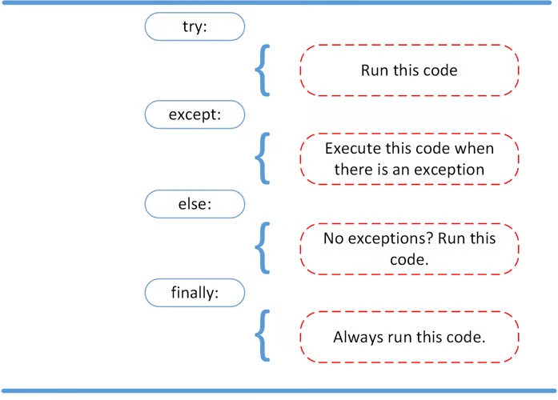

# Python Exceptions

An exception in Python is an event that occurs during the execution of a program to disrupt its normal flow. Also called runtime errors.

Unlike syntax errors, which are detected by the parser, Python raises exceptions when an error occurs in syntactically correct code. 

We cannot "handle" a Python SyntaxError at runtime because these errors prevent the code from running at all; they are caught during the initial parsing/compilation stage before the code is executed.

## Raising an Exception in Python
If a certain condition occurs which creates situation of crashing the program, we can raise an error to stop the execution and handles the exception

```
number = 10
if number > 5:
    raise Exception(f"The number should not exceed 5. ({number=})")
print(number)
```

## Debugging During Development With assert (used for debugging only)
Python offers a specific exception type that you should only use when debugging your program during development. This exception is the AssertionError. The AssertionError is special because you shouldn’t ever raise it yourself using raise.

```
number = 10
assert (number < 5), f"The number should not exceed 5. ({number=})"
print(number)
```

In production, your Python code may run using this optimized mode, which means that assertions aren’t a reliable way to handle runtime errors in production code as assert statements are completely neglected.
<!-- <hr> -->

## Handling Exceptions With the try and except Block


Using raise, will do crash the program. So, we use the try and except block for smooth flow of code.

try...except blocks are designed to handle runtime errors (exceptions). They cannot catch SyntaxErrors, which are problems with the structure of your Python code detected before the code even runs.

We can use multiple except blocks. Avoid using bare except blocks as it catches all exceptions that inherit from BaseException, including system-terminating ones like SystemExit and KeyboardInterrupt (e.g., when a user presses Ctrl+C).

## Exception Classes in python
- ArithmeticError: Base class for exceptions that occur during arithmetic operations.
    - ZeroDivisionError: Raised when the second operand of a division or modulo operation is zero.
    
    - OverflowError: Raised when the result of an arithmetic operation is too large to be represented.
- LookupError: Base class for exceptions raised when a key or index used on a mapping (like a dictionary) or sequence (like a list) is invalid.
    - IndexError: Raised when a sequence index is out of range.
    
    - KeyError: Raised when a dictionary key is not found.

- AttributeError: Raised when attribute assignment or reference fails (e.g., trying to access a non-existent class member).
- ImportError: Raised when an imported module is not found.
- NameError: Raised when a local or global variable name is not found.
- TypeError: Raised when an operation or function is applied to an object of inappropriate type.
- ValueError: Raised when a function receives an argument of the correct type but an inappropriate value (e.g., trying to convert a non-numeric string to an integer).
- FileNotFoundError: Raised when a file or directory is requested but does not exist.
- SyntaxError: Raised by the parser when a syntax error is encountered in the code. 

## Creating Custom Exceptions in Python
We can create custom exception in python by inheriting base 'Exception' class which is best choice or any exception class.

```
class PlatformException(Exception):
    def __init__(self, msg):
        self.msg = msg
        super().__init__(msg)

def linux_check():
    import sys
    if 'linux' not in sys.platform:
        raise PlatformException("Linux required")
    print('Doing Something')

try:
    linux_check()
except PlatformException as p:
    print(p)
```

#### Methods to Override
- ```__init__(self, *args, **kwargs)```
- ```__str__(self)``` : defines the string representation of the exception object, which is what gets printed when you print() the exception or when the exception is displayed in a traceback.
- ```__repr__(self)``` (Optional): provides an "official" string representation of the object, typically used for debugging, and should ideally be an expression that could be used to recreate the object.
- ```add_note(self, note)``` : adds a string note to the exception's __notes__ list, which appears in the standard traceback.
- ```with_traceback(self, tb)``` : allows you to set a new traceback for the exception and returns the updated exception object.

## ExceptionGroup
A built-in exception type that wraps a list of other exception instances. It takes a message string and a sequence of sub-exceptions as arguments to its constructor.

```
try:
    # Simulate multiple errors
    raise ExceptionGroup(
        "Multiple errors occurred",
        [ValueError("Invalid value"), TypeError("Invalid type")]
    )
except ExceptionGroup as eg:
    print(f"Caught exception group: {eg}")

```

By using except* instead of except, we can selectively handle only the exceptions in the group that match a certain type.
```
try:
    raise ExceptionGroup("ArithmeticError")
except* ExceptionGroup as eg:
    print(eg)
```

### Enriching Exceptions with Notes
```
try:
    raise TypeError('bad type')
except Exception as e:
    e.add_note('Add some information')
    e.add_note('Add some more information')
    raise
```


