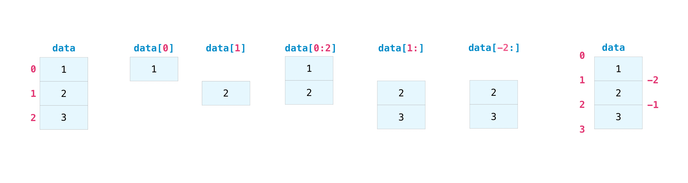
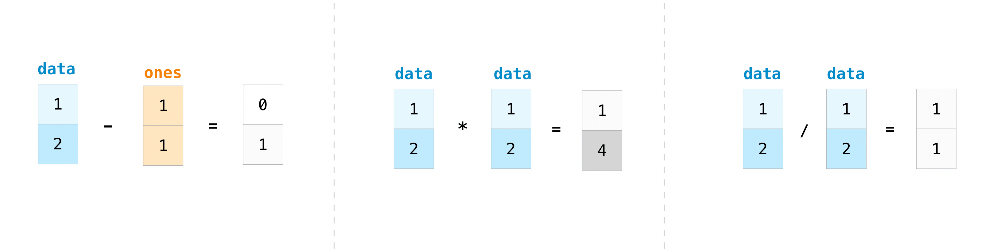
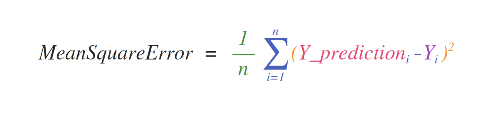
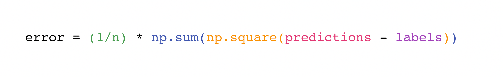

# Numpy

NumPy (Numerical Python) is an open source Python library that’s widely used in science and engineering. 

The NumPy library contains multidimensional array data structures, such as the homogeneous, N-dimensional ndarray, and a large library of functions that operate efficiently on these data structures.

## How to import NumPy
```
import numpy as np
```

### Why numpy?
NumPy shines when there are large quantities of “homogeneous” (same-type) data to be processed on the CPU. And ND-Array.

### Array fundamentals

One way to initialize an array is using a Python sequence, such as a list.
```
a = np.array([1, 2, 3, 4, 5, 6])
a = np.array([[1, 2, 3, 4], [5, 6, 7, 8], [9, 10, 11, 12]])
```

> In NumPy, a dimension of an array is sometimes referred to as an “axis”.

#### Array attributes
- ndim: number of dimensions of an array
- shape: shape of an array is a tuple of non-negative integers that specify the number of elements along each dimension.
- size: total number of elements in array
- dtype: data type of array

## How to create a basic array
- np.zeros(): Besides creating an array from a sequence of elements, you can easily create an array filled with 0’s
    ```
    np.zeros(2)
    ```
- np.ones(): an array filled with 1’s
    ```
    np.ones(3)
    ```
- np.empty(): creates an array whose initial content is random and depends on the state of the memory. The reason to use empty over zeros (or something similar) is speed - just make sure to fill every element afterwards!
    ```
    np.empty(5)
    ```
- np.arange(): an array with a range of elements
    ```
    np.arange(4)
    # np.arange(2, 9, 2) #output: [2,4,6,8]
    ```
- np.linspace(): to create an array with values that are spaced linearly in a specified interval
    ```
    np.linspace(2, 5, 20)
    ```

- Specifying Datatype while creating array auto: using the dtype keyword
    ```
    x = np.ones(2, dtype=np.int64)
    ```

## Adding, removing, and sorting elements

- np.sort():
    ```
    arr = np.array([5,4,3,9,12,700])
    np.sort(arr)
    ```

    - argsort: indirect sort along a specified axis. ```np.argsort(arr)```
    - lexsort: indirect stable sort using multiple keys, where the last key in the sequence is the primary sort key, the second-to-last is the secondary, and so on.
        ```
        data = np.array([
            [25, 50000],
            [35, 60000],
            [20, 45000],
            [30, 55000],
            [25, 55000] # Added for tie-breaking
        ])
        indices = np.lexsort((data[:, 1], data[:, 0]))
        sorted_data = data[indices]
        print(sorted_data)
        ```
    - searchsorted: finds the indices where elements should be inserted into a sorted array to maintain its order.
        ```
        np.searchsorted(sorted_array, values_to_insert)
        ```
    - partition: which is a partial sort. ```np.partition(new_arr, 3)```

- np.concatenate(): Both of the array should be of same dimension    
    ```
    np.concatenate((new_arr, new_arr2))
    ```

## reshape an array

- arr.reshape(): 
    ```
    arr = np.array([[5,4,3], [9,12,700]])
    b = arr.reshape(3,2)
    ```

- np.reshape(): you can specify a few optional parameters
    ```
    b = np.reshape(arr, (3,2))
    ```

### adding a new axis to an array
- np.newaxis:
    - arr[np.newaxis, :] inserts a new axis at the beginning (index 0). Row vector.
    - arr[:, np.newaxis] inserts a new axis along the second dimension (index 1 for a 1D array). Column vector.

    - arr[..., np.newaxis] inserts the new axis at the end using the ellipsis ... notation.

- np.expand_dims: add an axis at index position 1
    ```
    b = np.expand_dims(a, axis=1)
    b.shape
    ```

## Indexing and slicing



### using conditional operators and logical operators (& and |) with index:
```
a = np.array([[1, 2, 3, 4], [5, 6, 7, 8], [9, 10, 11, 12]])
a[a > 4]

# also
divisible_by_2 = a[a%2==0]
print(divisible_by_2)
```

- np.nonzero(): To get the indices of non-zero elements in a NumPy array, use the numpy.nonzero() function.
    ```
    arr_1d = np.array([0, 1, 0, 3, 4])
    indices_1d = np.nonzero(arr_1d)
    print(f"Non-zero indices: {indices_1d}")
    ```

## How to create an array from existing data

- slicing and indexing: ```arr1 = a[3:8]```

- np.vstack() & np.hstack(): You can also stack two existing arrays, both vertically and horizontally
    ```
    a = np.array([[1, 2], [3, 4]])
    b = np.array([[1, 2], [3, 4]])
    np.vstack((a, b))
    np.hstack((a, b))
    ```

- np.hsplit(): takes n as a number to divide in n equal parts horizontally or we can pass arg like (n, n+x) to split from specific index
    ```
    c = np.arange(1, 25).reshape(2, 12)
    np.hsplit(c, 3)

    # If you wanted to split your array after the 5th and 10th column
    c = np.arange(1, 25).reshape(2, 12)
    np.hsplit(c, (5, 10))
    ```
- .view(): Use the view method to create a new array object that looks at the same data as the original array. 

    This saves memory and is faster. Modifying data in a view also modifies the original array.
    ```
    b2 = a.view()
    ```

- copy(): Using copy() creates a deep copy which doesn't changes original array. just assigning makes a shallow copy.

    ```
    b2 = a.copy()
    ```

## Basic array operations

- array elements arithmetic operations:
    ```
    d = np.array([1, 2])
    e = np.array([1, 2])
    e + d # output: [2, 4]
    ```
    
    

- sum(): To find sum of all array elements. 
    ```
    arr.sum()
    # using 2d using axis
    f = np.array([[1, 5], [6, 7]])
    print(f.sum(axis=0))
    ```

## Broadcasting
Operation between vector and scaler. NumPy understands that the multiplication should happen with each cell. That concept is called broadcasting. Broadcasting is a mechanism that allows NumPy to perform operations on arrays of different shapes.

The dimensions of your array must be compatible.

```
a = np.array([1, 2, 5])
a*2.1245
```

### General broadcasting rules
 NumPy broadcasting adheres to mathematical fundamentals of linear algebra

When operating on two arrays, NumPy compares their shapes element-wise. It starts with the trailing (i.e. rightmost) dimension and works its way left. 

Two dimensions are compatible when
- they are equal, or
- one of them is 1.

```
a = np.array([[1, 2, 3], [1, 3, 2]])
b = np.array([10, 20, 30])
a[0, :] = a[(0,1)] + b # updates first row of array a
a
```

## More useful array operations

- maximum : ```a.max()```
- minimum : ```a.min()```
- sum : ```a.sum()```
- mean : ```a.mean()```
- product : ```a.prod()```
- standard deviation : ```a.std()```

- intersect1d(): ```np.intersect1d(a,b)```
- np.setdiff1d(a,b)
- get the positions where elements of two arrays match: ```np.where(a == b)```
- np.percentile(iris_data, q=[5, 95])

## Creating matrices
nd array

## Generating random numbers
NumPy's modern and recommended approach to generating random numbers is the numpy.random.default_rng() function, which creates a Generator object.

```
# Instantiate a new Generator with the default bit generator (PCG64)
rng = np.random.default_rng()

rng.random(size=(2,3))
print(rng.integers(0, 10, 5)) # output: [2, 9, 4, 2, 4]
# endpoint true makes high no inclusive
print(rng.integers(5, size=(5,2), endpoint=True)) 
```

## How to get unique items and counts

- np.unique() : to print the unique values in your array. ```np.unique(a)```

- To get the indices of unique values in a NumPy array:
    ```
    unique_values, indices_list = np.unique(a, return_index=True)
    print(f"{indices_list} : {unique_values}")
    ```

- pass the return_counts argument in np.unique() to get the frequency count of unique values in a NumPy array.
    ```
    unique_values, occurrence_count = np.unique(a, return_counts=True)
    print(occurrence_count)
    ```

## Transposing and reshaping a matrix

- arr.reshape() : switch the dimensions of a matrix. ```data.reshape(2, 3)```

- arr.transpose() : 
    ```
    a = np.array([[1, 2], [4, 3]])
    a.transpose()
    ```
- arr.T : does the same as transpose()

## How to reverse an array

- np.flip(): allows you to flip, or reverse, the contents of an array along an axis. If no axis mentioned that flips the array completely. 

```
np.flip(a)
# with axis
np.flip(a, axis=0)
```

## Reshaping and flattening multidimensional arrays

The primary difference between .flatten() and .ravel() is that the new array created using ravel() is actually a reference to the parent array (i.e., a “view”). 

This means that any changes to the new array will affect the parent array as well. Since ravel does not create a copy, it’s memory efficient.

```
a = np.array([[1, 2], [2, 4]])
a.flatten() # deep copy
a.ravel() # shallow copy
```

## How to access the docstring for more information

- help() : Python has a built-in help() function that can help you access this information.
Ex: ```help(max)```

- ? :  IPython uses the ? character as a shorthand for accessing this documentation along with other relevant information.
Ex: ```arr?```

- ?? :  Using a double question mark (??) allows you to access the source code.
Ex: ```len??```

## Working with mathematical formulas
The ease of implementing mathematical formulas that work on arrays is one of the things that make NumPy so widely used in the scientific Python community.




## How to save and load NumPy objects
You can save your arrays to disk and load them back without having to re-run the code.

The .npy and .npz files store data, shape, dtype, and other information required to reconstruct the ndarray in a way that allows the array to be correctly retrieved, even when the file is on another machine with different architecture.

The savetxt() and loadtxt() functions accept additional optional parameters such as header, footer, and delimiter.

- np.save & np.load : easy way to save and load an array
    ```
    np.save('filename', a)
    b = np.load('filename.npy')
    ```

- np.savez : handles NumPy files with a .npz file. If you want to store more than one ndarray object in a single file, save it as a .npz file

- np.savetxt : You can save a NumPy array as a plain text file like a .csv or .txt file with np.savetxt
    ```
    csv_arr = np.array([1, 2, 3, 4, 5, 6, 7, 8])
    np.savetxt('new_file.csv', csv_arr)
    ```

- np.loadtxt : You can quickly and easily load your saved text file
    ```
    np.loadtxt('new_file.csv')
    ```

## Importing and exporting a CSV
Best way to do this is using Pandas.

```
import pandas as pd

# If all of your columns are the same type:
x = pd.read_csv('music.csv', header=0).values
print(x)

# You can also simply select the columns you need:
x = pd.read_csv('music.csv', usecols=['Artist', 'Plays']).values
print(x)
```

## Plotting arrays with Matplotlib

```
import matplotlib.pyplot as plt
a = np.array([2, 1, 5, 7, 4, 6, 8, 14, 10, 9, 18, 20, 22])
plt.plot(a)
```

## Mathematical Functions in Numpy

#### Trignometric functions
- sin()
- cos()
- tan()
- cosec()
- sec()
- cot()
- asin()
- acos()
- atan()
- acosec()
- asec()
- acot()
- degrees() : Convert angles from radians to degrees.
- radians(x, /[, out, where, casting, order, ...]) : Convert angles from degrees to radians.
- unwrap(p[, discont, axis, period]): Unwrap by taking the complement of large deltas with respect to the period.
- deg2rad(x, /[, out, where, casting, order, ...]) : Convert angles from degrees to radians.
- rad2deg(x, /[, out, where, casting, order, ...]) : Convert angles from radians to degrees.

#### Rounding
- round(a[, decimals, out]) : Evenly round to the given number of decimals.
- around(a[, decimals, out]) : Round an array to the given number of decimals.
- rint(x, /[, out, where, casting, order, ...]) : Round elements of the array to the nearest integer.
- fix(x[, out]) : Round to nearest integer towards zero.
- floor(x, /[, out, where, casting, order, ...]) : Return the floor of the input, element-wise.

- ceil(x, /[, out, where, casting, order, ...]) : Return the ceiling of the input, element-wise.
- trunc(x, /[, out, where, casting, order, ...]) : Return the truncated value of the input, element-wise.

#### Sums, products, differences
- prod(a) : Return the product of array elements over a given axis.
- sum(a) : Sum of array elements over a given axis.
- nanprod(a) : Return the product of array elements over a given axis treating Not a Numbers (NaNs) as ones.
- nansum(a) : Return the sum of array elements over a given axis treating Not a Numbers (NaNs) as zero.
- cumulative_sum(x, /) : Return the cumulative sum of the elements along a given axis.
- cumulative_prod(x, /) : Return the cumulative product of elements along a given axis.
- cumprod(a) : Return the cumulative product of elements along a given axis.
- cumsum(a) : Return the cumulative sum of the elements along a given axis.
- nancumprod(a) : Return the cumulative product of array elements over a given axis treating Not a Numbers (NaNs) as one.

- nancumsum(a[, axis, dtype, out]) : Return the cumulative sum of array elements over a given axis treating Not a Numbers (NaNs) as zero.
- diff(a[, n, axis, prepend, append]) : Calculate the n-th discrete difference along the given axis.
- ediff1d(ary[, to_end, to_begin]) : The differences between consecutive elements of an array.
- gradient(f, *varargs[, axis, edge_order]) : Return the gradient of an N-dimensional array.
- cross(a, b[, axisa, axisb, axisc, axis]) : Return the cross product of two (arrays of) vectors.
- trapezoid(y[, x, dx, axis]) :Integrate along the given axis using the composite trapezoidal rule.

#### Exponents and logarithms
- exp(x, /) : Calculate the exponential of all elements in the input array.
- exp2(x, /[, out, where, casting, order, ...]) : Calculate 2**p for all p in the input array.
- log(x, /) : Natural logarithm, element-wise.
- log10(x, /) : Return the base 10 logarithm of the input array, element-wise.
- log2(x, /) : Base-2 logarithm of x.
- logaddexp(x1, x2, /) : Logarithm of the sum of exponentiations of the inputs.

#### Floating point routines
- signbit(x, /) : Returns element-wise True where signbit is set (less than zero).
- copysign(x1, x2, /) : Change the sign of x1 to that of x2, element-wise.
- frexp(x[, out1, out2], / [[, out, where, ...]) : Decompose the elements of x into mantissa and twos exponent.
- nextafter(x1, x2, /) : Return the next floating-point value after x1 towards x2, element-wise.
- spacing(x, /[, out, where, casting, order, ...]) : Return the distance between x and the nearest adjacent number.

#### Rational routines
- lcm(x1, x2, /[, out, where, casting, order, ...])
- gcd(x1, x2, /[, out, where, casting, order, ...])

#### Arithmetic operations
- add(x1, x2) : Add arguments element-wise.
- reciprocal(x) : Return the reciprocal of the argument, element-wise.
- positive(x) : Numerical positive, element-wise.
- negative(x) : Numerical negative, element-wise.
- multiply(x1, x2) : Multiply arguments element-wise.
- divide(x1, x2) : Divide arguments element-wise.
- power(x1, x2) : First array elements raised to powers from second array, element-wise.

- pow(x1, x2) : First array elements raised to powers from second array, element-wise.
- subtract(x1, x2) : Subtract arguments, element-wise.
- true_divide(x1, x2) : Divide arguments element-wise.
- floor_divide(x1, x2) : Return the largest integer smaller or equal to the division of the inputs.
- float_power(x1, x2) : First array elements raised to powers from second array, element-wise.
- fmod(x1, x2) : Returns the element-wise remainder of division.
- mod(x1, x2) : Returns the element-wise remainder of division.
- modf(x[, out1, out2]) : Return the fractional and integral parts of an array, element-wise.
- remainder(x1, x2) : Returns the element-wise remainder of division.
- divmod(x1, x2[, out1, out2], / [[, out, ...]) : Return element-wise quotient and remainder simultaneously.

#### Handling complex numbers
- angle(z[, deg]) : Return the angle of the complex argument.
- real(val) : Return the real part of the complex argument.
- imag(val) : Return the imaginary part of the complex argument.
- conj(x) : Return the complex conjugate, element-wise.
- conjugate(x) : Return the complex conjugate, element-wise.

#### Extrema finding
- maximum()
- max()
- amax() : Return the maximum of an array or maximum along an axis.
- fmax()
- nanmax()
- minimum()
- min()
- amin()
- fmin()
- nanmin()

#### Miscellaneous
- convolve() : Returns the discrete, linear convolution of two one-dimensional sequences.
- clip()
- sqrt()
- cbrt()
- square()
- absolute()
- fabs()
- sign()
- nan_to_num() : Replace NaN with zero and infinity with large finite numbers
- real_if_close() : If input is complex with all imaginary parts close to zero, return real parts.
- 

#### Example
```
np.sin(np.pi/4) # gives value of sin 45 deg in decimal
```


