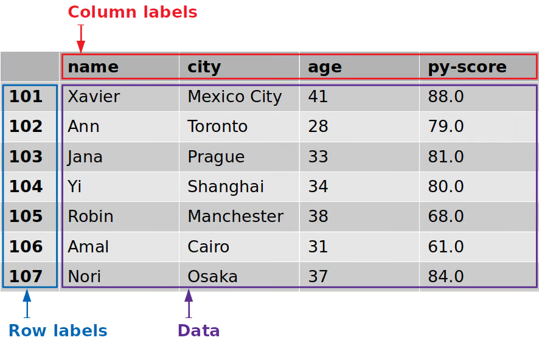

# Pandas

Pandas is a Python library used for working with data sets. It has functions for analyzing, cleaning, exploring, and manipulating data.

### Why Use Pandas?
Pandas allows us to analyze big data and make conclusions based on statistical theories.

Pandas can clean messy data sets, and make them readable and relevant.

## Pandas Series
A Pandas Series is like a column in a table. It is a one-dimensional array holding data of any type.

```
import pandas as pd
a = [1, 7, 2]
print(pd.Series(a))
```

### Create Labels
With the index argument, you can name your own labels.
```
print(pd.Series(data[0], index= ['a', 'b', 'c']))
# print(pd.Series(data[0], index= ['a', 'b', 'c'])['b'])
```

### Key/Value Objects as Series
```
calories = {"day1": 420, "day2": 380, "day3": 390}
myvar = pd.Series(calories)
print(myvar)
```

## DataFrames

Data sets in Pandas are usually multi-dimensional tables, called DataFrames. Series is like a column, a DataFrame is the whole table.  2-dimensional data structure

```
data = {
  "calories": [420, 380, 390],
  "duration": [50, 40, 45]
}
myvar = pd.DataFrame(data)
print(myvar)
```

#### Creating a pandas DataFrame From Files
```
df.to_csv('data.csv')
```

### Get length

#### get number of rows, columns, shape and size
```
# rows
df = pd.DataFrame(data)
len(df) # gets length
len(df.index) # fastest way to get length

# columns
len(df.columns)

# dimension
df.ndim 

# both
rows, columns = df.shape
print(f"{rows} {columns}")

# size
df.size

# shape
df.shape()
```

- df.count(): This method counts the number of non-null values for each column and returns a Series.

- df_.memory_usage(): returns a Series with the column names as labels and the memory usage in bytes as data values.

### Accessors
We can set and get data using accessors

- .loc[] accepts the labels of rows and columns and returns Series or DataFrames. You can use it to get entire rows or columns, as well as their parts.

- .iloc[] accepts the zero-based indices of rows and columns and returns Series or DataFrames. You can use it to get entire rows or columns, or their parts.

- .at[] accepts the labels of rows and columns and returns a single data value. Ex : ```df.at[12, 'name']```

- .iat[] accepts the zero-based indices of rows and columns and returns a single data value.

### Inserting and Deleting Data

#### Inserting Row
by creating a new Dataframe object that represents this new candidate
```
data_ins = pd.DataFrame([[400, 79]], columns=df.columns)
df = pd.concat([df, data_ins], ignore_index=True)
```

#### Deleting Row
```df = df.drop(labels=3)```

#### Inserting Column
```df.insert(loc=2, column="XYZ", value=np.array([0,0,0]))```

#### Deleting Column
```
del df['XYZ']
df.pop('total-score') # deletes column and returns
```

### pandas DataFrame Labels as Sequences
The following code assigns the custom row indexes
```
df.index = np.arange(10, 17)
```

### Data as NumPy Arrays
```df.to_numpy()```

### Locate Row
Pandas use the loc attribute to return one or more specified row(s)

```
print(df.loc[0])
print(df.loc[[0, 1]])
```

### Named Indexes
With the index argument, you can name your own indexes.

```
data = {
  "calories": [420, 380, 390],
  "duration": [50, 40, 45]
}
df = pd.DataFrame(data, index = ["day1", "day2", "day3"])
print(df) 
print(df.loc["day2"]) # named index
```

## Applying Arithmetic Operations
```
a = df['calories'].head(2) + df['duration'].head(2)
np.sum(a)
```

## Sorting a pandas DataFrame
- sort_values(): 
    ```
    df.sort_values(by=['calories', 'duration'], ascending=False)
    df.sort_values(by=['calories', 'duration'], ascending=False, inplace=True) # changes real df object

    df.sort_index() # sorts by row index
    ```

## Pandas Read CSV
A simple way to store big data sets is to use CSV files (comma separated files).

CSV files contains plain text and is a well know format that can be read by everyone including Pandas.

```
import pandas as pd
df = pd.read_csv('data.csv')
print(df.to_string()) 
```

> Tip: use to_string() to print the entire DataFrame.

- max_rows: number of rows returned is defined in Pandas option settings.
```
print(pd.options.display.max_rows)
pd.options.display.max_rows = 9999 # set the max number of rows
```

## Pandas Read JSON
Big data sets are often stored, or extracted as JSON.

JSON is plain text, but has the format of an object, and is well known in the world of programming, including Pandas.

```
df = pd.read_json('data.json')
print(df.to_string()) 
```

## Analyzing DataFrames

### Viewing the Data
- head(): returns the headers and a specified number of rows, starting from the top. If no arg passed default is 5 rows. ```print(df.head(10))```
- tail(): returns the headers and a specified number of rows, starting from the bottom. ```df.tail()```
- info(): gives you more information about the data set. Also gives us count of non null rows. ```df.info()```


## Filtering Data
It works similarly to indexing with Boolean arrays in NumPy.

```
filtered_data = df['calories'] < 400
df[filtered_data]
```

Using logical operators:
- NOT (~)
- AND (&)
- OR (|)
- XOR (^)

```
filtered_data = (df['calories'] >= 400) | (df['duration'] >= 80)
df[filtered_data]
```

##### filter using .where()
It replaces the values in the positions where the provided condition isn’t satisfied.
```
df['calories'].where(cond=~pd.isna(df['duration']), other=np.nan)
```

## Pandas - Cleaning Data
Data cleaning means fixing bad data in your data set.

Bad data could be:
- Empty cells
- Data in wrong format
- Wrong data
- Duplicates

### Cleaning Empty Cells
Empty cells can potentially give you a wrong result when you analyze data.

#### Remove Rows :
One way to deal with empty cells is to remove rows that contain empty cells. Using dropna()

By default, the dropna() method returns a new DataFrame, and will not change the original.

Use the inplace = True argument, if you want to change the original DataFrame, 

```
df = pd.read_csv('data.csv')
new_df = df.dropna()
print(new_df.to_string())
```

#### Replace Empty Values
Another way of dealing with empty cells is to insert a new value instead. Using fillna(.)

```
df = pd.read_csv('data.csv')
df.fillna(130, inplace = True)
df.fillna({"Calories": 130}, inplace=True) # Replace Only For Specified Columns
```

#### Replace Using Mean, Median, or Mode

- mean() : the average value (the sum of all values divided by number of values). ```df["Calories"].mean()```
- median() : the value in the middle, after you have sorted all values ascending. ```df["Calories"].median()```
- mode() : the value that appears most frequently. ```df["Calories"].mode()[0]```

## Cleaning Data of Wrong Format
Cells with data of wrong format can make it difficult, or even impossible, to analyze data.

Either remove the rows, or convert all cells in the columns into the same format.

Pandas has a to_datetime() method to convert data and time to pandas date representation.

Example:
```
df = pd.read_csv('data.csv')
df['Date'] = pd.to_datetime(df['Date'], format='mixed')
print(df.to_string())
```

#### Replacing Values
To replace specific field use loc like below example:
```
df.loc[7, 'Duration'] = 45

# or using some condition to dynamically choose specific location
for x in df.index:
  if df.loc[x, "Duration"] > 120:
    df.loc[x, "Duration"] = 120
```

#### Removing Rows
use drop() to completely remove the row 
```
for x in df.index:
  if df.loc[x, "Duration"] > 120:
    df.drop(x, inplace = True)
```

#### Removing Duplicates

The duplicated() method returns a Boolean values for each row: ```df.duplicated()```

To remove duplicates, use the drop_duplicates() method. ```df.drop_duplicates(inplace = True)```

## Iterating Over a pandas DataFrame

- .items(): iterates over columns
    ```
    for col_label, col in df.items():
    print(col_label, col, sep='\n', end='\n\n')
    ```

- .iteritems(): iterates over columns. Deprecated
- .iterrows(): iterates over rows
- .itertuples(): iterates over rows and get named tuples

## Working With Time Series
pandas excels at handling time series. Although this functionality is partly based on NumPy datetimes and timedeltas, pandas provides much more flexibility.

```
dt = pd.date_range(start='2019-10-27 00:00:00.0', periods=24, freq='D')
```

### Resampling and Rolling
- .resample(): you can combine filter with other methods such as .mean()
- .rolling(): provides a way to perform calculations over a moving or "rolling" window of a fixed size

## Pandas - Data Correlations

corr() method calculates the relationship between each column in your data set. ```df.corr()```

- The output number varies from -1 to 1.
- 1 means that there is a 1 to 1 relationship (a perfect correlation), and for this data set, each time a value went up in the first column, the other one went up as well.

- 0.9 is also a good relationship, and if you increase one value, the other will probably increase as well.
- -0.9 would be just as good relationship as 0.9, but if you increase one value, the other will probably go down.
- 0.2 means NOT a good relationship, meaning that if one value goes up does not mean that the other will.

## Pandas - Plotting
Pandas uses the plot() method to create diagrams.

```
import pandas as pd
import matplotlib.pyplot as plt

df = pd.read_csv('data.csv')
# df.plot(kind = 'scatter', x = 'Duration', y = 'Calories')
# df["Duration"].plot(kind = 'hist')
df.plot()

plt.show()
```

## Groupby
Grouping in pandas, achieved using the .groupby() method, is a powerful data analysis technique that follows a "split-apply-combine" strategy: splitting data into groups based on some criteria, applying a function to each group, and combining the results into a new data structure.

```
data = {'Key': ['A', 'B', 'C', 'A', 'B', 'C'],
        'Data1': [0, 1, 2, 3, 4, 5],
        'Data2': [5, 0, 3, 3, 7, 9]}
df = pd.DataFrame(data)

grouped_data = df.groupby('Key').sum()
print(grouped_data)
```

### Key Operations with GroupBy Objects
- Aggregation:
    ```
    group_means = df.groupby('Key')['Data1'].mean()
    ```
- Transformation:
    ```
    df.groupby('Key')['Data1'].transform(lambda x: x.fillna(x.mean()))
    ```
- Filtration:
    ```
    df.groupby('Key').filter(lambda x: x['Data1'].mean() > 1.5)
    ```
- Applying Multiple Functions:
    ```
    agg_functions = {'Data1': ['sum', 'mean'], 'Data2': ['min', 'max']}
    multi_agg = df.groupby('Key').agg(agg_functions)
    ```

## Combining Data in pandas With merge(), .join(), and concat()

### merge()
a primary method for combining two DataFrames based on common columns or indices

```
df_1 = pd.DataFrame({'key': ['A', 'B', 'C', 'D'], 'value1': [1, 2, 3, 4]})
df_2 = pd.DataFrame({'key': ['B', 'D', 'E', 'F'], 'value2': [5, 6, 7, 8]})

# Inner merge (default)
merged_df = pd.merge(df_1, df_2, on='key', how='inner')
print(merged_df)
```

#### Types of Merges
- 'inner' (Default): 
- 'left': 
- 'right': 

- 'outer': Returns all rows from both DataFrames (union of keys), filling in NaN for missing values where no match is found.
- 'cross': Performs a Cartesian product of rows, resulting in every combination of rows between the two DataFrames. No on parameter is allowed for a cross merge

### join()
The .join() method is a convenient instance method for combining DataFrames based on their indices. Default: left join.

#### Syntax
```
dataframe.join(other, on, how, lsuffix, rsuffix, sort)
# how accepts: left, right, outer, inner
```


```
df10 = pd.DataFrame({'A': ['A0', 'A1', 'A2'],
                    'B': ['B0', 'B1', 'B2']},
                   index=['K0', 'K1', 'K2'])

df20 = pd.DataFrame({'C': ['C0', 'C2', 'C3'],
                    'D': ['D0', 'D2', 'D3']},
                   index=['K0', 'K2', 'K3'])

# Perform a left join (default behavior)
result = df10.join(df20)
print(result)
```

### concat()
```concatenated = pandas.concat([df1, df2])```

## Working with Excel files using Pandas
Excel files store data in rows and columns, making them useful for managing structured datasets.

> Special requirement from read_excel(): ```pip install pandas openpyxl```

### Reading data from excel
- Reading Data From Excel

    ```df = pd.read_excel("your_file.xlsx")```

- Specify a specific sheet

    ```df = pd.read_excel("your_file.xlsx", sheet_name=1)```

- Read specific columns:
    
    ```df = pd.read_excel("your_file.xlsx", usecols=['ColumnA', 'ColumnB'])```

### Writing Data to Excel

- Write to a new file:

    ```df.to_excel("new_file.xlsx", index=False)```

- Write to multiple sheets in one file:

    ```
    writer = pd.ExcelWriter('multi_sheet.xlsx', engine='openpyxl')
    df1.to_excel(writer, sheet_name='Sheet1')
    df2.to_excel(writer, sheet_name='Sheet2')
    writer.close()
    ```

### Write the modified DataFrame back to the Excel file

    ```
    with pd.ExcelWriter(file_path, mode='a', engine='openpyxl', if_sheet_exists='replace') as writer:
        df.to_excel(writer, sheet_name='Sheet1', index=False) # index=False prevents writing the DataFrame index to Excel

    ```

#### changing a field in excel:
```
df.at[4, 'english'] = 19
print(df.at[4, 'english'])

with pd.ExcelWriter('pandas_practical.xlsx', mode='a', engine='openpyxl', if_sheet_exists='replace') as writer:
    df.to_excel(writer, sheet_name='Sheet1', index=False)
```
