# Seaborn
Seaborn is a popular, high-level Python library for creating attractive and informative statistical graphics.

It builds on top of matplotlib and integrates closely with pandas data structures.

## Installation
```
python -m pip install seaborn
```

Example:
```
# Import seaborn
import seaborn as sns

# Apply the default theme
sns.set_theme()

# Load an example dataset
tips = sns.load_dataset("tips")

# Create a visualization
sns.relplot(
    data=tips,
    x="total_bill", y="tip", col="time",
    hue="smoker", style="smoker", size="size",
)
plt.show()
```

## Data structures accepted by seaborn
Seaborn treats the argument to data as wide form when neither x nor y are assigned.

### Long-form data
A long-form data table has the following characteristics:
- Each variable is a column
- Each observation is a row

Example : Month is a single column and has values repeating from jan to dec.

##### Advantages:
- Accommodates datasets of arbitrary complexity.
- Easier to filter, aggregate, and perform transformations in pandas.
- Adding new variables or observations is straightforward (just add rows).

##### Disadvantages: 
- Can be less intuitive for humans to read at a glance compared to wide format.

### Wide-form data
Wide-form data spreads a variable across several columns.

Example : Month is a multi-column and has values as passenger.

##### Advantages:
- Easy for humans to read and interpret.
- Useful for a quick visual inspection of the data very early in the analysis process.

##### Disadvantages:
- Limited in plotting flexibility; each function only makes one kind of wide-form plot.
- Information about the meaning of values in different columns can be lost (e.g., no automatic y-axis labels).
- Adding new variables requires adding new columns, which can be cumbersome.

> Wide to Long: Use pandas.DataFrame.melt() to unpivot a table.

> Long to Wide: Use pandas.DataFrame.pivot() to reshape data from long to wide format.


## seaborn.objects interface
Offers a more consistent and flexible API, comprising a collection of composable classes for transforming and plotting data. 

In contrast to the existing seaborn functions, the new interface aims to support end-to-end plot specification and customization without dropping down to matplotlib.

```
import seaborn.objects as so
penguins = sns.load_dataset("penguins")
(
    so.Plot(penguins, x='flipper_length_mm', y='body_mass_g').add(so.Dot())
)
```

> Write seaborn objects within parentheses for : Code Readability and Method Chaining

#### Transforming data before plotting
```
(
    so.Plot(penguins, x="species", y="body_mass_g")
    .add(so.Bar(), so.Agg())
)
```

#### Resolving overplotting
Sometimes, bars overlap, so we we use so.Dodge(). Dodge class is kind of about move operation.

It’s also possible to apply multiple Move operations in sequence: by using so.Jitter()

```
(
    so.Plot(penguins, x="species", y="body_mass_g", color="sex")
    .add(so.Bar(), so.Agg(), so.Dodge(), so.Jitter())
)
```

- orient : (orient : "x", "y", "v", or "h")

The orientation of the mark, which also affects how transforms are computed. Typically corresponds to the axis that defines groups for aggregation.

#### Building and displaying the plot

- Adding multiple layers : 
    ```
    (
        so.Plot(tips, x="total_bill", y="tip")
        .add(so.Dots())
        .add(so.Line(), so.PolyFit())
    )
    ```

- Faceting and pairing subplots : 
    
    Technique used to partition a dataset into subsets based on one or more categorical variables, displaying each subset in its own small subplot, also known as a small multiple or trellis plot.

    ```
    (
        so.Plot(penguins, x="species", y="body_mass_g", color="sex")
        .add(so.Bar(), so.Agg(), so.Dodge(), so.Jitter())
        .facet("species", wrap=3) # wrap defines fitting in n columns
    )
    ```

    While, we can also pair plots with different axis.
    ```
    (
        so.Plot(penguins, y="body_mass_g", color="species")
        .pair(x=["bill_length_mm", "bill_depth_mm"])
        .add(so.Dots())
    )
    ```

#### Customizing the appearance
- scale() : accepts several different types of arguments.
    ```
    (
        so.Plot(tips, x="total_bill", y="size", color="time")
        .add(so.Bar(), so.Agg(), so.Dodge(), orient="y")
        .scale(color="flare")
    )
    ```

    we can also Customizing legends and ticks using scale : 
    ```
    .scale(
        x=so.Continuous().tick(every=0.5),
        y=so.Continuous().label(like="${x:.0f}"),
        color=so.Continuous().tick(at=[1, 2, 3, 4]),
    )
    ```
- Theme customization :
    ```
    from seaborn import axes_style
    theme_dict = {**axes_style("whitegrid"), "grid.linestyle": ":"}
    so.Plot().theme(theme_dict)
    ```


## Properties of Mark objects

- Coordinate properties (x, y, xmin, xmax, ymin, ymax) :
    determines where a mark is drawn on a plot.

- Color properties (color, fillcolor, edgecolor) :
    Color scales are parameterized by the name of a palette, such as 'viridis', 'rocket', or 'deep'. Some palette names can include parameters, including simple gradients (e.g. 'dark:blue')

    - alpha, fillalpha, edgealpha: alpha property determines the mark’s opacity.

- Style properties :
    - fill : relevant to marks with a distinction between the edge and interior and determines whether the interior is visible. It is a boolean state.
    - marker : dot marks and some line marks.
    - linestyle, edgestyle

- Size properties :
    - pointsize : relevant to dot marks and to line marks that can show markers at individual data points. units in diameter
    - linewidth
    - edgewidth
    - stroke : applies when a dot mark is defined by its stroke rather than its fill.

- Text properties :
    - halign, valign : halign values 'left', 'right', and 'center' and valign values: 'top', 'bottom', 'center', 'baseline', and 'center_baseline'.
    - fontsize
    - offset

- Other properties :
    - text
    - group


## Visualizing statistical relationships
Statistical analysis is a process of understanding how variables in a dataset relate to each other and how those relationships depend on other variables. For this, we mainly use relplot().

- Relating variables with "scatter plots"
- Emphasizing continuity with "line plots"
- Aggregation and representing uncertainty with "Relational Plot"

## Visualizing distributions of data
- Plotting univariate histograms


## Types Of Seaborn Plots
- Relational Plots in Seaborn
    
    Tells about "How are variables related?”
    - Scatter Plot :
        - What it shows: Relationship between two numeric variables.
        - Use when:
            - You want to see correlation
            - You want to detect clusters
            - You want to find outliers
        
        - Example: Study hours vs exam score.
        - Don’t use when:
            - X is categorical → use boxplot/barplot instead
            - You have too many overlapping points → use hexbin or KDE    
        
        ```
        sns.scatterplot(data=tips, x="total_bill", y="tip")
        ```
        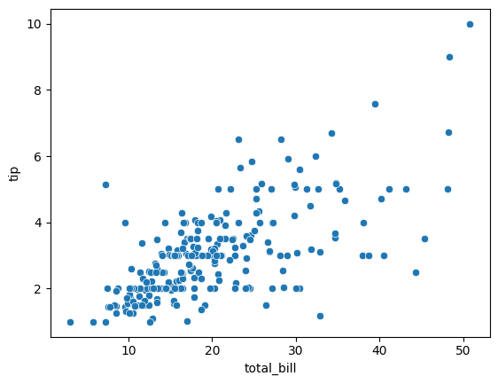
        
    - Line Plot :

        - What it shows: Trend over continuous x-axis (usually time).
        - Use when:
            - Time series data
            - Ordered numeric progression
            - You care about trends
        - Example: Sales over months.
        - Don’t use when:
            - X has no natural order
            - You want distribution → use histogram

        ```
        sns.lineplot(data=tips, x="size", y="tip")
        ```
        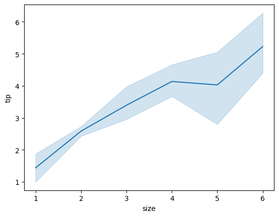

    - Relational Plot
        - What it shows: 
            - Figure-level version of scatter/line.
            - Supports faceting (multiple subplots).
        - Use when:
            - You want multiple subplots by category
            - Comparing trends across groups
        - Don’t use when:
            - Single simple plot → scatterplot() is simpler

        ```
        sns.relplot(data=tips, x="total_bill", y="tip", hue="smoker")
        ```
        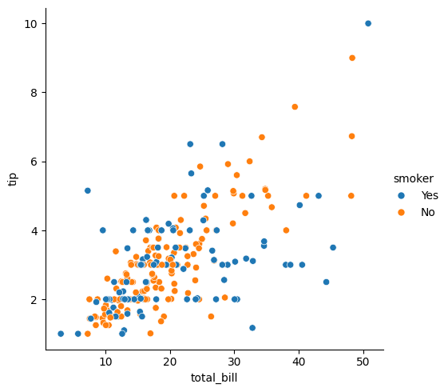

- Categorical Plots in Seaborn

    Tells about “How does a numeric variable behave across categories?”

    - Bar Plot 
        - What it shows:
            - Mean (by default) of numeric variable per category.
        - Use when: 
            - Comparing averages across categories
        - Example: Average salary by department.
        - Don’t use when:
            - You care about distribution → use boxplot or violin
            - You’re counting frequency → use countplot
        
        ```
        sns.barplot(data=tips, x="day", y="total_bill")
        ```
        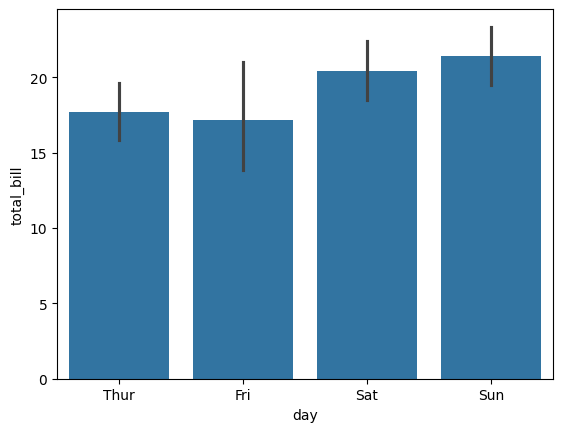

    - Count Plot

        - What it shows:
            - Number of observations per category.
        - Use when: You want frequency of categories
        - Example: Number of customers per city.
        - Don’t use when:
            You already calculated counts → use barplot
        
        ```
        sns.countplot(data=tips, x="day")
        ```
        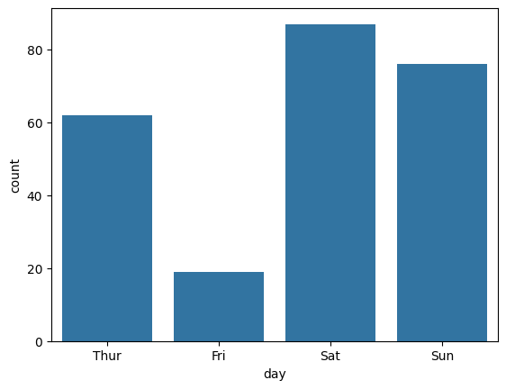

    - Box Plot
        - What it shows:
            Median, quartiles, outliers.
        - Use when:
            - You want distribution comparison
            - You care about outliers
            - Skewed data
        - Don’t use when:
            - Very small dataset
            - You want smooth distribution → violinplot
        
        ```
        sns.boxplot(data=tips, x="day", y="total_bill")
        ```
        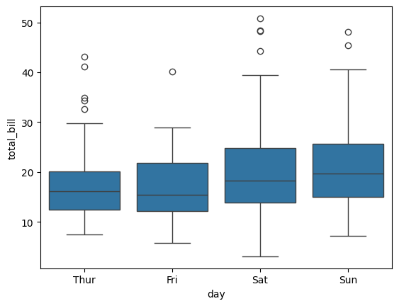

    - Violin Plot
        - What it shows: Full distribution shape + density.
        - Use when:
            - You want to see distribution shape
            - Comparing multiple categories
        - Don’t use when:
            - Small dataset (density misleading)
            - You only care about median → boxplot simpler
            
        ```
        sns.violinplot(data=tips, x="day", y="total_bill")
        ```
        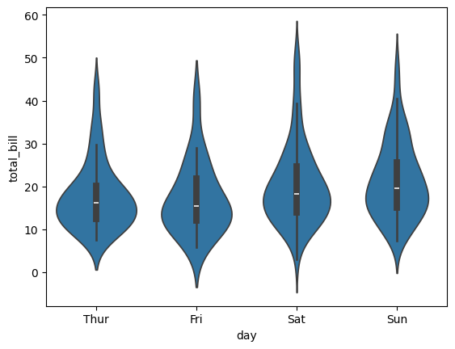

    - Strip Plot 
        - What it shows: All individual data points (with jitter as points overlap).
        - Use when:
            - Small datasets
            - You want to see every observation
        - Don’t use when:
            - Large dataset (overlapping mess)
            - Use boxplot instead
        
        ```
        sns.stripplot(data=tips, x="day", y="total_bill")
        ```
        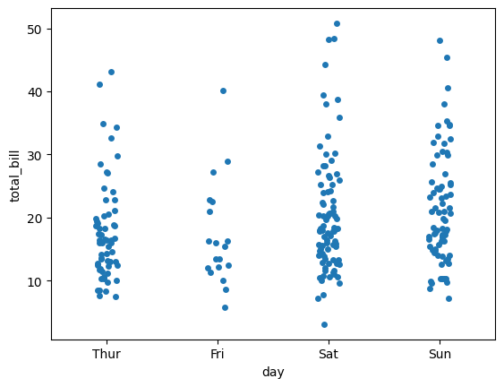
        
    - Swarm Plot
        - What it shows: Like stripplot but no overlapping points.
        - Use when:
            - Small to medium dataset
            - You want clean individual points
        - Don’t use when:
            - Large dataset (slow + cluttered)
        
        ```
        sns.swarmplot(data=tips, x="day", y="total_bill")
        ```
        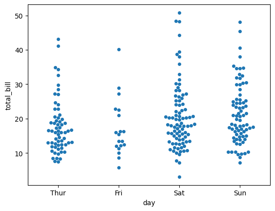
        
- Distribution Plots in Seaborn

    Tells about “How is one variable distributed?”
    - Histogram 
        - What it shows: Counts per bin.
        - Use when:
            - You want frequency distribution
            - Basic understanding of shape
        -  Don’t use when:
            - Comparing many groups → use KDE or violin
        
        ```
        sns.histplot(data=tips, x="total_bill")
        ```
        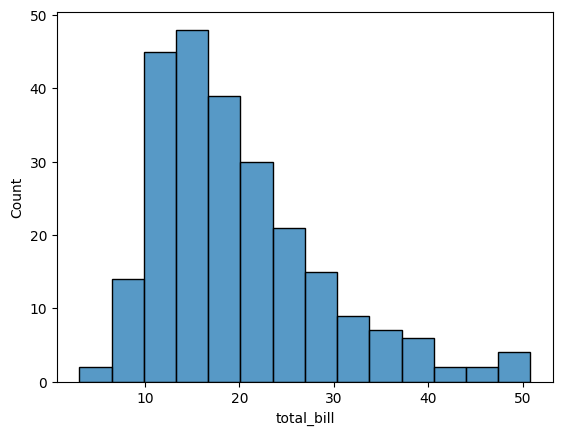

    - Kernel Density Estimate Plot
        - What it shows: Smooth probability density curve.
        - Use when:
            - You want smooth distribution shape
            - Comparing distributions
        - Don’t use when:
            - Very small data
            - Discrete integer data

        ```
        sns.kdeplot(data=tips, x="total_bill")
        ```
        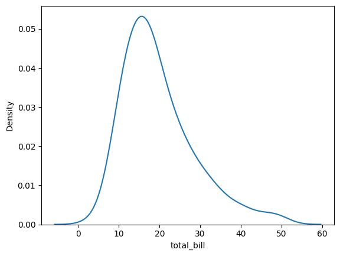
        
    - Distribution Plot
        
        Allows for visualization of univariate distributions. It can combine histograms, kernel density estimates, and rug plots to provide insights into the distribution of a single variable.
        ```
        sns.displot(data=tips, x="total_bill", kind="kde")
        ```
        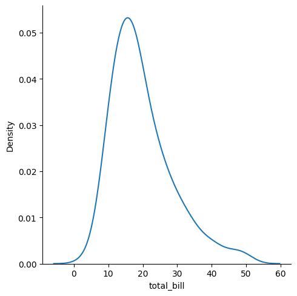
        
    - Empirical Cumulative Distribution Function Plot
        - What it shows: Cumulative proportion of observations.
        - Use when:
            - You want percentile information
            - Comparing distributions precisely
        -  Don’t use when:
            - You want shape → use histogram/KDE
        
        ```
        sns.ecdfplot(data=tips, x="total_bill")
        ```
        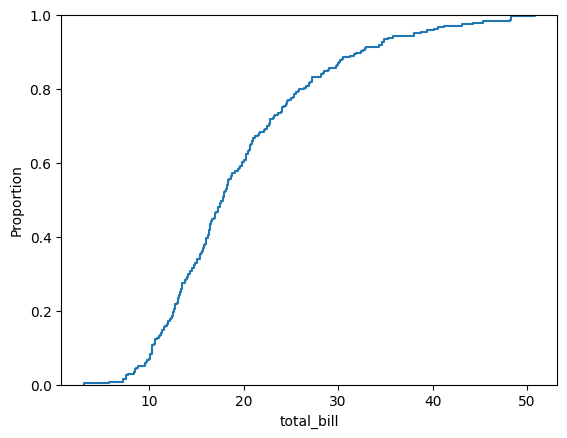
        
    - Rug Plot
        - What it shows: Small tick marks for each observation.
        - Use when:
            - Add to KDE/histogram
            - Show exact data points
        - Don’t use alone (not informative)
        
        ```
        sns.rugplot(data=tips, x="total_bill")
        ```
        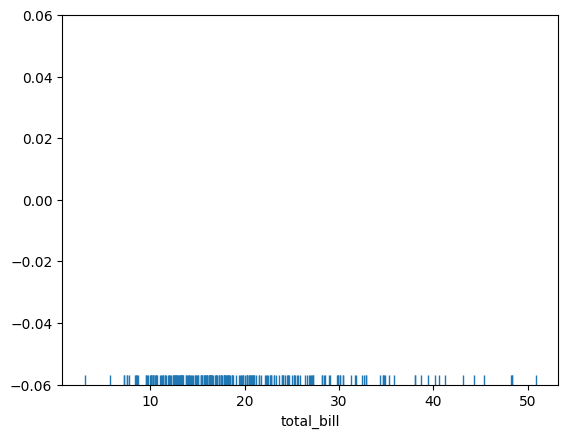
        
- Matrix Plots in Seaborn

    Tells about “How do many variables relate together?”
    - Heatmap
        - What it shows: 2D color-coded matrix, visualize the magnitude of values in a matrix.
        - Most common use: Correlation matrix.
        - Use when:
            - You want to see correlation quickly
            - Many numeric variables
        - Don’t use when:
            - Only 2 variables → scatter better

        ```
        sns.heatmap(flights_pivot, annot=True, fmt="d", cmap="YlGnBu")
        ```
        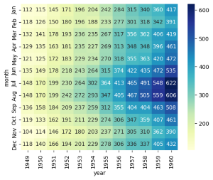
        
    - Cluster Map
        - What it shows: Heatmap + hierarchical clustering.
        - Use when:
            - You want to group similar variables
            - Genomics, ML feature grouping
        - Don’t use when:
            - You don’t care about clustering
        
        ```
        sns.clustermap(flights_pivot, cmap="viridis", standard_scale=1)
        ```
        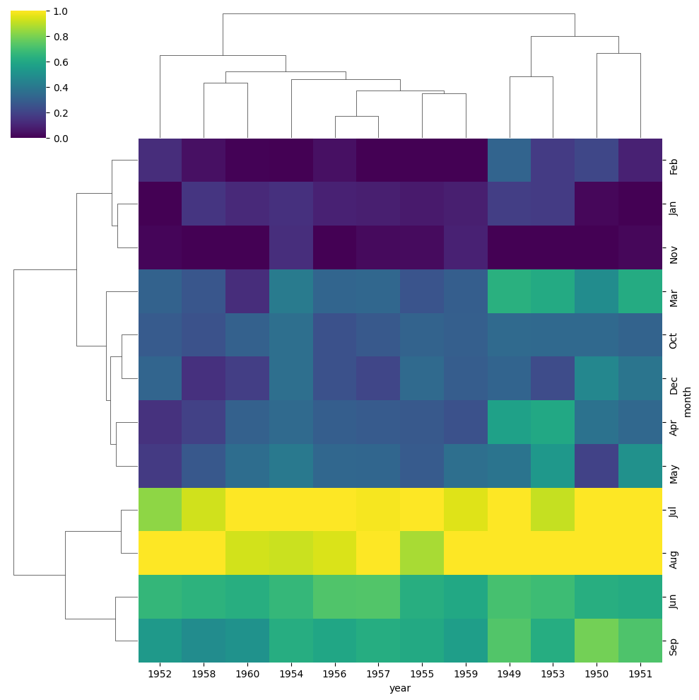
        
- Pair Grid in Seaborn
    - Pair Plot
        - What it shows: Scatterplot matrix of all numeric variables.
        - Use when:
            - Exploratory Data Analysis
            - Small to medium dataset
            - Want to detect relationships quickly
        - Don’t use when:
            - Many variables (becomes messy)
            - Very large dataset (slow)

        ```
        sns.pairplot(tips, hue="smoker", palette="coolwarm")
        ```
        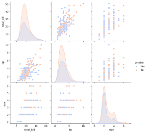

#### Quick Decision Guide
- See relationship → Scatter / Line

- Compare averages → Bar plot

- Compare distributions → Box / Violin

- Count categories → Count plot

- See one distribution → Histogram / KDE

- See correlations → Heatmap

- Explore everything quickly → Pairplot


## Statistical estimation and error bars

### Errorbar 
It is a parameter that allows you to visualize uncertainty or variability in your data around a central estimate (like the mean)

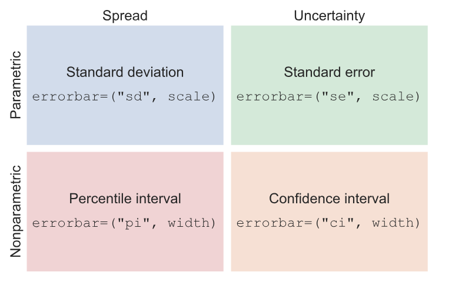

> For parametric error bars, it is a scalar factor that is multiplied by the statistic defining the error (standard error or standard deviation).

> For nonparametric error bars, it is a percentile width.

- Standard deviation error bars :
    
    It is the average distance from each data point to the sample mean. ```errorbar="sd"```

- Percentile interval error bars :

    Represents the range where some amount of the data fall, but they do so by computing those percentiles directly from your sample. ```errorbars=("pi", 50)```

- Standard error bars : 

    The standard error statistic is related to the standard deviation: in fact it is just the standard deviation divided by the square root of the sample size. ```errorbars ="se"```

- Confidence interval error bars ;

    The nonparametric approach to representing uncertainty uses bootstrapping: a procedure where the dataset is randomly resampled with replacement a number of times, and the estimate is recalculated from each resample. ```errorbar="ci"```

- Custom error bars :
    ```
    penguins = sns.load_dataset("penguins")
    cust_err = lambda x: (x.min(), x.max())
    sns.barplot(
        data=penguins,
        x="species",
        y="body_mass_g",
        errorbar=cust_err
    )
    ```

## Estimating regression fits
Many datasets contain multiple quantitative variables, and the goal of an analysis is often to relate those variables to each other.

### Functions for drawing linear regression models
- regplot() : axes level function (uses matplotlib.axes to draw)
    - What it does :
        - Draws a scatter plot
        - Fits a regression line
        - Shows a confidence interval (shaded area)
    - So you see:
        - The data points
        - The best-fit line
        - How confident the model is
    - Use regplot when:
        - You want quick regression visualization
        - You’re working inside a single matplotlib axis
        - You don’t need multiple subplots

    ```
    anscombe = sns.load_dataset('anscombe')
    sns.regplot(x="x", y="y", data=anscombe.query("dataset == 'II'"), order=2, ci=None, scatter_kws={"s": 80})
    ```

- lmplot() : Figure level function (uses matplotlib.Figure to draw)
    - What it does
        - Scatter plot
        - Regression line
        - Supports hue
        - Supports multiple panels (col, row)
        - It internally uses regplot.
    - Use lmplot when:
        - You need grouped regressions
        - You need faceting
        - You want automatic layout

    ```
    sns.lmplot(x="x", y="y", data=anscombe.query("dataset == 'III'"), order=12, ci=None, scatter_kws={"s": 80})
    ```

- residplot() :
    is a visualization tool used to evaluate the fit of a linear regression model by plotting the residuals (the differences between observed and predicted values) against an independent variable.


## Building structured multi-plot grids

1. Using FacetGrid for Conditional Plots
    used to visualize the same plot on different subsets of a dataset, typically conditioned by one or more categorical variables.

    Steps: 
        1. Initialize the grid using FacetGrid()
        2. Map a plotting function
    
    ```
    attend = sns.load_dataset("attention").query("subject <= 12")
    g = sns.FacetGrid(attend, col="subject", col_wrap=4, height=2, ylim=(0, 10))
    g.map(sns.pointplot, "solutions", "score", order=[1, 2, 3], color=".3", errorbar=None)
    ```

2. Using PairGrid for Pairwise Relationships
    Used to create a matrix of plots that visualize the pairwise relationships between multiple variables in a dataset.

    Steps:
        1. Initialize the grid using PairGrid()
        2. Map plotting functions

    ```
    iris = sns.load_dataset("iris")
    g = sns.PairGrid(iris, hue="species")
    g.map_diag(sns.kdeplot)
    ```

## Controlling figure aesthetics

### Seaborn figure styles
There are five preset seaborn themes: darkgrid, whitegrid, dark, white, and ticks.

```
sns.set_style('darkgrid')
```

## Choosing color palettes

### Qualitative color palettes
```
sns.color_palette() # gives the color pallete of specified values
```

Values: pastel, muted, bright, deep, colorblind, dark, rocket, mako, flare, crest, magma, viridis, rocket_r, cubehelix


