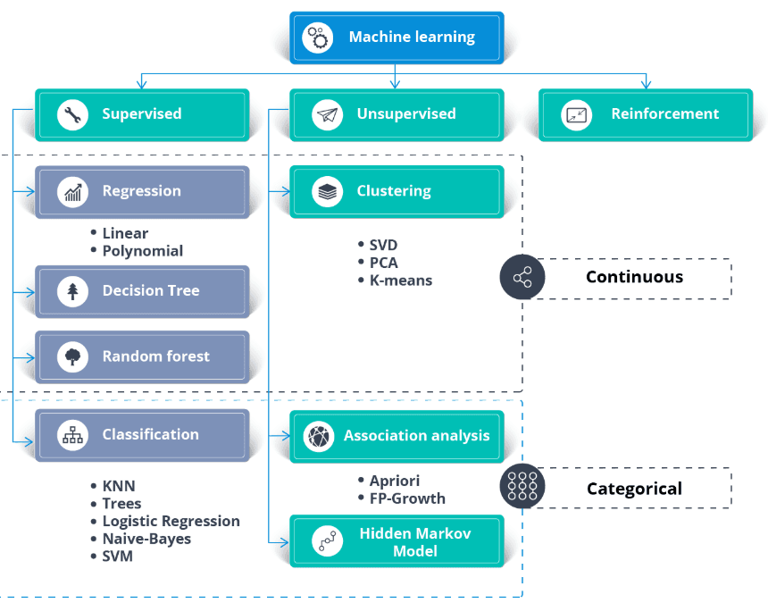
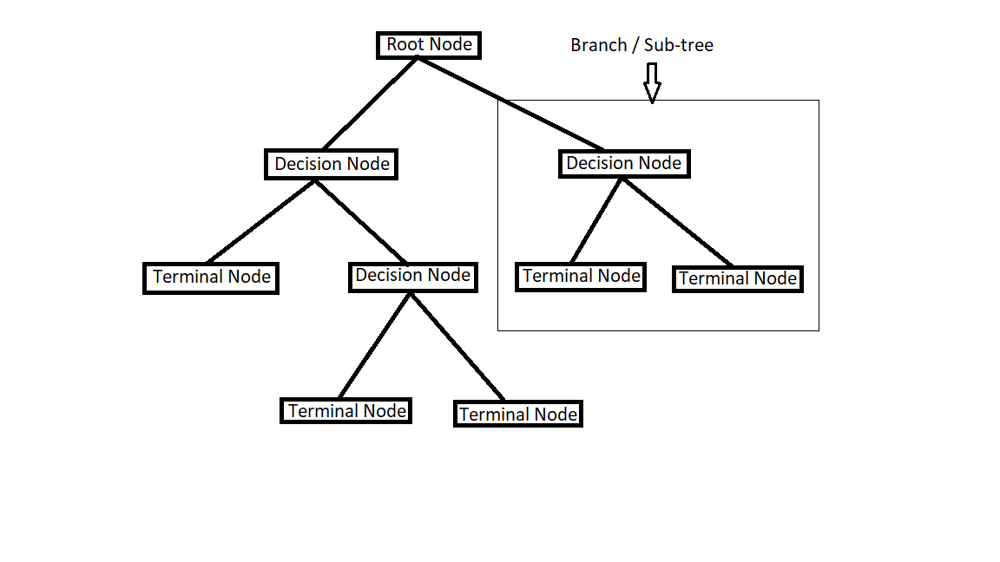

# Introduction to Machine Learning (ML)

ML is a subset of AI that enables computers to learn patterns and make predictions or decisions without being explicitly programmed for every task. 

Instead of following fixed rules, ML systems improve their performance by analyzing data.

Key concepts:
- Data: The foundation of ML. Can be structured (tables) or unstructured (images, text, audio).

- Model: A mathematical representation that learns from data.
- Training: The process where the model learns patterns from the data.
- Prediction/Inference: Using the trained model to make decisions on new data.

ML can broadly be classified into Supervised Learning, Unsupervised Learning, and Reinforcement Learning.



> Step of capturing patterns from data is called ***fitting*** or ***training the model***. 

## Supervised Learning
Supervised learning is when the ML model is trained on a labeled dataset, meaning each training example has an input and a corresponding output (the "label"). The model learns the mapping between inputs and outputs.

> Goal: Predict the output for new, unseen inputs.

### Examples of Supervised Learning:
- Predicting house prices based on size, location, etc. (Regression)
- Classifying emails as spam or not spam (Classification)

### Techniques/Algorithms:
- Linear Regression, Logistic Regression
- Decision Trees, Random Forests
- Support Vector Machines (SVM)
- Neural Networks


## Unsupervised Learning
Unsupervised learning is when the ML model is trained on unlabeled data. The model tries to find hidden patterns, structures, or relationships in the data without explicit output labels.

> Goal: Understand the structure of data or group similar data points.

### Examples of Unsupervised Learning:
- Customer segmentation in marketing (Clustering)
- Reducing dimensions of data for visualization (Dimensionality Reduction)
- Anomaly detection in transactions

### Techniques/Algorithms:
- K-Means Clustering
- Hierarchical Clustering
- Principal Component Analysis (PCA)
- Autoencoders


## Reinforcement Learning: 
An agent learns to make decisions by performing actions in an environment to maximize a reward signal. It relies on trial-and-error to learn optimal behaviors, used in robotics, gaming, and navigation.


## Semi-Supervised Learning: 
A hybrid approach using a small amount of labeled data and a large amount of unlabeled data. It is useful when labeling data is too expensive, but unlabeled data is plentiful.


## Self-Supervised Learning: 
A type of training where the model generates its own labels from input data, often used in large-scale natural language processing (NLP) and computer vision.


## Generative AI: 
Uses learned patterns to create new content, such as text, images, or music, based on data it has been trained on.

---


## Your First Machine Learning Model

### Selecting Data for Modeling
To choose variables/columns, we'll need to see a list of all columns in the dataset. That is done with the columns property of the DataFrame (the bottom line of code below). Ex: ```melbourne_data.columns```

### Choosing "Features"
The columns that are inputted into our model (and later used to make predictions) are called ***features***.

By convention, the data of features is called X.

Ex:
```
melbourne_features = ['Rooms', 'Bathroom', 'Landsize', 'Lattitude', 'Longtitude']
X = melbourne_data[melbourne_features]
X.describe()
```

### Building Your Model
Use the scikit-learn library to create your models.

The steps to building and using a model are:
- Define: 
    What type of model will it be? A decision tree? Some other type of model Some other parameters of the model type are specified too.

- Fit: 
    Capture patterns from provided data. This is the heart of modeling.
- Predict: 
    Just what it sounds like
- Evaluate: 
    Determine how accurate the model's predictions are.


    ```
    # defining a decision tree model with scikit-learn and fitting it with the features and target variable.

    from sklearn.tree import DecisionTreeRegressor

    # Define model. Specify a number for random_state to ensure same results each run
    melbourne_model = DecisionTreeRegressor(random_state=1)

    # Fit model
    melbourne_model.fit(X, y)
    ```

Many machine learning models allow some randomness in model training. Specifying a number for random_state ensures you get the same results in each run. This is considered a good practice. You use any number, and model quality won't depend meaningfully on exactly what value you choose.

-> Randomness in ML models:
Randomness in machine learning is the intentional introduction of stochastic (random) processes during training—such as weight initialization, data shuffling, or feature sampling—to improve model generalization, reduce overfitting, and increase robustness against noise.


## Model Validation
Model validation is the process of evaluating how well a machine learning model performs. The goal is to estimate how accurately the model will make predictions on new, unseen data.

Evaluation must be done on data that was not used during training.

### Problem with Evaluating on Training Data
If you test the model on the same data used to train it:
- The model will appear very accurate.
- This happens because it has already learned patterns from that data.
- However, the model may perform poorly on real-world data.
- This leads to overfitting, where the model memorizes training data rather than learning general patterns.

The measure we just computed can be called an "in-sample" score.

The scikit-learn library has a function ```train_test_split``` to break up the data into two pieces. 

We'll use some of that data as training data to fit the model, and we'll use the other data as validation data to calculate mean_absolute_error.

#### Train-Test Split in Python
```
from sklearn.model_selection import train_test_split
train_X, val_X, train_y, val_y = train_test_split(X, y, random_state=0)
```

Here’s what each variable means:
```
train_X:	Training input features	Data used to train the model
train_y:	Training target values (labels)	Correct answers for training
val_X:	    Validation input features. Data used to test the model
val_y:  	Validation target values(true outputs). Correct answers to evaluate predictions
```

- Train the model using train_X and train_y.
- Predict using val_X.
- Evaluate predictions with an error metric.

##### Mean Absolute Error (MAE)
MAE measures the average prediction error, where lower values mean better predictions.

Formula: ```𝑀𝐴𝐸=(1/𝑁)∑ ∣𝐴𝑐𝑡𝑢𝑎𝑙 − 𝑃𝑟𝑒𝑑𝑖𝑐𝑡𝑒𝑑∣```

```
from sklearn.metrics import mean_absolute_error
mean_absolute_error(val_y, predictions)
```

## Underfitting and Overfitting in ML
Machine learning models should learn useful patterns from training data. When a model learns too little or too much, we get underfitting or overfitting.

### Underfitting 
Underfitting means that the model is too simple and does not cover all real patterns in the data.

Underfitting mainly occurs due to high bias:
- High bias means model makes strong assumptions
- Ignores patterns  
- Learns an overly simple representation
- Variance is low because the model gives similar outputs even if the data changes

### Overfitting 
Overfitting means that the model learns not just the underlying pattern, but also noise or random quirks in the training data. model memorizes training data

Overfitting is mainly caused by high variance:
- High variance means model reacts too strongly to training data
- Learns noise as patterns
- Low bias because the model is extremely flexible
- Overfitting = Low Bias + High Variance

> A good model finds the right spot, it is complex enough to capture real patterns, but not so complex that it “memorizes” noise

#### Bias-Variance Tradeoff
The relationship between bias and variance is often referred to as the bias-variance tradeoff, which highlights the need for balance:

- Increasing model complexity reduces bias but increases variance (risk of overfitting).
- Simplifying the model reduces variance but increases bias (risk of underfitting).
- The goal is to find an optimal balance where both bias and variance are minimized, resulting in good generalization performance.


## Random Forests
A deep tree with lots of leaves will overfit but a shallow tree with few leaves will perform poorly because it fails to capture as many distinctions in the raw data.

The random forest uses many trees, and it makes a prediction by averaging the predictions of each component tree. 

It generally has much better predictive accuracy than a single decision tree and it works well with default parameters. 

---

# Supervised Learning Techniques

### Additional note
-> mean_absolute_error() is for regression models
-> accuracy_score() is for classification models

### Terms:
- Independent Variables (Features/Inputs/Predictors) : 
    
    These are the variables that are not influenced by other variables in the dataset and are used to influence the output. Examples include house size, number of rooms, or age.

- Dependent Variable (Target/Output/Label) : 

    This variable depends on other factors and is the outcome the model aims to predict, such as a house price or whether a patient has a disease.

## Simple Linear Regression
Linear regression is a supervised learning model which is used to analyze continuous data. 

It is a data plot that graphs the linear relationship between independent and dependent variables.

Features are called independent variables and outcome or label is known as dependent variables which are dependent on features.

Example : ```y=a+bx+e```

where,
- y=dependent variable(outcome)
- x=independent variable(feature)
- a=intercept
- b=slope
- e=model error

Training model means finding slope and intercept. With that slope and intercepts model will predict y with a change in x.

Code:
```python
# importing dependencies
import pandas as pd
from sklearn.datasets import fetch_california_housing
from sklearn.linear_model import LinearRegression
from sklearn.model_selection import train_test_split
from sklearn.metrics import mean_absolute_error

# fetching data and setting feature, target 
data = fetch_california_housing()
df = pd.DataFrame(data=data.data, columns=data.feature_names)
df['Price'] = data.target
X = df[["MedInc"]] # feature
y = df["Price"] # target

# spliting data into test and validation set
train_X, val_X, train_y, val_y = train_test_split(X, y, random_state=1)

# training linear reg model
model = LinearRegression()
model.fit(train_X, train_y)

# making prediction
predictions = model.predict(val_X)

# model evaluation
mae = mean_absolute_error(val_y, predictions)
print("MAE", mae)

print("Slope: ", model.coef_[0])
print("Intercept: ", model.intercept_)
```

## Multi-Linear Regression
Multilinear regression is almost similar to simple linear regression except, here model takes multiple feature variables to predict the target variable.

Example: ```y= b0 + b1 x1 + … + bn xn + e```

Where,
- y=Dependent variable
- b0=y-intercept
- b1x1=Regression coefficient(b1) of independent variable x1
- bnxn=Regression coefficient(bn) of independent variable xn
- e=Model Error

Code:
```python
# multi-linear reg

import pandas as pd
from sklearn.linear_model import LinearRegression
from sklearn.datasets import fetch_california_housing
from sklearn.model_selection import train_test_split
from sklearn.metrics import mean_absolute_error

data = fetch_california_housing()

df = pd.DataFrame(data=data.data, columns=data.feature_names)
df["Price"] = data.target

X = df[["MedInc", "HouseAge", "AveRooms", "AveBedrms"]] # feature
y = df["Price"] # target

train_X, val_X, train_y, val_y = train_test_split(X, y, random_state=1)

model = LinearRegression()
model.fit(train_X, train_y)

predictions = model.predict(val_X)

print("MAE: ", mean_absolute_error(val_y, predictions))
```

## Logistic Regression
The logistic regression model is a supervised learning model which is a generalization of a linear regression model, which is mainly used for categorical data. 

By the name regression in it, many used to think of it as a Regression algorithm but it is a classification algorithm.

Code: 
```python
import pandas as pd
from sklearn.datasets import load_breast_cancer
from sklearn.model_selection import train_test_split
from sklearn.linear_model import LogisticRegression
from sklearn.metrics import accuracy_score

data = load_breast_cancer()
df = pd.DataFrame(data.data, columns=data.feature_names)
df["target"] = data.target

X = df[["mean radius","mean texture"]]
y = df["target"]

train_X, val_X, train_y, val_y = train_test_split(X, y, random_state=1)

model = LogisticRegression()
model.fit(train_X, train_y)

predictions = model.predict(val_X)

print("Accuracy:", accuracy_score(val_y, predictions))
```

## Decision Tree 
A decision tree is a supervised Machine learning technique. 

A decision tree algorithm is used for both regression and classification type problems.



* Decision Node: 
    When sub-node divides into sub-nodes, then it is called decision node.

* Leaf/Terminal Node: 
    Node with no children.

* Pruning: 
    The process of reducing the size of the decision tree by removing nodes.

* Entropy: 
    Entropy is the measure of the randomness of elements. It is the measure of uncertainty in the given set.

    If entropy = 0, then the sample is completely homogeneous.

* Information gain: 
    Information gain measures how much “Information” a feature variable gives us about the class. Decision tree algorithms always try to maximize Information gain.

    An attribute with the highest information gain will be split first.

    Information gain = Entropy(parent) – (average weight) * Entropy(children)

    For decision tree out of all features, which will be the root node, which will be the next decision node??? This will be decided by entropy. Attributes with the highest information gain will be split first.

Code:
```python
from sklearn.datasets import load_iris
from sklearn.model_selection import train_test_split
from sklearn.tree import DecisionTreeClassifier
from sklearn.metrics import accuracy_score

data = load_iris()
df = pd.DataFrame(data=data.data, columns=data.feature_names)
df["target"] = data.target

X = df[data.feature_names]
y = df["target"]

train_X, val_X, train_y, val_y = train_test_split(X, y, random_state=1)

model = DecisionTreeClassifier()
model.fit(train_X, train_y)
predictions = model.predict(val_X)

print("Accuracy: ", accuracy_score(val_y, predictions))
from sklearn.tree import plot_tree
import matplotlib.pyplot as plt

plt.figure(figsize=(12, 8))
plot_tree(model, feature_names=data.feature_names, class_names=data.target_names, filled=True)
plt.show()
```

## Support Vector Machine(SVM)
A Support Vector Machine (SVM) is a supervised machine learning algorithm used for classification and regression. It works by finding the best boundary (hyperplane) that separates different classes of data.

#### Key Idea :
SVM tries to find a line (in 2D) or a plane (in higher dimensions) that maximizes the margin between two classes.

- Hyperplane → decision boundary separating classes
- Margin → distance between the boundary and nearest data points
- Support Vectors → the closest data points that define the margin

```python
import pandas as pd
from sklearn.datasets import load_iris
from sklearn.model_selection import train_test_split
from sklearn.svm import SVC
from sklearn.metrics import accuracy_score

data = load_iris()

df = pd.DataFrame(data.data, columns=data.feature_names)
df["target"] = data.target

X = df[data.feature_names]
y = df["target"]

train_X, val_X, train_y, val_y = train_test_split(X, y, random_state=1)

model = SVC()
model.fit(train_X, train_y)

predictions = model.predict(val_X)
print("Accuracy:", accuracy_score(val_y, predictions))
```

## K Nearest neighbours (KNN) 
K Nearest Neighbors(KNN) is a supervised Machine Learning algorithm that can be used for regression and classification type problems. 

KNN algorithm is used to predict data based on similarity measures from past data.

k = number of nearest neighbours.

EQ: ```d = √[(x2 – x1)^2 + (y2 – y1)^2]```

#### Key Idea
KNN predicts the class of a new data point by looking at the K closest data points (neighbors) in the training dataset.

##### Steps:
- Choose K (number of neighbors).
- Calculate distance from the new point to all training points.
- Select the K nearest neighbors.
- The majority class among those neighbors becomes the prediction.

##### Example (K = 3):
```
New point → ?
Nearest neighbors → A, A, B
Prediction → A
```

Code:
```python
import pandas as pd
from sklearn.datasets import load_iris
from sklearn.model_selection import train_test_split
from sklearn.neighbors import KNeighborsClassifier
from sklearn.metrics import accuracy_score

data = load_iris()

df = pd.DataFrame(data=data.data, columns=data.feature_names)
df["target"] = data.target

X = df[data.feature_names] #feature
y = df["target"] # target

train_X, val_X, train_y, val_y = train_test_split(X, y, random_state=1)

model = KNeighborsClassifier(n_neighbors=3)

model.fit(train_X, train_y)

predictions = model.predict(val_X)

print("Accuracy:", accuracy_score(val_y, predictions))
```

## Supervised Model Use

1️⃣ Regression (Predict Numbers)
| Model                                 | When to Use                                                                                           |
| ------------------------------------- | ----------------------------------------------------------------------------------------------------- |
| **Linear Regression**                 | When the relationship between features and target is roughly **linear**. Simple and fast.             |
| **Multiple Linear Regression**        | Like linear regression but with **more than one feature**. Still works best for linear relationships. |
| **Decision Tree Regressor**           | When the data has **non-linear patterns** or thresholds (e.g., if-then rules).                        |
| **Random Forest / Gradient Boosting** | When you need **better accuracy** for complex non-linear data. Works well with lots of features.      |

<br>

2️⃣ Classification (Predict Categories)
| Model                        | When to Use                                                                                                                                |
| ---------------------------- | ------------------------------------------------------------------------------------------------------------------------------------------ |
| **Logistic Regression**      | When the target has **2 categories** (yes/no, spam/not spam) and the relationship is mostly linear.                                        |
| **Decision Tree Classifier** | When rules can be expressed as **if-else conditions**. Works with non-linear patterns.                                                     |
| **Random Forest Classifier** | Like decision tree but **more accurate** and less overfitting.                                                                             |
| **SVM**                      | When you want **clear margin between classes**, works well with **small to medium datasets**. Can handle non-linear patterns with kernels. |
| **KNN**                      | When prediction depends on **similarity to neighbors**. Simple, but slower on big datasets.                                                |


###  Quick Cheat Sheet
- Regression → numbers
- Linear relationship → Linear Regression
- Non-linear → Decision Tree / Random Forest / Gradient Boosting
- Classification → categories
- 2 classes, linear → Logistic Regression
- Non-linear / rules → Decision Tree / Random Forest
- Clear boundary → SVM
- Based on similarity → KNN


# Unsupervised Learning Techniques

- K means clustering
- PCA
- hierarchical Clustering
- DBSCAN Clustering
- Silhoutte Clustering


