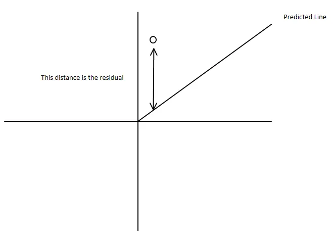
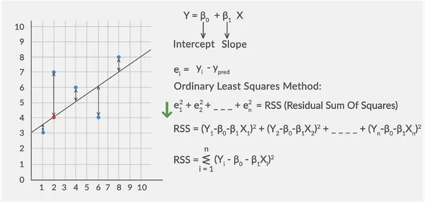
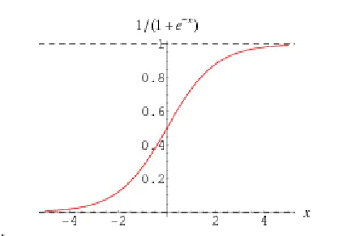

# An intuitive approach to Supervised Learning

## Linear regression
A linear regression assumes to model a linear relationship between the input variables (x) and the output variable (y).

A linear regression line has an equation of the form Y = a + bX, where X is the input/explanatory variable and Y is the dependent variable/output. The slope of the line is b, and a is the intercept (the value of y when x = 0).

### SIMPLE LINEAR REGRESSION

A simple linear regression is a linear regression model with a single input/explanatory variable.

In regression models, the independent variables are also referred to as regressors or predictor variables.

The slope and the intercept are also known as the regression coefficients.

### Fitted Regression Line
The fitted line is obtained by finding the co-coefficients which minimize the Residual sum of Squares( RSS). 

RSS is a statistical technique used to measure the amount of variance unexplained by the regression model. It is also known as Mean Squared Error.

> MSE (Mean Squared Error) is better when large errors are unacceptable and require heavy penalties, while MAE (Mean Absolute Error) is preferred for robustness against outliers, offering better interpretability.

#### Cost function (MSE)
If line is $h_o(x) = \theta_0 + \theta_1 x$ , then cost function is
```math
j(\theta_0, \theta_1) = 1/2m * \sum_{i=1}^{m} (h_0(x)^i - y^i)^2 
```

here, $\theta_0$ is intercept and $\theta_1$ is slope, $h_0(x)^i$ is predicted point and $y^i$ is real point and m is no of data points.

Linear regression fits a line by minimizing MSE. It finds the optimal slope and intercept by iteratively reducing this error—often using gradient descent—until the line best represents the data trend.

#### Convergence algorithm
A convergence algorithm in linear regression, often implemented via Gradient Descent, is an iterative procedure that adjusts model parameters (slope and intercept) to minimize the cost function (error) until they reach a stable, optimal value.

**Gradient Descent (Iterative)** 
Gradient Descent is an iterative optimization algorithm that finds the best parameters (weights and bias) for a linear regression model by minimizing the cost function, typically the Mean Squared Error (MSE). 

The process involves repeatedly taking steps proportional to the negative of the gradient of the function at the current point, effectively "descending" the error curve until it reaches the lowest point (global minimum).

>Updates param using : 

For slope m : $m := m - \alpha . \partial J / \partial m$
For intercept b : $b := b - \alpha . \partial J / \partial b$

> Here $\alpha$ is called as learning rate

 

#### Total, Explained, and Residual Sum of Squares

- Explained sum of squares: 
    Sum of the squared differences between the predicted Y and the mean of Y, or, 
    
    ```math
    ESS = \sum_{i=1}^{n} (\hat{Y}_i - \bar{Y})^2
    ```

    Intuition: ESS tells us how much of the variation in the dependent variable has been explained by our model

- Residual sum of squares: 
    Sum of squared differences between the actual Y and the predicted Y, or,
    
    ```math
    RSS = \sum_{i=1}^{n} (Y_i - \hat{Y}_i)^2
    ```

    Intuition: RSS tells us how much of the variation in the dependent variable our model did not explain.

- Total sum of squares: 
    Sum of the squared difference between the actual Y and the mean of Y, or TSS = ESS + RSS

    ```math
    \sum_{i=1}^{n} (Y_i - \bar{Y}_i)^2 = \sum_{i=1}^{n} (Y_i - \hat{Y}_i)^2 + \sum_{i=1}^{n} (\hat{Y_i} - \bar{Y})^2
    ```

##### The coefficient of determination or R-squared : 
R-squared tell us what proportion of the variance has been explained by our model, it is a value between 0 and 1 , the higher the value , the better the fit.
```math
R^2= ESS/TSS
```

#### Asssumptions of a linear regression model
- Linearity: 
- Homoscedasticity: The variance of residual is the same for any value of X.
- Independence: Observations are independent of each other.
- Normality: For any fixed value of X, Y is normally distributed.

### Performance metrics in linear regression

- R squared :
    $R^2 = 1 - (SS_{residuals} / SS_{total})$

    Problem: it always increases when adding predictors (even irrelevant ones), encouraging overfitting

- Adjusted r square :
    Penalise with every irrelevant features or predictors with output feature
    ```math
    Adjusted R Square = 1 - (1-R^2)(N-1)/(N-P-1)
    ```
    where N=no of data points and  p = no of independent features

    Advantages:
    - Penalizes Model Complexity
    - Balances Explained Variance and Model Parsimony

    Disadvantages:
    - Complex Interpretation
    - Assumes Linear Relationship

- MSE : 
    ```math
    MSE = \sum_{i=1}^w (y - \hat{y})^2/n
    ```
    Advantages : 
    - Emphasis on Larger Errors
    - Mathematical Convenience
    
    Disadvantages : 
    - Sensitive to Outliers
    - Interpretation Challenge

- MAE : 
    ```math
    𝑀𝐴𝐸=(1/𝑁)∑ ∣𝐴𝑐𝑡𝑢𝑎𝑙 − 𝑃𝑟𝑒𝑑𝑖𝑐𝑡𝑒𝑑∣
    ```
    Advantages : 
    - Robustness to Outliers
    - Intuitive Interpretation
    
    Disadvantages : 
    - Lack of Sensitivity to Prediction Magnitude
    - Not Differentiable at Zero

- RMSE (Root Mean Squared Error):
    ```math
    RMSE = \sqrt{MSE}
    ```
    Advantages:
    - Similar Scale to Target Variable
    - Greater Penalty for Large Errors

    Disadvantages:
    - Outlier Sensitivity
    - Complexity in Interpretation


## Multi-Linear Regression
Multiple Linear Regression finds the projection of the target vector onto the feature space that minimizes squared distance.

#### The Idea
Suppose we want to **predict a student's exam marks**.

But marks may depend on many things:
* hours studied
* hours slept
* number of practice questions

So we try to make a **formula** like this:
[
Marks = a + b_1(Study\ Hours) + b_2(Sleep) + b_3(Practice)
]

This idea is called **Multiple Linear Regression**.

So **many factors → one prediction**.

---

#### What the Model Is Trying To Do

Imagine we have real data:

| Study | Sleep | Practice | Marks |
| ----- | ----- | -------- | ----- |
| 2     | 6     | 5        | 50    |
| 4     | 7     | 10       | 70    |
| 6     | 7     | 12       | 85    |

We want a formula that **best matches these marks**. But predictions will never be perfect. So we choose numbers that make the **mistakes as small as possible**.

Example:
Actual marks = 70
Predicted marks = 68

Error = **2 marks**

The algorithm tries to **make all errors small**.

---

#### A Simple Visual Idea
Think of plotting points.

With one feature:
* points lie near a **line**

With two features:
* points lie near a **plane**

With many features:
* points lie near a **higher-dimensional surface**

Multiple regression finds the **best surface** passing through the data.

---

#### What Math Is Actually Doing (Simple Idea)
Math tries many combinations of numbers until it finds the ones that make predictions **closest to the real data**.

It does this by minimizing:
```
(predicted marks − real marks)²
```
Squaring just means **big mistakes get punished more**.

Multiple Linear Regression finds a **formula that mixes many factors to predict something as accurately as possible**.


## Logistic Regression
Logistic regression is a statistical model that in its basic form uses a logistic function to model a binary dependent variable, although many more complex extensions exist.

Logistic Regression is used when the dependent variable(target) is categorical. For example, To predict whether an email is spam (1) or (0).

Logistic regression is still called a "regression" because it calculates a continuous, numerical probability score (ranging from 0 to 1) for an outcome rather than directly predicting a discrete class label.

#### The sigmoid function 
It is a core component of logistic regression that maps any real-valued number to a probability value between 0 and 1.  
```math
\sigma(x) = 1/(1+e^{-x})
```
where x is $\theta_0 + \theta_1 x_1$



In probability: odds (Ratio of success to failure)
```math
odds = P / 1 - P
```

Log-Odds (Logit) : Logistic regression actually models the log of the odds.
```math
log(P / 1 - P)
```

This transformation converts probabilities into a linear relationship with input variables.


Probabilities always range between 0 and 1 but the odds are not constrained to lie between 0 and 1 but can take any value from zero to infinity.

It’s time… to transform the model from linear regression to logistic regression using the logistic function.

The logit transformation transforms a line to a logistic curve. Logistic regression fits a logistic curve to set of data where the dependent variable can only take the values 0 and 1. It can be generalized to fitting ordinal data.

---

##### Cost Function
Unlike linear regression, logistic regression does not use mean squared error.

Because the sigmoid function makes the loss non-convex, which causes optimization problems.

The algorithm may get stuck at local minima as we are using a non-linear sigmoid function and then squaring it. MLE is used to derive a better cost function.

Instead it uses Maximum Likelihood Estimation (MLE) to derive a better cost function.

MLE chooses parameters that maximize the probability of observing the given data.

```math
Cost(h_θ(x),y)=−y⋅log(h_θ(x))−(1−y)⋅log(1−h_θ(x))
```
where, 
- $h_θ(x)$ : Predicted probability using sigmoid
- y: Actual value (0 or 1)

### Maximum Likelihood Estimation
MLE is a method used to find the best parameters of a model.

The idea is simple: Choose parameters that make the observed data most likely to happen.

So instead of minimizing error directly, we ask:
    “Which parameters make the data we observed most probable?”

Likelihood becomes:
```math
𝐿 = ∏ 𝑝^𝑦(1−𝑝)^{1−𝑦}
```
This is called the Bernoulli likelihood.

The log-likelihood formula in machine learning measures how well model parameters $\theta$ explain observed data x by taking the natural logarithm of the likelihood function.

It converts product-based likelihoods of independent events into sums, simplifying calculus for Maximum Likelihood Estimation (MLE):
 
```math
LL(\theta) : log L(\theta) = \sum_{i_1}^n log(x_i | \theta)
```

### Model Evaluation /  Performance metrics
 
#### Confusion Matrix :
A confusion matrix is a table that is often used to describe the performance of a classification model (or “classifier”) on a set of test data for which the true values are known.

Important metrics:
- Precision
- Recall
- Specificity

-> Which metric matters depends on the problem.
Example :
- Medical diagnosis → minimize false negatives
- Criminal justice → minimize false positives

```
| TP | FP | 
| FN | TN |
```

#### Accuracy
```math
Accuracy = TP + TN / (TP + TN + FP + FN)
```

#### Precision
```math
Precision = TP / (TP + FP)
```

#### Recall
```math
Recall = TP / (TP + FN)
```

#### F - Beta Square
```math
FBS = (1+ \beta^2) (Precision * Recall) / (Precision + Recall)
```

#### ROC Curve and AUC

ROC(Receiver Operating Characteristics) curve plots:
- True Positive Rate Vs False Positive Rate i.e. Sensitivity vs (1-Specificity)
```math
1 - Specificity = FP / (TN + FP)
```

The AUC (Area Under Curve) measures model quality.
- AUC ≈ 0.5 → random guessing
- AUC close to 1 → strong model.


## Decision Tree
It works for both categorical and continuous (regression) input and output variables. 

In this technique, we split the population or sample into two or more homogeneous sets (or sub-populations) based on most significant splitter / differentiator in input variables.

#### Important Terminology related to Decision Trees
* Root Node: 
    It represents entire population or sample and this further gets divided into two or more homogeneous sets.
* Splitting: 
    It is a process of dividing a node into two or more sub-nodes.
* Decision Node: 
    When a sub-node splits into further sub-nodes, then it is called decision node.

* Leaf / Terminal Node: 
    Nodes do not split is called Leaf or Terminal node.
* Pruning: 
    When we remove sub-nodes of a decision node, this process is called pruning.
* Branch / Sub-Tree: 
    A sub section of entire tree is called branch or sub-tree.
* Parent and Child Node: 
    A node, which is divided into sub-nodes is called parent node of sub-nodes where as sub-nodes are the child of parent node.


### How does Decision Tree work?
There are multiple algorithms written to build a decision tree, which can be used according to the problem characteristics you are trying to solve.

Example:
- ID3
- C4.5
- CART (binary tree)
- CHAID (Chi-squared Automatic Interaction Detector)


#### How the Tree Decides Where to Split?
The main goal is to create groups that are as pure as possible (i.e., mostly one class).

To choose the best split, the algorithm measures impurity using metrics such as:
- Entropy
- Information Gain
- Gini impurity

The feature that reduces impurity the most becomes the next split.

Entropy measures how mixed the data is.
```
High entropy → mixed classes (uncertain)
Low entropy → mostly one class (pure)
```
```math
Entropy (S) = \sum_{i=1}^c - p_i . log_2 . p_i
```

The tree tries to reduce entropy at every split.

Information Gain = reduction in entropy after splitting.
```math
Gain(S, f_1) = H(S) - \sum_{v \in val} (|S_v| . H) / |S|
```
where, 
* IG(T, A) is the Information Gain from splitting dataset 
 on attribute .
* H(T) is the Entropy of the original dataset (parent node) before the split.
* Values(A) is the set of all possible values for attribute.
* $T_v$ is the subset of dataset where attribute has the value.
* H($T_v$) is the entropy of the subset 
 (child node) after the split. 


Gini impurity is a metric used in the decision tree algorithm to measure the likelihood of an incorrect classification of a randomly chosen element from a dataset.
```math
G = 1 - \sum_{i=1}^c (p_i)^2
```
Where:
- `c` is the total number of classes.
- $p_i$ is the proportion (or probability) of instances belonging to class 
 within that specific node. 

Entropy vs Gini Impurity:
- Small dataset -> Entropy
- Big dataset -> Gini Impurity

### Advantages of Decision Trees
- Easy to understand and visualize
- Works with both numerical and categorical data
- Requires little preprocessing
- Can capture non-linear relationships

### Limitations
Decision trees also have drawbacks:
- They can overfit the training data (become too complex).
- Small changes in data may produce a very different tree.
- Because of this, techniques like pruning or ensemble methods (e.g., random forests) are often used.

### Pruning
Pruning is a technique in machine learning that reduces the size of decision tree by removing sections of the tree that provide little power to classify instances.

- Pre Pruning: 
    - For large dataset
    - we prune the branches then construct decision tree
- Post Pruning: 
    - For Small dataset
    - We construct decision tree then prune the branches 

### Decision Tree Regression
Variance reduction is the primary criterion used to select the optimal feature and split point at each node. The goal is to partition the data into subsets (child nodes) that are more homogeneous, i.e., have lower internal variance, than the parent node.

##### The Variance Equation
```math
Var(T) = 1/n \sum_{i=1}^n (y_i - \bar{y})^2
```

## Random Forest
A random forest is a supervised machine learning algorithm that builds multiple decision trees and merges their predictions to get a more accurate and stable result.

### Bagging and boosting
Bagging and boosting are ensemble machine learning techniques that improve predictive performance by combining multiple models. 

> Bagging (Bootstrap Aggregating) reduces variance by training models in parallel on random subsets, commonly used in Random Forests. 

#### Key Aspects of Bagging:
- Bootstrap Sampling: Data points can be used multiple times or not at all in each subset.

- Independent Training: Models are trained in parallel, not sequentially, allowing for faster computation.

- Aggregation: For classification, the majority vote is taken; for regression, the average is calculated.

- Reduction of Variance: By averaging, the impact of outliers and noise in the training set is reduced, leading to better generalization.

> Boosting reduces bias by sequentially training models to correct errors from previous ones.

##### Key Concepts and Types of Boosting:
- Weak Learners: These are simple models that perform slightly better than random guessing (e.g., a decision tree with only one split).

- Sequential Training: Models are built one after another, making the process dependent and generally slower than parallel methods like bagging (used in Random Forests).

- Bias Reduction: Boosting primarily aims to reduce bias (systematic error) by consistently correcting previous mistakes, leading to a highly accurate overall model.

- Algorithms: Popular boosting algorithms include:
    - AdaBoost (Adaptive Boosting): The first practical boosting algorithm, which re-weights data points based on misclassification.
    
    - Gradient Boosting Machine (GBM): Uses gradient descent to minimize a loss function by fitting new models to the residual errors.
    
    - XGBoost (Extreme Gradient Boosting): An optimized and highly efficient implementation of gradient boosting that includes regularization and supports parallel processing for speed and scalability.


## Support Vector Machine(SVMs)
Support Vector Machines (SVMs) are a type of supervised machine learning algorithm used for classification and regression tasks. 

They are widely used in various fields, including pattern recognition, image analysis, and natural language processing.

SVMs work by finding the optimal hyperplane that separates data points into different classes.

### Idea of the Best Decision Boundary
When separating two classes, many possible lines (or boundaries) can divide the data.

SVM chooses the boundary that maximizes the margin (distance from the nearest points of both classes).

Key concepts:
- Hyperplane : 
    A hyperplane is a decision boundary that separates data points into different classes in a high-dimensional space.

    In N-dimensional space, a hyperplane has (N-1)-dimensions.

- Margin : 
    A margin is the distance between the decision boundary (hyperplane) and the closest data points from each class. The goal of SVMs is to maximize this margin while minimizing classification errors.

    A larger margin indicates a greater degree of confidence in the classification, as it means that there is a larger gap between the decision boundary and the closest data points from each class.

- Support vectors : 
    closest data points that determine the boundary

    Support vectors have a significant impact on the classification accuracy of the SVM.

The optimal classifier is the one with the largest margin, called large-margin classification.

### Handling Non-Linear Data
Solution: Transform data into a higher-dimensional feature space where it becomes linearly separable.

Example transformation:
```math
𝑍 = \sqrt{𝑋^2 + 𝑌^2}
```
This adds a new feature so a linear boundary can separate the data in higher dimensions.

### Kernel Trick
Manually adding new features can be computationally expensive.

SVM uses the kernel trick, which:
- implicitly maps data to higher dimensions
- avoids computing all new features directly

This makes nonlinear classification computationally feasible.

### Hard Margin vs Soft Margin

Hard Margin SVM :
- No misclassification allowed
- Works only if data is perfectly separable
- Very sensitive to outliers

Soft Margin SVM :
Allows some misclassification using slack variables.

A parameter C controls the tolerance:
- Large C → fewer misclassifications (harder margin)
- Small C → more tolerance (softer margin)

This parameter manages the bias–variance trade-off.

### Cost Function


### Support Vector Regression (SVR)
SVM can also perform regression.

Instead of separating classes, SVR :
- fits a function within a margin (ε-tube) around data
- ignores errors inside that margin

Advantages:
- handles non-linear relationships
- robust to outliers
- uses only important data points (support vectors)

Applications of SVM
- SVMs are used in many domains, including:
- Image recognition and OCR
- Spam and text classification
- Bioinformatics (gene analysis)
- Financial prediction
- Medical diagnosis


## KNN (K-Nearest Neighbor)
K-Nearest Neighbors (KNN) is a supervised machine learning algorithm used for classification and regression. 

It predicts the label of a new data point based on the labels of the closest data points in the dataset.

Key characteristics:
- Non-parametric → makes no assumptions about the data distribution.
- Lazy learning algorithm → does not train a model; it stores the dataset and performs computation only during prediction.

### Core Idea (Intuition)
KNN follows the principle: "Similar data points are located close to each other."

When predicting for a new point:
- Find the K nearest neighbors in the dataset.
- Use them to decide the output.
- Classification: choose the majority class among neighbors.
- Regression: take the average value of neighbors.

#### Distance Metrics
To find nearest neighbors, the algorithm calculates distance between points.

Common metrics include:
- Euclidean distance – straight-line distance
    $distance = \sqrt{(x_2 - x_1) + (y_2 - y_1)}$
- Manhattan distance : 
- Cosine distance – similarity between vectors
- Jaccard distance – used for comparing sets
- Hamming distance – used for categorical data

#### Choosing the Value of K
The value of K (number of neighbors) is very important.

- Small K → sensitive to noise → may cause overfitting
- Large K → smoother predictions → may cause underfitting

The best K is usually found using cross-validation or hyperparameter tuning.

#### Improving KNN
To improve performance:
- Normalize features so all variables are on the same scale.
- Tune K and distance metric.
- Use cross-validation to find the best parameters.

> To handle large datasets efficiently, different data structures are used to find neighbors: 
- KD-Tree: 
    A binary tree structure that splits data along axes, improving search time for low-dimensional data.
- Ball Tree: 
    Structures data in nested hyper-spheres, which is more efficient for higher-dimensional data compared to KD-Trees.

#### Advantages
- Simple and easy to understand
- No training phase (fast setup)
- Only two main parameters (K and distance metric)
- Naturally supports multi-class classification

#### Limitations
KNN has some drawbacks:
- Poor performance with high-dimensional data
- Sensitive to noise and missing data
- Struggles with imbalanced datasets
- Computationally expensive for large datasets due to distance calculations


## When to use which supervised technique:
* Linear Regression → predict numbers (linear relation)

* Logistic Regression → binary classification

* KNN → similarity-based prediction

* Decision Tree → interpretable rules

* Random Forest → strong general-purpose model

* SVM → high-dimensional data