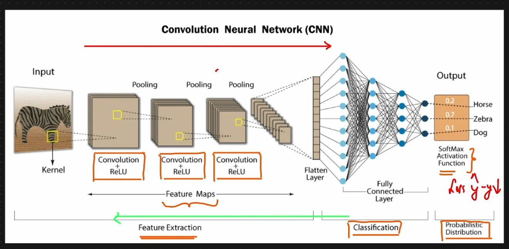

# **Deep Learning**

* A subset of **machine learning** focused on **artificial neural networks** with multiple layers.
* Inspired by the structure and function of the **human brain**.
* Excels at **feature extraction** automatically from raw data (images, text, audio).

---

### DL vs ML:
As the size of data increase ML performance shows no increment while DL's performance still increases.

---

### Key Concepts

* **Neurons**: Basic computational units, inspired by biological neurons.
* **Layers**:

  * **Input layer** – receives raw data
  * **Hidden layers** – perform transformations and learn patterns
  * **Output layer** – produces predictions or classifications
* **Activation functions**: Introduce non-linearity (e.g., ReLU, Sigmoid, Tanh).
* **Weights & Biases**: Parameters learned during training.

---

### Types of Neural Networks
A neural network in deep learning is a computational model inspired by the human brain, designed to recognize patterns and process data through interconnected layers of artificial neurons.

* **Feedforward Neural Networks (FNN)** – simplest type, data flows one way.
* **Convolutional Neural Networks (CNN)** – used for images and spatial data.
* **Recurrent Neural Networks (RNN)** – handle sequential data (e.g., text, time series).
* **Transformers** – advanced networks for NLP and sequence tasks.

---

### Training Deep Learning Models

* **Forward propagation** – input passes through the network to produce output.
* **Loss function** – measures the error between prediction and actual output.
* **Backpropagation** – computes gradients of loss w.r.t weights.
* **Optimization** – updates weights using algorithms like **Stochastic Gradient Descent (SGD)** or **Adam**.

---

### Key Advantages

* Can handle **large-scale, high-dimensional data**.
* Learns **complex patterns** without manual feature engineering.
* State-of-the-art results in **computer vision, NLP, speech recognition**.

---

### Challenges

* Requires **large datasets** and **high computational power**.
* Prone to **overfitting**.
* **Interpretability** is often limited (“black box”).


---


## **Perceptron**

### Definition
* A **perceptron** is the **simplest artificial neural network (single neuron model)** and acts as a single-layer, feed-forward model. 
* Used for **binary classification** (output = 0 or 1). 
* Introduced by **Frank Rosenblatt (1957)**. 

---

### Basic Idea
* Mimics a **biological neuron**.
* Takes inputs → multiplies by weights → sums them → applies activation → gives output.

---

### Components of Perceptron

* **Inputs (x₁, x₂, …)** → feature values
* **Weights (w₁, w₂, …)** → importance of inputs
* **Bias (b)** → shifts decision boundary
* **Weighted Sum:**
  [
  z = \sum w_i x_i + b
  ]
* **Activation Function** → decides output
* **Output (y)** → final prediction (0 or 1)

### Example
```python
# 1) Imports
import numpy as np
import matplotlib.pyplot as plt
from sklearn import datasets
from sklearn.linear_model import Perceptron
from sklearn.model_selection import train_test_split
from sklearn.metrics import accuracy_score

# 2) Load Iris dataset
iris = datasets.load_iris()
X = iris.data
y = iris.target

# For simplicity, only take classes 0 and 1 (Setosa vs Versicolor)
mask = y < 2
X = X[mask]
y = y[mask]

# Only use two features: sepal length and sepal width
X = X[:, :2]

# 3) Train-test split
X_train, X_test, y_train, y_test = train_test_split(X, y, test_size=0.3, random_state=42)

# 4) Create & fit Perceptron
clf = Perceptron(max_iter=1000, random_state=42)
clf.fit(X_train, y_train)

# 5) Predict
y_pred = clf.predict(X_test)

# 6) Accuracy
acc = accuracy_score(y_test, y_pred)
print(f"Accuracy: {acc * 100:.2f}%")

# 7) Plot decision boundary
xmin, xmax = X[:, 0].min() - 1, X[:, 0].max() + 1
ymin, ymax = X[:, 1].min() - 1, X[:, 1].max() + 1

xx, yy = np.meshgrid(np.linspace(xmin, xmax, 100),
                     np.linspace(ymin, ymax, 100))

Z = clf.predict(np.c_[xx.ravel(), yy.ravel()])
Z = Z.reshape(xx.shape)

plt.contourf(xx, yy, Z, alpha=0.3)
plt.scatter(X_train[:, 0], X_train[:, 1], c=y_train, label="Train")
plt.scatter(X_test[:, 0], X_test[:, 1], marker='x', c=y_test, label="Test")
plt.xlabel("Sepal length")
plt.ylabel("Sepal width")
plt.title("Perceptron Decision Boundary")
plt.legend()
plt.show()
```

---

### Activation Function

* Usually **Step Function**:

  * Output = 1 if ( z ≥ 0 )
  * Output = 0 if ( z < 0 )
* Can also use **Sigmoid** for smoother output (0 to 1).

---

### Working of Perceptron

1. Multiply inputs with weights
2. Add bias
3. Apply activation function
4. Produce output
5. Compare with actual value and update weights

---

### Learning Rule (Weight Update)

* Weights updated using error:
  [
  w = w + \eta (y_{true} - y_{pred}) x
  ]
* **η (learning rate)** controls update size 

---

### Example
* Can model **logic gates (AND, OR)** by adjusting weights and bias.

---

### Advantages
* Simple and easy to implement
* Fast for small problems
* Foundation of neural networks

---

### Limitations
* Only works for **linearly separable data**
* Cannot solve problems like **XOR**
* Single-layer → cannot learn complex patterns

---

### Importance
* Building block of **deep learning models**
* Leads to **Multilayer Perceptron (MLP)** and modern neural networks

#### **NOTE**

> Loss function vs Cost function :-
    Scope: loss function for specific value while cost function is for all dataset.

### Multilayer Perceptron (MLP)

If the problem is not linear seperable, so to classify we will use MLP.


We will have Part 1 of Hidden layer 1 as:
```math
Z = \sum_{i=1}^n w_i^T x_i + b_1
```
or
```math
Z = x_1 . w_1 + x_2 . w_2 + x_3 . w_3 + b_1 
```
Part 2: Activation Function
```math
f(Z) = 1 / (1 + e^{-Z}) = 0.759
```

Hidden layer 2
```math
Z = O_1 (Output of layer 1) + w_4 + b_2 = 0.04518
```
Part 2: Activation Function
```math
f(Z) = 1 / (1 + e^{-Z}) = 0.51129
```

After that we will find loss using loss function:
```math
f(n) = (actual - predicted) = (1 - 0.51129) = 0.49
```

So, to reduce the error, we update the weights and it is called as back propagation.

### Back Propagation in Multilayer Perceptron

> Weight update formula:
```math
W_{new} = W_{old} - \eta \frac{\partial L}{\partial W_{old}}
```

To decrease the loss function value, we use gradient descent optimizer.


The integration part is learning rate which decides the step size towards global minima.

It should be small value as if it is a large then it'll never reach minima or never converge.

Chain Rule of derivative:
Backpropagation uses the chain rule to calculate the gradient of the loss function with respect to each weight in a multilayer perceptron (MLP), enabling efficient updates.

Formula
```math
\frac{dy}{dx} = \frac{dy}{du} . \frac{du}{dx} 
```

### Vanishing Gradient Problem
The vanishing gradient problem occurs when gradients become very small (≈ 0) during backpropagation.

As a result, early layers (closer to input) learn very slowly or stop learning.

#### Where It Happens
- Common in deep neural networks (MLPs with many layers)
- Especially when using Sigmoid or Tanh activation functions

---

# Activation Functions

## Sigmoid Function
* The **sigmoid function** is a **non-linear activation function** used in neural networks.
* It maps any real value to a range between **0 and 1**.

---

#### Mathematical Formula
```math
\sigma(x) = \frac{1}{1 + e^{-x}}
```

#### Derivative
```math
\sigma'(x) = \sigma(x)(1 - \sigma(x))
```
---

#### Why Sigmoid is Used
* Smooth and differentiable
* Output interpretable as probability
* Useful in:
  * **Binary classification**
  * **Output layer of neural networks**

---

#### Advantages
* Simple and mathematically elegant
* Differentiable everywhere
* Output bounded (0 to 1)

---

#### Disadvantages
* ❌ Vanishing Gradient Problem
    * Derivative:
    ```math
    \sigma'(x) \leq 0.25
    ```
    * Causes gradients to shrink

* ❌ Saturation
    * For large |x|:
        * Output ≈ 0 or 1
        * Gradient ≈ 0

* ❌ Not Zero-Centered
    * Output always positive → slows learning


## Tanh Function
* **Tanh (Hyperbolic Tangent)** is a **non-linear activation function**.
* It maps input values to a range between **−1 and +1**.

---

### Mathematical Formula
```math
\tanh(x) = \frac{e^x - e^{-x}}{e^x + e^{-x}}
```

---

### Graph Intuition
* S-shaped curve (similar to sigmoid but centered at 0)
* Key points:
```math
  * ( x \to +\infty \Rightarrow \tanh(x) \to 1 )
```
```math
  * ( x \to -\infty \Rightarrow \tanh(x) \to -1 )
```
```math
  * ( x = 0 \Rightarrow \tanh(x) = 0 )
```

---

### Derivative
```math
\tanh'(x) = 1 - \tanh^2(x)
```

### Why Tanh is Used
* Zero-centered output → improves gradient updates
* Better than sigmoid for **hidden layers**

---

### Advantages
* Zero-centered (faster convergence than sigmoid)
* Smooth and differentiable
* Strong gradients near 0

---

### Disadvantages
*  Vanishing Gradient Problem
*  Saturation
    * Output becomes flat near -1 and 1
    * Learning slows down

---

### Where It Is Used
* Hidden layers (older neural networks)
* Sometimes in:
  * RNNs
  * Intermediate layers

---

## Relu activation function
The **ReLU activation function** (Rectified Linear Unit) is one of the most widely used activation functions in deep learning.

---

### 🔹 Definition
```math
\text{ReLU}(x) = \max(0, x)
```
---

### 🔹 Output Behavior

* If ( x > 0 ) → output = ( x )
* If $( x \leq 0 )$ → output = 0

So the range is: $[0, \infty)$

---

### 🔹 Graph Behavior
* Flat (0) for negative inputs
* Linear (straight line) for positive inputs
* Looks like a “hinge” at 0

---

### 🔹 Key Properties

1. **Non-linear**

   * Even though it looks linear for ( x > 0 ), overall it's non-linear

2. **Computationally efficient**

   * Very simple: just a comparison

3. **Sparse activation**

   * Many neurons output 0 → efficient and reduces overfitting

4. **Derivative**
$ \frac{d}{dx} = \begin{cases}1 & x > 0 ,\ 0 & x \leq 0 \end{cases} $

---

### 🔹 Advantages
* 🚀 **Fast computation**
* 📈 **Avoids vanishing gradient (for positive values)**
* 🧠 Helps deep networks train efficiently
* 🔥 Works very well in practice (default choice in many models)

---

### 🔹 Disadvantages
1. **Dying ReLU problem**
   * Neurons can get stuck outputting 0
   * Happens when weights push inputs into negative region permanently

2. **Not zero-centered**
   * Outputs only positive values

---

### 🔹 Variants of ReLU
To fix its problems, several variants exist:
* **Leaky ReLU**
  Small slope for negative values (e.g., 0.01x)

* **Parametric ReLU (PReLU)**
  Learnable slope for negative part

* **ELU (Exponential Linear Unit)**
  Smooth negative values

---

### 🔹 When to Use
* Default choice for:
  * Hidden layers in deep neural networks
  * CNNs (Convolutional Neural Networks)

* Often replaced only if:
  * You face dying ReLU → use Leaky ReLU/ELU

---

### 🔹 Comparison with tanh
| Feature        | ReLU   | tanh    |
| -------------- | ------ | ------- |
| Range          | [0, ∞) | (-1, 1) |
| Speed          | Fast   | Slower  |
| Vanishing Grad | ❌ Less | ✅ More  |
| Zero-centered  | ❌ No   | ✅ Yes   |

---

### 🔹 Simple Intuition

ReLU acts like a **filter**:
* Keeps positive signals
* Completely blocks negative ones

---

## Leaky Relu and Parametric Relu
Both **Leaky ReLU** and **Parametric ReLU (PReLU)** are improvements over the standard ReLU designed to fix the **dying ReLU problem** (where neurons get stuck outputting 0).

---

#### 🔹Leaky ReLU
$
f(x) =
\begin{cases}
x & x > 0 ,\
\alpha x & x \leq 0
\end{cases}
$

* $\alpha$ is a **small constant** (e.g., 0.01)

---

#### 🔹 Behavior
* Positive inputs → same as ReLU
* Negative inputs → small non-zero output

Example:
If ( $\alpha$ = 0.01 ), then

* ( x = -5 $\Rightarrow$ f(x) = -0.05 )

---

#### 🔹 Key Idea

Instead of making negative values **0**, it allows a **small slope**, so neurons don’t “die”.

---

#### 🔹 Advantages

* Prevents dying ReLU problem
* Keeps gradient alive for negative inputs
* Simple and efficient

---

#### 🔹 Disadvantages

* Slope ( $\alpha$ ) is fixed → not adaptable

---

### 🔹 Parametric ReLU (PReLU)
$
f(x) =
\begin{cases}
x & x > 0 ,\
\alpha x & x \leq 0
\end{cases}
$

* ( $\alpha$ ) is **learned during training** (not fixed)

---

#### 🔹 Behavior
* Same structure as Leaky ReLU
* But slope for negative inputs is **adaptive**

---

#### 🔹 Key Idea
Let the network **learn the best value of ( $\alpha$ )** instead of setting it manually.

---

#### 🔹 Advantages
* More flexible than Leaky ReLU
* Can improve model performance
* Learns optimal negative slope

---

#### 🔹 Disadvantages
* Slightly more computation
* Risk of overfitting (extra parameter)

---

#### 🔹 Key Difference

| Feature             | Leaky ReLU         | PReLU               |
| ------------------- | ------------------ | ------------------- |
| Negative slope      | Fixed (e.g., 0.01) | Learnable parameter |
| Flexibility         | Low                | High                |
| Risk of overfitting | Low                | Slightly higher     |
| Complexity          | Simple             | Slightly complex    |

---

#### 🔹 When to Use
* **ReLU** → default choice
* **Leaky ReLU** → if neurons are dying
* **PReLU** → when you want better performance and can afford extra parameters

---

## ELU activation function
The **ELU (Exponential Linear Unit)** is an activation function used in deep learning to improve learning speed and performance compared to functions like ReLU.

$ \text{ELU}(x) = \begin{cases} x & \text{if } x > 0 ,\ \alpha (e^x - 1) & \text{if } x \leq 0 \end{cases} $

* ( x ): input
* ( $\alpha$ ): a hyperparameter (usually set to 1)

---

#### 🔹 Intuition
* For **positive values** → behaves like **ReLU** (linear)
* For **negative values** → produces smooth negative outputs instead of zero

---

#### 🔹 Key Properties
* Smooth Curve
* Negative Outputs
* Avoids Dead Neurons

---

#### 🔹 Comparison with ReLU

| Feature           | ReLU            | ELU                        |
| ----------------- | --------------- | -------------------------- |
| Negative values   | 0               | Smooth negative values     |
| Differentiability | Not smooth at 0 | Smooth everywhere          |
| Dead neurons      | Possible        | Less likely                |
| Computation       | Faster          | Slightly slower (exp calc) |

---

#### 🔹 Advantages
* Faster convergence during training
* Better performance in deeper networks
* Reduces bias shift (mean closer to zero)

---

#### 🔹 Disadvantages
* More computationally expensive (uses exponential)
* Requires tuning of ( \alpha ) (though often 1 works well)

---

#### 🔹 When to Use ELU
* Deep neural networks where **training is slow or unstable**
* When you want **better gradient flow**
* As an alternative to ReLU or Leaky ReLU

---

## Softmax Activation Function
The **Softmax activation function** is widely used in deep learning for **multi-class classification problems**. It converts raw model outputs (logits) into probabilities.

---

For a vector ( $z = [z_1, z_2, ..., z_n]$ ), Softmax is defined as:

$
\text{Softmax}(z_i) = \frac{e^{z_i}}{\sum_{j=1}^{n} e^{z_j}}
$

---

#### 🔹 Intuition
* Takes any real-valued numbers (logits)
* Converts them into:
  * **Probabilities (0 to 1)**
  * Sum of all outputs = **1**

> So it answers: *“What is the probability of each class?”*

---

#### 🔹 Example
Suppose a model outputs:
$ [2.0, 1.0, 0.1] $


After applying Softmax:
$ [0.66, 0.24, 0.10] $

* Class 1 → 66% probability
* Class 2 → 24%
* Class 3 → 10%

---

#### 🔹 Key Properties
* Probability Distribution
* Emphasizes Larger Values
* Differentiable

---

#### 🔹 Where It Is Used
* Final layer of neural networks for:
  * Image classification
  * Text classification
  * Speech recognition

---

#### 🔹 Softmax vs Sigmoid

| Feature        | Softmax                  | Sigmoid                   |
| -------------- | ------------------------ | ------------------------- |
| Output         | Probability distribution | Independent probabilities |
| Use case       | Multi-class (one class)  | Multi-label (multiple)    |
| Sum of outputs | = 1                      | Not necessarily 1         |

---

#### 🔹 Advantages
* Interpretable probabilities
* Works well with **categorical cross-entropy loss**
* Highlights the most likely class clearly

---

#### 🔹 Disadvantages
* Sensitive to large input values (can cause overflow)
* Not suitable for multi-label classification
* Can become overconfident (very high probabilities)

---

#### 🔹 Numerical Stability Trick
To avoid overflow:
$ \text{Softmax}(z_i) = \frac{e^{z_i - \max(z)}}{\sum e^{z_j - \max(z)}} $

---

#### 🔹 When to Use Softmax

* When your problem is:
  * **Multi-class classification**
  * Only **one correct class per input**

--- 

## **Which activation function to use when?**
```flowchart
Start
  │
  ├── Is it output layer?
  │       │
  │       ├── Yes
  │       │     ├── Binary classification → Sigmoid
  │       │     ├── Multi-class (one class) → Softmax
  │       │     ├── Multi-label → Sigmoid
  │       │     └── Regression → Linear
  │       │
  │       └── No (Hidden layer)
  │             ├── Default → ReLU
  │             ├── Dying ReLU issue → Leaky ReLU
  │             ├── Want smoother learning → ELU
  │             └── Advanced models → GELU
```

--- 

# Cost & Loss Function

- ANN
  - Regression
    - MSE
    - MAE
    - Huber loss
    - RMSE
  - Classification
    - Binary Cross Entropy
    - Categorical Cross Entropy
    - Sparse Categorical Cross Entropy

#### 🔷 What is Cost vs Loss Function?
* **Loss Function**: Error for a *single data point*
* **Cost Function**: Average loss over *entire dataset*

$ \text{Cost } J(\theta) = \frac{1}{n} \sum_{i=1}^{n} L(y_i, \hat{y}_i) $

---

## ANN – Regression Loss Functions

### 1. Mean Squared Error (MSE)

#### Intuition
* Penalizes **large errors more** (squared term)
* Smooth and differentiable → good for gradient descent

#### Equation
Loss:
$ L = (y - \hat{y})^2 $

Cost:
$ J = \frac{1}{n} \sum (y_i - \hat{y}_i)^2 $

#### Advantages
* Easy to compute and differentiate
* Strongly penalizes large errors
* Works well for normally distributed errors

#### Disadvantages
* Very sensitive to **outliers**
* Can cause large gradients → unstable training

---

### 2. Mean Absolute Error (MAE)

#### Intuition
* Measures **absolute difference**
* Treats all errors equally

#### Equation
Loss:
$ L = |y - \hat{y}| $

Cost:
$ J = \frac{1}{n} \sum |y_i - \hat{y}_i| $

#### Advantages
* Robust to **outliers**
* Simple interpretation

#### Disadvantages
* Not differentiable at 0
* Slower convergence (constant gradient)

---

### 3. Huber Loss
#### Intuition
* Combines **MSE + MAE**
* Uses MSE for small errors, MAE for large errors

#### Equation
$ 
L =
\begin{cases}
\frac{1}{2}(y - \hat{y})^2 & \text{if } |y - \hat{y}| \leq \delta ,\
\delta |y - \hat{y}| - \frac{1}{2}\delta^2 & \text{otherwise}
\end{cases}
$ 

Cost: $ J = \frac{1}{n} \sum L_i $ 

#### Advantages
* Robust to outliers
* Smooth near zero → stable gradients

#### Disadvantages
* Need to tune **δ (delta)**
* Slightly more complex

---

### 4. Root Mean Squared Error (RMSE)

#### Intuition
* Same as MSE but in **original scale**
* Easier to interpret

#### Equation
$ RMSE = \sqrt{ \frac{1}{n} \sum (y_i - \hat{y}_i)^2 } $

#### Advantages
* Same unit as output
* Penalizes large errors

#### Disadvantages
* Sensitive to outliers (like MSE)
* Extra computation (sqrt)

---

## ANN – Classification Loss Functions

### 1. Binary Cross Entropy (BCE)

#### Intuition
* Measures difference between **true label & predicted probability**
* Used for **binary classification (0/1)**

#### Equation
$ L = -[y \log(\hat{y}) + (1-y)\log(1-\hat{y})] $

Cost:
$ J = \frac{1}{n} \sum L_i $

#### Advantages
* Works well with **sigmoid activation**
* Probabilistic interpretation
* Strong gradients when wrong

#### Disadvantages
* Sensitive to **log(0)** (needs clipping)
* Poor for class imbalance (unless weighted)

---

### 2. Categorical Cross Entropy (CCE)

#### Intuition
* Used for **multi-class classification (one-hot labels)**
* Compares full probability distribution

#### Equation
$ L = - \sum_{j=1}^{k} y_j \log(\hat{y}_j) $

Cost:
$ J = \frac{1}{n} \sum L_i $

#### Advantages
* Works with **softmax output**
* Efficient for multi-class problems

#### Disadvantages
* Requires **one-hot encoding**
* Memory inefficient for large classes

---

### 3. Sparse Categorical Cross Entropy (SCCE)

#### Intuition
* Same as CCE but labels are **integers (not one-hot)**

#### Equation
$ L = - \log(\hat{y}*{y*{true}}) $

#### Advantages
* No need for one-hot encoding
* Memory efficient

#### Disadvantages
* Less intuitive
* Requires correct label indexing

---

## Summary Table

| Problem Type          | Loss Function | When to Use      | Key Strength           | Weakness              |
| --------------------- | ------------- | ---------------- | ---------------------- | --------------------- |
| Regression            | MSE           | Default choice   | Penalizes large errors | Sensitive to outliers |
| Regression            | MAE           | Outliers present | Robust                 | Slow learning         |
| Regression            | Huber         | Mixed noise      | Balanced               | Needs tuning          |
| Regression            | RMSE          | Interpretability | Same units             | Outliers sensitive    |
| Binary Classification | BCE           | 2 classes        | Probabilistic          | Imbalance issue       |
| Multi-class           | CCE           | One-hot labels   | Standard               | Memory heavy          |
| Multi-class           | SCCE          | Integer labels   | Efficient              | Less intuitive        |

---

# Gradient Descent Optimizers
If we draw a graph of Weights against Loss then we will have hyperbola.

***Gradient descent optimizers*** are algorithms used in deep learning to iteratively adjust a model's parameters (weights and biases) to minimize the loss function, which measures the error in the model's predictions.

- Epoch: 
  - An epoch represents one complete pass of the neural network through the entire training dataset. 
  
  - Training a model usually requires multiple epochs to achieve optimal performance, with the process potentially repeating many times until the model converges or begins to overfit the training data.

- Iteration: 
  - An iteration is a single update of the model's parameters. 
  
  - It occurs after the model has processed one batch (or mini-batch/single sample, depending on the gradient descent variant) of data.

- The total number of iterations in one epoch is calculated by dividing the total number of training samples by the batch size:
```math
\text{Iterations per Epoch} = \frac{\text{Total Training Samples}}{\text{Batch Size}}
```

They are resource intensive so we have to use optimizers.

---

## SGD

### 1. Stochastic Gradient Descent (SGD)

SGD is an optimization algorithm used to minimize a loss function in deep learning. Instead of computing gradients on the entire dataset, it updates parameters using **one training example at a time**.

---

#### 🔹 Mathematical Intuition

We want to minimize a loss function:
$ L(\theta) = \frac{1}{N} \sum_{i=1}^{N} \ell(x_i, y_i, \theta) $

Instead of computing full gradient:
$
\nabla L(\theta)
$

SGD approximates it using one sample:
$
\theta = \theta - \eta \cdot \nabla \ell(x_i, y_i, \theta)
$

Where:

* $\theta$ = model parameters
* $\eta$ = learning rate
* $\nabla \ell$ = gradient from a single data point

Intuition: noisy but fast steps toward minimum.

---

#### 🔹 Process
1. Initialize parameters (\theta)
2. Shuffle dataset
3. For each sample:
   * Compute gradient
   * Update parameters immediately
4. Repeat for multiple epochs

---

#### 🔹 Advantages
* Fast updates (low computation per step)
* Can escape local minima due to noise
* Works well for large datasets

---

#### 🔹 Disadvantages
* High variance (noisy updates)
* Unstable convergence
* May oscillate around minimum

---

### 2. Mini-Batch SGD

Instead of one sample, updates are computed using a **small batch of data (e.g., 32, 64, 128 samples)**.

---

#### 🔹 Mathematical Intuition
Gradient is computed over a mini-batch:
$
\theta = \theta - \eta \cdot \frac{1}{B} \sum_{i=1}^{B} \nabla \ell(x_i, y_i, \theta)
$

Where:
* $B$ = batch size

Intuition: balance between accuracy (batch GD) and speed (SGD).

---

#### 🔹 Process
1. Shuffle dataset
2. Divide into mini-batches
3. For each batch:
   * Compute average gradient
   * Update parameters
4. Repeat for epochs

---

#### 🔹 Advantages
* More stable than SGD
* Efficient on GPUs (parallel computation)
* Faster convergence than full batch GD

---

#### 🔹 Disadvantages
* Still some noise in updates
* Requires tuning batch size
* Memory usage higher than SGD

---

### 3. SGD with Momentum
Momentum improves SGD by adding a **velocity term** that accumulates past gradients to smooth updates.

---

#### 🔹 Mathematical Intuition
Velocity update:
$ v_t = \gamma v_{t-1} + \eta \nabla L(\theta) $

Parameter update:
$ \theta = \theta - v_t $

Where:
* $v_t$ = velocity
* $\gamma$ = momentum coefficient (e.g., 0.9)

Intuition:
* Like a **ball rolling downhill**
* Builds speed in consistent direction
* Reduces oscillation in steep directions

---

#### 🔹 Process
1. Initialize $\theta$ and velocity $v=0$
2. For each batch:
   * Compute gradient
   * Update velocity
   * Update parameters
3. Repeat

---

#### 🔹 Advantages
* Faster convergence
* Reduces oscillations
* Helps in ravines (uneven loss surfaces)

---

#### 🔹 Disadvantages
* Extra hyperparameter ($\gamma$)
* Can overshoot minima if not tuned
* Slightly more computation

---

### Summary Table

| Method         | Stability | Speed     | Noise  | Key Idea              |
| -------------- | --------- | --------- | ------ | --------------------- |
| SGD            | Low       | High      | High   | 1 sample update       |
| Mini-batch SGD | Medium    | High      | Medium | Batch averaging       |
| SGD + Momentum | High      | Very High | Low    | Accumulated gradients |

---

Here are well-structured notes on **adaptive optimization methods** used with SGD:

---

### 1. AdaGrad (Adaptive Gradient Algorithm)

AdaGrad adapts the learning rate **individually for each parameter** based on past gradients. 

Frequently updated parameters get smaller learning rates, while infrequent ones get larger updates.

---

#### 🔹 Mathematical Intuition
Accumulate squared gradients:
$
G_t = G_{t-1} + (\nabla L(\theta))^2
$

Update rule:
$
\theta = \theta - \frac{\eta}{\sqrt{G_t + \epsilon}} \cdot \nabla L(\theta)
$

Where:
* $G_t$ = sum of squared past gradients
* $\epsilon$ = small constant (to avoid division by zero)

Intuition:
* Parameters with large gradients → smaller steps
* Parameters with small gradients → larger steps

---

#### 🔹 Process
1. Initialize parameters $\theta$ and $G = 0$
2. For each iteration:
   * Compute gradient
   * Update accumulated squared gradients
   * Adjust learning rate
   * Update parameters

---

#### 🔹 Advantages
* No need to manually tune learning rate much
* Works well for sparse data (e.g., NLP)
* Per-parameter learning rates

---

#### 🔹 Disadvantages
* Learning rate keeps decreasing
* Can stop learning too early
* Not suitable for deep networks long-term

---

### 2. RMSProp (Root Mean Square Propagation)
RMSProp fixes AdaGrad’s issue by using a **moving average of squared gradients** instead of accumulating them indefinitely.

---

#### 🔹 Mathematical Intuition
Exponential moving average:
$
E[g^2]*t = \beta E[g^2]*{t-1} + (1 - \beta)(\nabla L(\theta))^2
$

Update rule:
$
\theta = \theta - \frac{\eta}{\sqrt{E[g^2]_t + \epsilon}} \cdot \nabla L(\theta)
$

Where:
* $\beta \approx 0.9$

Intuition:
* Keeps recent gradient information
* Prevents learning rate from shrinking too much

---

#### 🔹 Process
1. Initialize $\theta$, $E[g^2]=0$
2. For each step:
   * Compute gradient
   * Update moving average
   * Update parameters using adjusted learning rate

---

#### 🔹 Advantages
* Solves AdaGrad’s diminishing learning rate problem
* Faster convergence
* Works well for non-stationary problems

---

#### 🔹 Disadvantages
* Requires tuning ($\beta$)
* No bias correction
* May still be unstable in some cases

---

### 3. Adam Optimizer (Adaptive Moment Estimation)
Adam combines:
* Momentum (first moment)
* RMSProp (second moment)

It is one of the most widely used optimizers in deep learning.

---

#### 🔹 Mathematical Intuition
First moment (mean):
$
m_t = \beta_1 m_{t-1} + (1 - \beta_1)\nabla L(\theta)
$

Second moment (variance):
$
v_t = \beta_2 v_{t-1} + (1 - \beta_2)(\nabla L(\theta))^2
$

Bias correction:
$
\hat{m}_t = \frac{m_t}{1 - \beta_1^t}, \quad
\hat{v}_t = \frac{v_t}{1 - \beta_2^t}
$

Update rule:
$
\theta = \theta - \frac{\eta}{\sqrt{\hat{v}_t} + \epsilon} \cdot \hat{m}_t
$

Intuition:
* Momentum smooths direction
* RMSProp scales learning rate
* Bias correction stabilizes early training

---

#### 🔹 Process
1. Initialize $\theta$, $m=0$, $v=0$
2. For each step:
   * Compute gradient
   * Update $m$ and $v$
   * Apply bias correction
   * Update parameters

---

#### 🔹 Advantages
* Fast convergence
* Works well in most problems
* Combines benefits of momentum + RMSProp
* Less sensitive to hyperparameters

---

#### 🔹 Disadvantages
* Can generalize worse than SGD in some cases
* More memory usage (stores m and v)
* Sometimes converges to suboptimal solutions

---

### Summary Table

| Optimizer | Key Idea             | Learning Rate Behavior  | Strength             | Weakness     |
| --------- | -------------------- | ----------------------- | -------------------- | ------------ |
| AdaGrad   | Accumulate gradients | Continuously decreasing | Good for sparse data | Stops early  |
| RMSProp   | Moving average       | Stable                  | Fixes AdaGrad        | Needs tuning |
| Adam      | Momentum + RMSProp   | Adaptive & corrected    | Fast & robust        | May overfit  |

---

### Exploding Gradient Problem

The exploding gradient problem occurs when gradients become **very large during training**, causing unstable updates to model parameters.

This is especially common in:
* Deep neural networks
* Recurrent Neural Networks (RNNs)

---

#### 🔹 Mathematical Intuition
In backpropagation, gradients are computed using the chain rule:
$
\frac{\partial L}{\partial \theta} = \prod_{i=1}^{n} \frac{\partial z_i}{\partial z_{i-1}}
$

If these derivatives are **greater than 1**, repeated multiplication causes:

$
\text{Gradient} \rightarrow \infty
$

Intuition:
* Multiplying many large numbers → very large gradients
* Leads to huge parameter updates

---

#### 🔹 Why It Happens
* Deep networks (many layers)
* Large weights
* Poor initialization
* Long sequences (in RNNs)
* Activation functions with large derivatives

---

#### 🔹 Effects / Problems
* Model becomes unstable
* Loss fluctuates wildly or becomes NaN
* Weights grow uncontrollably
* Training fails to converge

---

#### 🔹 Process (What Happens During Training)
1. Forward pass computes loss
2. Backpropagation computes gradients
3. Gradients become very large
4. Parameter update becomes huge:
   $
   \theta = \theta - \eta \cdot \text{very large gradient}
   $
5. Model overshoots optimal solution

---

#### 🔹 Solutions / Techniques
1. Gradient Clipping :
  Keeps gradients within a safe range

  -  Limit gradient values: $ g = \frac{g}{|g|} \cdot \text{threshold} $

---

2. Weight Initialization : Prevents large activations and gradients
  * Use methods like:
    * Uniform Distribution
    * Xavier Initialization
    * He Initialization

---

3. Use Better Architectures : Helps stabilize gradient flow
  * LSTM / GRU (for RNNs)
  * Residual Networks (ResNet)

---

4. Normalize Inputs
  * Batch Normalization
  * Layer Normalization

---

5. Lower Learning Rate
  * Smaller updates prevent explosion

---

#### 🔹 Advantages (of understanding & handling it)
* Stable training
* Faster convergence
* Enables deep network training

---

#### 🔹 Disadvantages / Challenges
* Requires tuning (e.g., clipping threshold)
* Adds computational steps
* Not always easy to detect early

---

#### 🧠 Quick Summary

| Aspect  | Exploding Gradient               |
| ------- | -------------------------------- |
| Cause   | Large derivative multiplication  |
| Effect  | Huge parameter updates           |
| Problem | Training instability             |
| Fix     | Gradient clipping, normalization |

---

# Dropout Layers
Dropout is a **regularization technique** used to prevent overfitting in neural networks by randomly “dropping” (i.e., deactivating) some neurons during training.

At each training step, a subset of neurons is ignored.

---

#### 🔹 Intuition (Conceptual Understanding)
* Prevents neurons from becoming too dependent on each other
* Forces the network to learn **robust and distributed features**
* Acts like training many smaller networks (ensemble effect)

---

#### 🔹 Process
1. During training:
   * Randomly drop neurons in each forward pass
   * Perform backpropagation only on active neurons
2. During testing:
   * Use full network
   * Scale outputs (or weights)

---

#### 🔹 Advantages
* Reduces overfitting
* Improves generalization
* Simple and effective
* Acts like implicit ensemble learning

---

#### 🔹 Disadvantages
* Slower convergence (training becomes noisy)
* Requires tuning dropout rate
* Not always effective for small datasets
* Can hurt performance if overused

---

#### 🔹 Common Dropout Rates
* Input layer: 0.1 – 0.3
* Hidden layers: 0.3 – 0.5
* Very deep networks: sometimes lower values

---

#### 🔹 Where to Use
* Fully connected layers (most common)
* CNNs (usually after dense layers)
* RNNs (carefully applied)

---

#### 🔹 Variants
* Spatial Dropout (for CNNs)
* DropConnect (drops weights instead of neurons)

---

#### Quick Summary

| Aspect   | Dropout                 |
| -------- | ----------------------- |
| Purpose  | Prevent overfitting     |
| Idea     | Randomly remove neurons |
| Training | Random masking          |
| Testing  | Full network + scaling  |
| Effect   | Better generalization   |

---

# ANN Example:
```python
import tensorflow as tf
from tensorflow.keras import layers, models
from sklearn.datasets import load_breast_cancer
from sklearn.model_selection import train_test_split
from sklearn.preprocessing import StandardScaler

data = load_breast_cancer()
X = data.data     # features
y = data.target   # labels (0 or 1)

X_train, X_test, y_train, y_test = train_test_split(X, y, test_size=0.2)

scaler = StandardScaler()
X_train = scaler.fit_transform(X_train)
X_test = scaler.transform(X_test)

model = models.Sequential()

model.add(layers.Dense(16, activation='relu', input_shape=(X_train.shape[1],)))
model.add(layers.Dense(8, activation='relu'))
model.add(layers.Dense(1, activation='sigmoid'))

model.compile(optimizer='adam',
              loss='binary_crossentropy',
              metrics=['accuracy'])

model.fit(X_train, y_train, epochs=20, batch_size=16)

loss, accuracy = model.evaluate(X_test, y_test)
print("Test Accuracy:", accuracy)

```

# Convolutional Neural Networks (CNN)
CNNs are a class of deep learning models primarily used for:
* Image recognition
* Computer vision tasks

They are designed to automatically and adaptively learn **spatial features** from data.

---

## 🔹 Human Brain Inspiration

CNNs are inspired by the **visual cortex** in the human brain.

Key idea:
* Neurons respond to **specific regions** of the visual field
* Hierarchical processing:
  * Detect edges → shapes → objects

Similarly, CNN:
* First layers detect edges
* Middle layers detect patterns
* Final layers detect objects

---

## 🔹 Convolutional Operation
Convolution is the core operation where a **filter (kernel)** slides over the input image to extract features.

---

## 🔸 Mathematical Intuition
For input (I) and kernel (K):

$ S(i,j) = \sum_m \sum_n I(i+m, j+n) \cdot K(m,n) $

Intuition:
* Multiply corresponding values
* Sum them → produce a feature map value

---

## 🔸 Key Concepts
* Kernel (filter): small matrix (e.g., 3×3)
* Stride: step size of movement
* Feature map: output after convolution

---

## 🔹 Padding
Padding adds extra pixels (usually zeros) around input.

#### 🔸 Types
* **Valid padding** → no padding (output shrinks)
* **Same padding** → output size same as input

#### 🔸 Padding Techniques
* Zero Padding : Fills padded space with zero
* Neighbour Padding : Fills padded space with the neighbours value

---

#### 🔸 Why Padding?

* Preserves spatial size
* Prevents loss of edge information

---

### 🔹 CNN vs ANN (Artificial Neural Network)
| Feature            | CNN                     | ANN              |
| ------------------ | ----------------------- | ---------------- |
| Input              | Images (2D/3D)          | Flattened vector |
| Connections        | Local (receptive field) | Fully connected  |
| Parameters         | Fewer                   | Large number     |
| Feature extraction | Automatic               | Manual/implicit  |
| Spatial info       | Preserved               | Lost             |

Intuition:
* CNN keeps image structure
* ANN treats input as plain numbers

---

## 🔹 Pooling
Pooling reduces spatial dimensions of feature maps.

---

#### 🔸 Types
* **Max Pooling** → takes maximum value
* **Average Pooling** → takes average

---

#### 🔸 Mathematical Example (Max Pooling)
From a 2×2 region:
$
\begin{bmatrix}
1 & 3 \ &
2 & 4
\end{bmatrix}
\rightarrow 4
$

---

#### 🔸 Intuition
* Keeps important features
* Reduces computation
* Adds translation invariance

---

#### 🔹 Advantages
* Reduces overfitting
* Speeds up computation

---

#### 🔹 Disadvantages
* Loss of some information

---

## 🔹 Flattening
Flattening converts multi-dimensional feature maps into a **1D vector**.

#### Example
$ \text{Feature map (2×2×3)} \rightarrow \text{vector (12×1)} $

---

#### Purpose
* Prepare data for fully connected layers

---

## 🔹 Fully Connected Layers (Dense Layers)
These layers connect every neuron to every neuron in the previous layer.

---

#### 🔸 Role
* Perform final classification
* Combine extracted features

---

#### 🔸 Mathematical Form
$ y = f(Wx + b) $

---

#### 🔸 Intuition
* Acts like traditional neural network
* Learns decision boundaries

---

#### 🔹 Overall CNN Flow
1. Input Image
2. Convolution Layer
3. Activation (ReLU)
4. Pooling
5. Repeat (Conv + Pool)
6. Flatten
7. Fully Connected Layers
8. Output (classification)



---

### Example
```python
import tensorflow as tf
from tensorflow.keras import layers, models

# Load dataset (MNIST)
(x_train, y_train), (x_test, y_test) = tf.keras.datasets.mnist.load_data()

# Normalize data (0–255 → 0–1)
x_train = x_train / 255.0
x_test = x_test / 255.0

# Reshape to include channel dimension (28x28 → 28x28x1)
x_train = x_train.reshape(-1, 28, 28, 1)
x_test = x_test.reshape(-1, 28, 28, 1)

# Build CNN model
model = models.Sequential()

# Convolution + Pooling layers
model.add(layers.Conv2D(32, (3, 3), activation='relu', input_shape=(28, 28, 1)))
model.add(layers.MaxPooling2D((2, 2)))

model.add(layers.Conv2D(64, (3, 3), activation='relu'))
model.add(layers.MaxPooling2D((2, 2)))

# Flatten layer
model.add(layers.Flatten())

# Fully connected layers
model.add(layers.Dense(64, activation='relu'))
model.add(layers.Dense(10, activation='softmax'))

# Compile model
model.compile(optimizer='adam',
              loss='sparse_categorical_crossentropy',
              metrics=['accuracy'])

# Train model
model.fit(x_train, y_train, epochs=5, batch_size=32)

# Evaluate model
test_loss, test_acc = model.evaluate(x_test, y_test)

print("Test Accuracy:", test_acc)
```
---

#### Quick Summary

| Component       | Function           |
| --------------- | ------------------ |
| Convolution     | Feature extraction |
| Padding         | Preserve size      |
| Pooling         | Reduce dimensions  |
| Flattening      | Convert to vector  |
| Fully Connected | Classification     |
