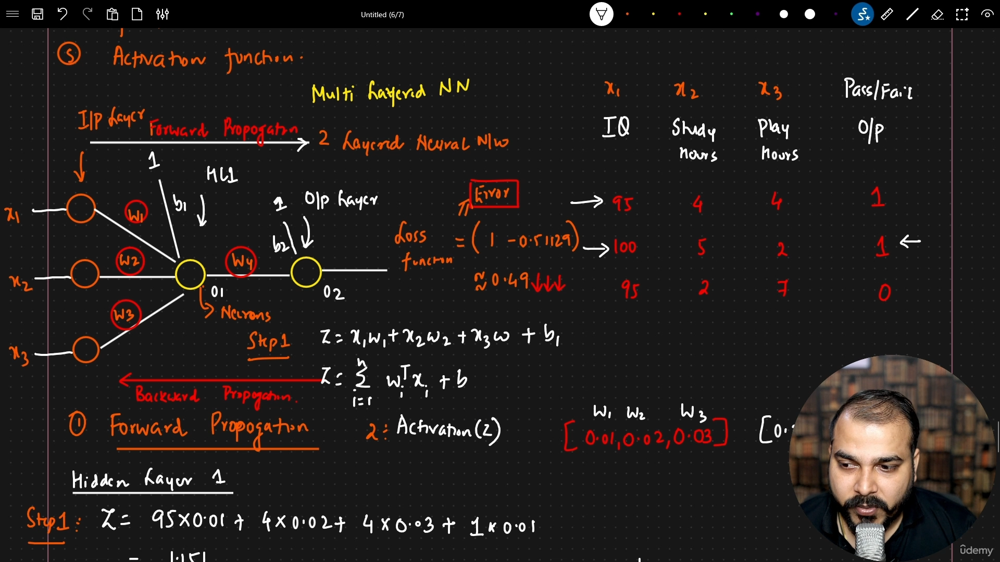
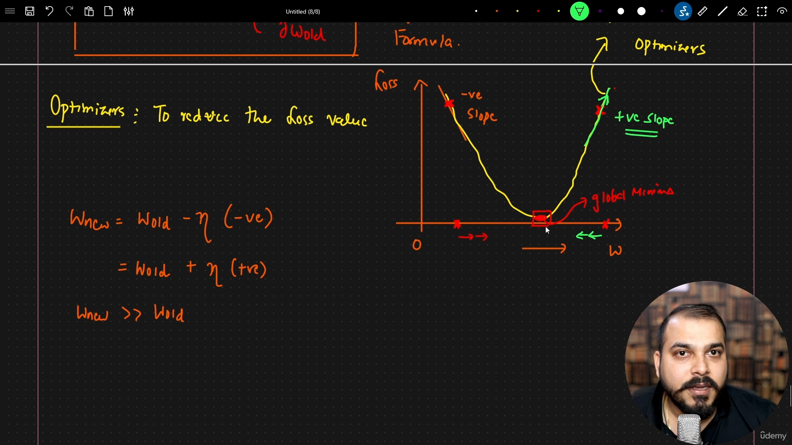

# **Deep Learning**

* A subset of **machine learning** focused on **artificial neural networks** with multiple layers.
* Inspired by the structure and function of the **human brain**.
* Excels at **feature extraction** automatically from raw data (images, text, audio).

---

### DL vs ML:
As the size of data increase ML performance shows no increment while DL's performance still increases.

---

### Key Concepts

* **Neurons**: Basic computational units, inspired by biological neurons.
* **Layers**:

  * **Input layer** – receives raw data
  * **Hidden layers** – perform transformations and learn patterns
  * **Output layer** – produces predictions or classifications
* **Activation functions**: Introduce non-linearity (e.g., ReLU, Sigmoid, Tanh).
* **Weights & Biases**: Parameters learned during training.

---

### Types of Neural Networks
A neural network in deep learning is a computational model inspired by the human brain, designed to recognize patterns and process data through interconnected layers of artificial neurons.

* **Feedforward Neural Networks (FNN)** – simplest type, data flows one way.
* **Convolutional Neural Networks (CNN)** – used for images and spatial data.
* **Recurrent Neural Networks (RNN)** – handle sequential data (e.g., text, time series).
* **Transformers** – advanced networks for NLP and sequence tasks.

---

### Training Deep Learning Models

* **Forward propagation** – input passes through the network to produce output.
* **Loss function** – measures the error between prediction and actual output.
* **Backpropagation** – computes gradients of loss w.r.t weights.
* **Optimization** – updates weights using algorithms like **Stochastic Gradient Descent (SGD)** or **Adam**.

---

### Key Advantages

* Can handle **large-scale, high-dimensional data**.
* Learns **complex patterns** without manual feature engineering.
* State-of-the-art results in **computer vision, NLP, speech recognition**.

---

### Challenges

* Requires **large datasets** and **high computational power**.
* Prone to **overfitting**.
* **Interpretability** is often limited (“black box”).


---


## **Perceptron**

### Definition
* A **perceptron** is the **simplest artificial neural network (single neuron model)** and acts as a single-layer, feed-forward model. 
* Used for **binary classification** (output = 0 or 1). 
* Introduced by **Frank Rosenblatt (1957)**. 

---

### Basic Idea
* Mimics a **biological neuron**.
* Takes inputs → multiplies by weights → sums them → applies activation → gives output.

---

### Components of Perceptron

* **Inputs (x₁, x₂, …)** → feature values
* **Weights (w₁, w₂, …)** → importance of inputs
* **Bias (b)** → shifts decision boundary
* **Weighted Sum:**
  [
  z = \sum w_i x_i + b
  ]
* **Activation Function** → decides output
* **Output (y)** → final prediction (0 or 1)

---

### Activation Function

* Usually **Step Function**:

  * Output = 1 if ( z ≥ 0 )
  * Output = 0 if ( z < 0 )
* Can also use **Sigmoid** for smoother output (0 to 1).

---

### Working of Perceptron

1. Multiply inputs with weights
2. Add bias
3. Apply activation function
4. Produce output
5. Compare with actual value and update weights

---

### Learning Rule (Weight Update)

* Weights updated using error:
  [
  w = w + \eta (y_{true} - y_{pred}) x
  ]
* **η (learning rate)** controls update size 

---

### Example
* Can model **logic gates (AND, OR)** by adjusting weights and bias.

---

### Advantages
* Simple and easy to implement
* Fast for small problems
* Foundation of neural networks

---

### Limitations
* Only works for **linearly separable data**
* Cannot solve problems like **XOR**
* Single-layer → cannot learn complex patterns

---

### Importance
* Building block of **deep learning models**
* Leads to **Multilayer Perceptron (MLP)** and modern neural networks

#### **NOTE**

> Loss function vs Cost function :-
    Scope: loss function for specific value while cost function is for all dataset.

### Multilayer Perceptron (MLP)

If the problem is not linear seperable, so to classify we will use MLP.



We will have Part 1 of Hidden layer 1 as:
```math
Z = \sum_{i=1}^n w_i^T x_i + b_1
```
or
```math
Z = x_1 . w_1 + x_2 . w_2 + x_3 . w_3 + b_1 
```
Part 2: Activation Function
```math
f(Z) = 1 / (1 + e^{-Z}) = 0.759
```

Hidden layer 2
```math
Z = O_1 (Output of layer 1) + w_4 + b_2 = 0.04518
```
Part 2: Activation Function
```math
f(Z) = 1 / (1 + e^{-Z}) = 0.51129
```

After that we will find loss using loss function:
```math
f(n) = (actual - predicted) = (1 - 0.51129) = 0.49
```

So, to reduce the error, we update the weights and it is called as back propagation.

### Back Propagation in Multilayer Perceptron

> Weight update formula:
```math
W_{new} = W_{old} - \eta \frac{\partial L}{\partial W_{old}}
```

To decrease the loss function value, we use gradient descent optimizer.


The integration part is learning rate which decides the step size towards global minima.

It should be small value as if it is a large then it'll never reach minima or never converge.

Chain Rule of derivative:
Backpropagation uses the chain rule to calculate the gradient of the loss function with respect to each weight in a multilayer perceptron (MLP), enabling efficient updates.

Formula
```math
\frac{dy}{dx} = \frac{dy}{du} . \frac{du}{dx} 
```

### Vanishing Gradient Problem
The vanishing gradient problem occurs when gradients become very small (≈ 0) during backpropagation.

As a result, early layers (closer to input) learn very slowly or stop learning.

#### Where It Happens
- Common in deep neural networks (MLPs with many layers)
- Especially when using Sigmoid or Tanh activation functions

---

# Activation Functions

## Sigmoid Function
* The **sigmoid function** is a **non-linear activation function** used in neural networks.
* It maps any real value to a range between **0 and 1**.

---

#### Mathematical Formula
```math
\sigma(x) = \frac{1}{1 + e^{-x}}
```

#### Derivative
```math
\sigma'(x) = \sigma(x)(1 - \sigma(x))
```
---

#### Why Sigmoid is Used
* Smooth and differentiable
* Output interpretable as probability
* Useful in:
  * **Binary classification**
  * **Output layer of neural networks**

---

#### Advantages
* Simple and mathematically elegant
* Differentiable everywhere
* Output bounded (0 to 1)

---

#### Disadvantages
* ❌ Vanishing Gradient Problem
    * Derivative:
    ```math
    \sigma'(x) \leq 0.25
    ```
    * Causes gradients to shrink

* ❌ Saturation
    * For large |x|:
        * Output ≈ 0 or 1
        * Gradient ≈ 0

* ❌ Not Zero-Centered
    * Output always positive → slows learning


## tanh Function
* **Tanh (Hyperbolic Tangent)** is a **non-linear activation function**.
* It maps input values to a range between **−1 and +1**.

---

### Mathematical Formula
```math
\tanh(x) = \frac{e^x - e^{-x}}{e^x + e^{-x}}
```

---

### Graph Intuition
* S-shaped curve (similar to sigmoid but centered at 0)
* Key points:
```math
  * ( x \to +\infty \Rightarrow \tanh(x) \to 1 )
```
```math
  * ( x \to -\infty \Rightarrow \tanh(x) \to -1 )
```
```math
  * ( x = 0 \Rightarrow \tanh(x) = 0 )
```

---

### Derivative
```math
\tanh'(x) = 1 - \tanh^2(x)
```

### Why Tanh is Used
* Zero-centered output → improves gradient updates
* Better than sigmoid for **hidden layers**

---

### Advantages
* Zero-centered (faster convergence than sigmoid)
* Smooth and differentiable
* Strong gradients near 0

---

### Disadvantages
*  Vanishing Gradient Problem
*  Saturation
    * Output becomes flat near -1 and 1
    * Learning slows down

---

### Where It Is Used
* Hidden layers (older neural networks)
* Sometimes in:
  * RNNs
  * Intermediate layers

---

## 


