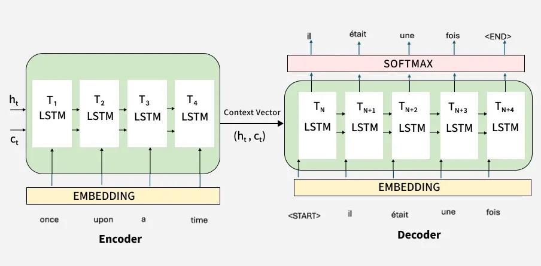

# Natural Language Processing

* **Natural Language Processing (NLP)** is a field of **AI + Computer Science + Linguistics**.
* It enables computers to **understand, interpret, and generate human language**.

---

## 🔹 Need for NLP
* Huge amount of **unstructured data** (text, speech, social media).
* Helps machines:
  * Extract meaning from text
  * Automate language-based tasks
* Major challenge: **ambiguity in language** (same sentence → multiple meanings).

---

## 🔹 NLP Pipeline (Steps)
#### 1. Sentence Segmentation
* Splitting text into sentences.

#### 2. Tokenization
* Breaking sentences into **words/tokens**.

#### 3. Part-of-Speech (POS) Tagging
* Assigning grammatical roles:
  * Noun, Verb, Adjective, etc.

#### 4. Lemmatization
* Converting words to **base/root form**
  (e.g., *running → run*)

#### 5. Stop Word Removal
* Removing common words (e.g., *the, is, and*)

#### 6. Dependency Parsing
* Identifying **relationships between words** (subject–verb–object structure)

---

## 🔹 NLP Techniques

### Rule-Based Approach
* Uses **manually defined rules**
* Simple but less flexible

### Machine Learning & Deep Learning
* Learns from data automatically
* Common models:
  * Decision Trees
  * SVM
  * Neural Networks (RNNs, Transformers)

### Modern Breakthrough
* **Transformers (e.g., BERT, GPT)**
* Excellent for language understanding & generation 

---

## Key NLP Tasks

### Text Processing
* Tokenization, stemming, lemmatization, normalization

### Syntax Analysis
* POS tagging, parsing

### Semantic Analysis
* Named Entity Recognition (NER)
* Word Sense Disambiguation
* Coreference Resolution

### Information Extraction
* Extract entities & relationships

### Text Classification
* Sentiment Analysis
* Spam Detection
* Topic Modeling

### Language Generation
* Machine Translation
* Text Summarization

### Speech Processing
* Speech-to-text
* Text-to-speech

---

## How NLP Works (Workflow)
1. Data Collection (text sources)
2. Text Preprocessing
3. Text Representation:
   * Bag of Words (BoW)
   * TF-IDF
   * Word Embeddings
4. Feature Extraction
5. Model Training (ML/DL)
6. Deployment & Prediction
7. Evaluation (Accuracy, Precision, Recall, F1-score)

---

## Applications of NLP
* Speech Recognition (Siri, Alexa)
* Machine Translation (Google Translate)
* Chatbots & Virtual Assistants
* Sentiment Analysis
* Text Summarization
* Search Engines / Information Retrieval

---

## Key Challenges
* Ambiguity in language
* Context understanding
* Sarcasm, idioms, slang
* Coreference resolution

---

## Key Concepts to Remember
* NLP = **Text → Structure → Meaning → Action**
* Works using:
  * Linguistics + Algorithms + Data
* Core idea: **Make machines understand human language**

---

## NLP Processing Libraries

### 1. NLTK
* One of the **oldest and most popular NLP libraries**
* Written in Python

#### Features:
* Tokenization
* Stemming & Lemmatization
* POS Tagging
* Parsing
* Access to linguistic datasets (WordNet, corpora)

#### Use:
* Learning & academic purposes
* Basic NLP tasks

---

### 2. spaCy
* **Fast and production-ready** NLP library

#### Features:
* Tokenization
* POS tagging
* Named Entity Recognition (NER)
* Dependency parsing
* Word vectors

#### Use:
* Real-world applications
* High-performance pipelines

---

### 3. TextBlob
* Built on top of NLTK
* Very **simple and beginner-friendly**

#### Features:
* Sentiment analysis
* POS tagging
* Translation
* Noun phrase extraction

#### Use:
* Quick prototyping
* Beginners

---

### 4. Gensim
* Designed for **topic modeling and vector space modeling**

#### Features:
* Word2Vec
* Doc2Vec
* Topic modeling (LDA)

#### Use:
* Large text corpora
* Semantic similarity tasks

---

### 5. Stanford CoreNLP
* Developed by Stanford University

#### Features:
* POS tagging
* NER
* Sentiment analysis
* Coreference resolution

#### Use:
* Research-level NLP
* Deep linguistic analysis

---

### 6. Transformers
* Modern NLP library using **deep learning models**

#### Features:
* Pretrained models (BERT, GPT, RoBERTa)
* Text classification
* Translation
* Summarization
* Question answering

#### Use:
* State-of-the-art NLP tasks

---

### 7. fastText
* Developed by Facebook (Meta)

#### Features:
* Word embeddings
* Text classification
* Handles out-of-vocabulary words

#### Use:
* Efficient text classification
* Large datasets

---

### 8. Flair
* Simple and powerful NLP framework

#### Features:
* Contextual word embeddings
* NER
* POS tagging

#### Use:
* Easy deep learning NLP tasks

---

## 🔹 Quick Comparison Table

| Library      | Best For          | Level        |
| ------------ | ----------------- | ------------ |
| NLTK         | Learning & basics | Beginner     |
| spaCy        | Production apps   | Intermediate |
| TextBlob     | Simple tasks      | Beginner     |
| Gensim       | Topic modeling    | Intermediate |
| CoreNLP      | Research          | Advanced     |
| Transformers | Deep learning     | Advanced     |
| fastText     | Classification    | Intermediate |
| Flair        | Embeddings        | Intermediate |


## Phases of Natural Language Processing (NLP)
NLP works in **5 main phases**, each focusing on understanding language at a deeper level.

---

### 1. Lexical & Morphological Analysis
Deals with **words and their structure**

#### Key Points:
* **Tokenization** → Split text into words
* **POS Tagging** → Identify noun, verb, etc.
* **Stemming** → Reduce to root form (running → run)
* **Lemmatization** → Convert to base meaning word

#### Purpose:
* Understand **basic units of language**
* Simplify text for further processing 

---

### 2. Syntactic Analysis (Parsing)
Deals with **grammar and sentence structure**

#### Key Points:
* Checks **correct arrangement of words**
* Builds **parse tree (structure of sentence)**
* Identifies:
  * Subject
  * Verb
  * Object

#### Purpose:
* Ensure sentence is **grammatically correct**
* Understand **relationships between words** 

---

### 3. Semantic Analysis
Deals with **meaning of words and sentences**

#### Key Points:
* **NER (Named Entity Recognition)** → Identify names, places, etc.
* **WSD (Word Sense Disambiguation)** → Correct meaning of ambiguous words

#### Purpose:
* Ensure sentence is **meaningful and logical**
* Understand **contextual meaning** 

---

### 4. Discourse Integration
Deals with **context across multiple sentences**

#### Key Points:
* **Anaphora Resolution** → Link pronouns to correct nouns
  (e.g., “She” → “Taylor”)
* Maintains **context continuity**

#### Purpose:
* Understand **full paragraph or conversation**
* Maintain **coherence across sentences** 

---

### 5. Pragmatic Analysis
Deals with **real-world meaning & intention**

#### Key Points:
* Understand **speaker’s intent**
* Interpret:
  * Idioms
  * Sarcasm
  * Indirect requests

#### Purpose:
* Go beyond literal meaning
* Understand **actual intention in context**

---

## Text Preprocessing Techniques
Preprocessing is an important to clean and prepare the raw text data for analysis. Common preprocessing steps include:

### Tokenization
Splitting text into **words/sentences (tokens)**

#### Working:
* Breaks text using spaces/punctuation
* Types: word tokenization, sentence tokenization

#### Code:
```python
from nltk.tokenize import word_tokenize

text = "NLP is amazing!"
tokens = word_tokenize(text)
print(tokens)
# ['NLP', 'is', 'amazing', '!']
```

---

### Stopword Removal
Removes **common words** (no important meaning)

#### Working:
* Filters words like: *is, the, and*

#### Code:
```python
from nltk.corpus import stopwords

words = ["this", "is", "nlp"]
filtered = [w for w in words if w not in stopwords.words('english')]
print(filtered)
# ['nlp']
```

---

### Punctuation Removal
Removes symbols like **.,!?**

#### Working:
* Uses string filters or regex

#### Code:
```python
import string
text = "Hello, NLP!"
clean = text.translate(str.maketrans('', '', string.punctuation))
print(clean)
# Hello NLP
```

---

### Stemming
Reduces words to **root form (not always meaningful)**

#### Working:
* Cuts suffixes (fast but crude)

#### Code:
```python
from nltk.stem import PorterStemmer
ps = PorterStemmer()
print(ps.stem("running"))
# run
```

---

### Lemmatization
Converts word to **dictionary base form**

#### Working:
* Uses vocabulary + POS
* More accurate than stemming

#### Code:
```python
from nltk.stem import WordNetLemmatizer
lem = WordNetLemmatizer()
print(lem.lemmatize("running", pos='v'))
# run
```

---

### Text Normalization
Standardizes text format

#### Working:
* Lowercasing
* Removing numbers, extra spaces
* Expanding contractions

#### Code:
```python
text = "NLP IS FUN 123"
normalized = text.lower()
print(normalized)
# nlp is fun 123
```

---

### Parts of Speech (POS) Tagging
Assigns **grammatical roles** (noun, verb, etc.)

#### Working:
* Uses trained models to label tokens

#### Code:
```python
from nltk import pos_tag, word_tokenize
text = "NLP is fun"
print(pos_tag(word_tokenize(text)))
# [('NLP', 'NNP'), ('is', 'VBZ'), ('fun', 'JJ')]
```

---

### Parsing
Analyzes **sentence structure (syntax)**

#### Working:
* Builds tree showing relationships between words

#### Code (simple):
```python
import spacy

nlp = spacy.load("en_core_web_sm")
doc = nlp("NLP is fun")

for token in doc:
    print(token.text, token.dep_)
```

---

## Text Representation Techniques
It converts textual data into numerical vectors.

### One-Hot Encoding
Represents each word as a **binary vector**

#### Working:
* Create vocabulary of all unique words
* Each word → vector of size *V* (vocab size)
* Only one position = 1, rest = 0

Example:
Vocabulary = [I, love, NLP]
* I → [1,0,0]
* love → [0,1,0]

#### Pros:
* Simple

#### Cons:
* High dimensional, no meaning captured

#### Code:
```python
from sklearn.preprocessing import OneHotEncoder
import numpy as np

words = np.array([["I"], ["love"], ["NLP"]])
encoder = OneHotEncoder(sparse=False)
print(encoder.fit_transform(words))
```

---

### Bag of Words (BoW)
Represents text based on **word frequency**

#### Working:
* Create vocabulary
* Count frequency of each word in document

Example:
"I love NLP NLP" → [I=1, love=1, NLP=2]

#### Pros:
* Easy, useful baseline

#### Cons:
* Ignores order & context

#### Code:
```python
from sklearn.feature_extraction.text import CountVectorizer

docs = ["I love NLP", "NLP is fun"]
vectorizer = CountVectorizer()
X = vectorizer.fit_transform(docs)

print(vectorizer.get_feature_names_out())
print(X.toarray())
```

---

### TF-IDF (Term Frequency – Inverse Document Frequency)
Measures **importance of a word**

#### Working:
* **TF** → frequency in document

  ```math
  TF = \frac{\text{No. of repitition of words in sentence}}{\text{No. of words in sentence}}
  ```
  

* **IDF** → rarity across documents

  ```math
  IDF = \frac{\text{No. of sentence}}{\text{No. of sentences containing the word}}
  ```
* Formula:
  TF-IDF = TF × log(N / DF)

    Rare words → higher weight
    Common words → lower weight

#### Pros:
* Better than BoW

#### Cons:
* Still ignores context

#### Code:
```python
from sklearn.feature_extraction.text import TfidfVectorizer

docs = ["I love NLP", "NLP is fun"]
vectorizer = TfidfVectorizer()
X = vectorizer.fit_transform(docs)

print(X.toarray())
```

---

### N-Gram Language Modeling
Considers **sequence of words**

#### Working:
* N = number of words in sequence
  * Unigram → 1 word
  * Bigram → 2 words
  * Trigram → 3 words

Example:
"I love NLP"
* Bigrams → ["I love", "love NLP"]

#### Pros:
* Captures context & word order

#### Cons:
* Large feature size

#### Code:
```python
from sklearn.feature_extraction.text import CountVectorizer

docs = ["I love NLP"]
vectorizer = CountVectorizer(ngram_range=(2,2))  # bigrams
X = vectorizer.fit_transform(docs)

print(vectorizer.get_feature_names_out())
```

---

## Text Embedding Techniques
Text embeddings convert words into **dense numerical vectors** so machines can process language.

Goal:
* Capture **semantic meaning**
* Preserve **similarity relationships**

Example:
* happy → [0.2, -0.1, 0.9, ...]
* glad → [0.21, -0.08, 0.88, ...]

👉 Similar meaning → similar vectors

---

### Word Embeddings
Dense vector representations where:

* Similar words → close in vector space
* Learned from **context**

Unlike one-hot encoding:

* Sparse, no meaning
* Embeddings capture semantics

---

### Word2Vec
A neural network-based method to learn embeddings using **context prediction**.

“Words that appear in similar contexts have similar meanings”

So:
* happy and glad appear in similar sentences
* Model pushes their vectors closer

---

#### CBOW (Continuous Bag of Words)
Predict **target word** from **context words**

##### Example:
Sentence:
> "I am happy today"

* Input → ["I", "am", "today"]
* Output → "happy"

##### Mathematical Intuition
We average context vectors:
```math
\vec{v}_{context} = \frac{1}{n} \sum \vec{v}_i
```

Then predict:
```math
P(w_{target} | context)
```

Learns:
* Which words are likely in a given context

##### Advantages
* Faster training
* Works well for **frequent words**
* Smooth representations

##### Disadvantages
* Ignores word order
* Poor for rare words
* Context is averaged → loss of nuance

---

#### Skip-gram
Predict **context words** from **center word**

##### Example:
* Input → "happy"
* Output → ["I", "am", "today"]

##### Mathematical Intuition
Maximize:
```math
P(context | word)
```

Using dot product similarity:
```math
\vec{v}*{word} \cdot \vec{v}*{context}
```

If two words share contexts:
* Their vectors align

##### Advantages
* Works well for **rare words**
* Better semantic quality
* Captures fine relationships

##### Disadvantages
* Slower than CBOW
* More computationally expensive

##### CBOW vs Skip-gram
| Feature    | CBOW     | Skip-gram |
| ---------- | -------- | --------- |
| Predicts   | Word     | Context   |
| Speed      | Fast     | Slower    |
| Rare words | Poor     | Good      |
| Accuracy   | Moderate | High      |

---

### Average Word2Vec (AvgWord2Vec)
To represent a **sentence/document**, take average of word vectors.

Sentence:
> "I am very happy"

```math
\vec{sentence} = \frac{1}{n} (\vec{I} + \vec{am} + \vec{very} + \vec{happy})
```

Smooth representation of overall meaning

---

#### Advantages
* Simple and fast
* Works surprisingly well for:
  * classification
  * similarity tasks

---

#### Disadvantages
* Ignores word order
* Loses syntax
* All words weighted equally (even stopwords)

---

#### Practical Code
Using Gensim

##### Train Word2Vec
```python
from gensim.models import Word2Vec

# Sample data
sentences = [
    ["i", "am", "happy"],
    ["i", "feel", "glad"],
    ["this", "is", "great"]
]

# Train model
model = Word2Vec(sentences, vector_size=100, window=2, min_count=1)
# Get vector
print(model.wv["happy"])
# Similar words
print(model.wv.most_similar("happy"))
```

---

##### CBOW vs Skip-gram
```python
# CBOW (default)
model_cbow = Word2Vec(sentences, sg=0)

# Skip-gram
model_sg = Word2Vec(sentences, sg=1)
```

---

##### AvgWord2Vec (Sentence Embedding)
```python
import numpy as np

def avg_word2vec(sentence, model):
    vectors = [model.wv[word] for word in sentence if word in model.wv]
    return np.mean(vectors, axis=0)

sentence = ["i", "am", "happy"]
print(avg_word2vec(sentence, model))
```

---

#### Final Summary
* Word2Vec learns meaning via **context prediction**
* CBOW → context → word (fast)
* Skip-gram → word → context (accurate)
* AvgWord2Vec → simple sentence embedding

--- 


---

## Text Summarization
Text summarization is the process of **automatically reducing large text into a shorter version while preserving key information and meaning**

### Why needed?
* Huge volume of text (news, blogs, research)
* Humans cannot process everything efficiently

Goal:
```math
\text{Summary} = f(\text{Original Text})
```

Where:
* shorter length
* same meaning

---

### Types of Text Summarization

#### Extractive Summarization
Selects **important sentences directly** from text
* No new sentence generation
* Just extraction + concatenation

---

#### Abstractive Summarization
Generates **new sentences** using understanding of text
* Paraphrasing
* Human-like summaries

---

#### Difference
| Feature      | Extractive         | Abstractive        |
| ------------ | ------------------ | ------------------ |
| Output       | Original sentences | New sentences      |
| Complexity   | Low                | High               |
| Intelligence | Surface-level      | Deep understanding |

---

### Extractive Summarization (In-depth)
Assign **importance score to each sentence** → select top-k

---

#### Techniques
1. Statistical Methods
    ##### (a) Frequency-Based
      ```math
      Score(S) = \sum_{w \in S} freq(w)
      ```

      Intuition:
      * Important words appear frequently
      * Sentences with such words → important

    ##### (b) TF-IDF
      ```math
      TF = \frac{count(w)}{total\ words}
      ```

      ```math
      IDF = \log \frac{N}{df(w)}
      ```

      ```math
      TF\text{-}IDF = TF \times IDF
      ```

      Intuition:
      * Frequent in document ✔
      * Rare globally ✔ → important

2. LSA (Latent Semantic Analysis)
    Based on:
    ```math
    X = U \Sigma V^T
    ```

    Intuition:
    * Reduce dimensionality
    * Capture hidden topics/themes

3. Graph-Based Methods
    Uses PageRank
    * Each sentence = node
    * Edge weight = similarity

    ```math
    sim(S_i, S_j) = \frac{S_i \cdot S_j}{||S_i|| , ||S_j||}
    ```

    This is **cosine similarity**

    Ranking Equation:
    ```math
    Score(S_i) = (1-d) + d \sum_{j \in In(S_i)} \frac{Score(S_j)}{Out(S_j)}
    ```

    Sentences important if:
    * Connected to other important sentences

4. Sentence Scoring
    Score based on:
    * Position
    * Length
    * Keywords
    * Similarity

    Advantages
    * Simple
    * Fast
    * No training required

    Disadvantages
    * No paraphrasing
    * Redundant sentences
    * Poor coherence

---

### Abstractive Summarization (In-depth)
Treat as **sequence generation problem**
```math
P(summary | text)
```

Mathematical Formulation
```math
P(y_1, ..., y_n | x) = \prod_{t=1}^{n} P(y_t | y_1,...,y_{t-1}, x)
```

Generate summary word-by-word

#### 🔑 Techniques (GFG)
1. Seq2Seq Models
    * Encoder → understand input
    * Decoder → generate summary

2. Attention Mechanism
    ```math
    Attention(Q,K,V) = \text{softmax}\left(\frac{QK^T}{\sqrt{d}}\right)V
    ```

    Intuition:
    * Focus on relevant parts of text while generating

3. Transformer Models
    Examples:
    * BERT
    * GPT

4. PEGASUS Model
    Key idea:
    * Mask important sentences
    * Train model to predict them

    Why powerful?
    * Learns summarization directly

    #### Advantages
    * Human-like summaries
    * Better coherence
    * Can rephrase

    #### Disadvantages
    * Needs large data
    * Computationally expensive
    * May hallucinate

---

### Mathematical Intuition (Big Picture)
#### Extractive = Ranking Problem
```math
\text{Find } S^* = \arg\max Score(S)
```

Where score based on:
* TF-IDF
* Cosine similarity
* Graph centrality

---

#### Abstractive = Language Modeling
```math
\text{Summary} = \arg\max P(Y | X)
```

Neural networks approximate this probability

---

### Practical Code

#### Extractive (TextRank using spaCy + PyTextRank)

```python
import spacy
import pytextrank

nlp = spacy.load("en_core_web_lg")
nlp.add_pipe("textrank")

text = """Artificial intelligence is transforming industries.
It improves efficiency and productivity.
However, it raises ethical concerns."""

doc = nlp(text)

for sent in doc._.textrank.summary(limit_sentences=2):
    print(sent)
```

---

#### Abstractive (PEGASUS via Transformers)
```python id="gfg2"
from transformers import pipeline

summarizer = pipeline("summarization", model="google/pegasus-xsum")

text = """Artificial intelligence improves efficiency but raises concerns."""

print(summarizer(text, max_length=40, min_length=10))
```

## Language Models
A **Language Model (LM)** is a model that assigns a **probability to a sequence of words**.

Goal:
```math
P(\text{sentence}) = P(w_1, w_2, ..., w_n)
```

Example:
* “I am happy” → high probability
* “happy am I” → low probability

Used in:
* Text generation
* Speech recognition
* Machine translation
* Chatbots

#### Core Idea
A language model learns:

“What word comes next?”
```math
P(w_t | w_1, w_2, ..., w_{t-1})
```

---

#### Mathematical Formulation
Using **chain rule of probability**:

```math
P(w_1, w_2, ..., w_n) =
\prod_{t=1}^{n} P(w_t | w_1,...,w_{t-1})
```

#### Problem
Full context is expensive → exponential complexity

#### Solution: Markov Assumption
Assume:

```math
P(w_t | w_1,...,w_{t-1}) \approx P(w_t | w_{t-1},...,w_{t-n+1})
```

* Only last *n-1 words matter*

### Types of Language Models

#### Statistical Language Models

##### N-gram Models
Predict using last (n−1) words

Example: Bigram Model
```math
P(w_t | w_{t-1}) = \frac{Count(w_{t-1}, w_t)}{Count(w_{t-1})}
```

Example:

Sentence:
> "I am happy"

```math
P(\text{happy} | am) = \frac{Count(am, happy)}{Count(am)}
```

##### Intuition
Learn from frequency:
* Words that appear together often → high probability

##### Problems
* Data sparsity
* Zero probability (unseen words)

##### Solution: Smoothing
Example:
* Laplace smoothing

```math
P = \frac{Count + 1}{Total + V}
```

Where:
* (V) = vocabulary size

---

##### Advantages
* Simple
* Interpretable

##### Disadvantages
* Cannot capture long context
* Memory inefficient

---

#### Neural Language Models
Use neural networks to learn:
```math
P(w_t | context)
```

##### Architecture
Input:
* Word embeddings

Model:
* Feedforward / RNN / Transformer

Output:
* Probability distribution (softmax)

##### Key Equation
```math
P(w_t | context) = \text{softmax}(W h + b)
```

Where:
* (h) = hidden representation

#### Types of Neural LMs
1. Feedforward Neural LM
    * Fixed context window

2. RNN / LSTM LM
    * Captures sequence
    * Handles variable length

3. Transformer-based LM

    Examples:
    * BERT
    * GPT

Attention Mechanism

```math
Attention(Q,K,V) =
\text{softmax}\left(\frac{QK^T}{\sqrt{d}}\right)V
```

Model focuses on relevant words in the sequence

---

### Training Objective
Maximize likelihood:

```math
\mathcal{L} =
\sum \log P(w_t | context)
```

Equivalent to minimizing:
```math
\text{Cross-Entropy Loss}
```

---

### Evaluation Metric

#### Perplexity (VERY IMPORTANT)
```math
PP = \left( \frac{1}{P(w_1,...,w_n)} \right)^{1/n}
```

#### Intuition
* Lower perplexity → better model
* Measures “how surprised” the model is

---

### Deep Mathematical Intuition
#### Language Modeling = Probability Estimation
Goal:
```math
\text{Learn distribution over sequences}
```

---

#### Embedding + Softmax View
1. Word → vector:
```math 
w \rightarrow \vec{v} 
```

2. Context → hidden state:
```math
h = f(w_1,...,w_{t-1}) 
```

3. Score each word:
```math
score(w) = h \cdot \vec{v}_w 
```

4. Convert to probability:
```math 
P(w) = \frac{\exp(score(w))}{\sum \exp(score)} 
```

---

### Practical Code

#### N-gram 
```python id="lm1"
from collections import defaultdict

corpus = ["i am happy", "i am glad"]

bigram = defaultdict(lambda: defaultdict(int))

for sentence in corpus:
    words = sentence.split()
    for i in range(len(words)-1):
        bigram[words[i]][words[i+1]] += 1

# Probability
def prob(w1, w2):
    return bigram[w1][w2] / sum(bigram[w1].values())

print(prob("am", "happy"))
```

---

#### Neural LM (Transformers)
Using Hugging Face Transformers
```python id="lm2"
from transformers import pipeline

generator = pipeline("text-generation", model="gpt2")

print(generator("I am feeling", max_length=10))
```

---

### Applications
* Autocomplete (Google, keyboards)
* Machine translation
* Speech recognition
* Chatbots

---

## Named Entity Recognition
* Named Entity Recognition (NER) is an NLP technique used to **identify and classify important information (entities)** in text.
* It converts **unstructured text → structured data**.

#### Examples of Entities:
* Person → *Albert Einstein*
* Organization → *Google*
* Location → *India*
* Date → *5th May 2025*
* Money → *$100* 

### Importance of NER
* Helps in:
  * Information extraction
  * Search engines
  * Chatbots
  * Question answering systems
  * Data analysis 

### spaCy for NER
* **spaCy** is a Python NLP library used for fast and efficient text processing. 

### Features:
* Pre-trained NER models
* High speed & accuracy
* Easy API
* Supports deep learning
* Custom model training possible

---

### Common Entity Labels in spaCy

| Label   | Meaning           |
| ------- | ----------------- |
| PERSON  | Names of people   |
| ORG     | Organizations     |
| GPE     | Countries, cities |
| DATE    | Dates/time        |
| MONEY   | Monetary values   |
| PRODUCT | Products          |
| EVENT   | Events            |
| LAW     | Legal documents   |


### Steps to Implement NER using spaCy

#### Step 1: Install spaCy
```bash
pip install spacy
python -m spacy download en_core_web_sm
```

#### Step 2: Load Model & Process Text
```python
import spacy

nlp = spacy.load("en_core_web_sm")
text = "Apple is buying a UK startup for $1 billion"
doc = nlp(text)
```

#### Step 3: Extract Entities
```python
for ent in doc.ents:
    print(ent.text, ent.label_)
```

#### Example Output:
```
Apple ORG
UK GPE
$1 billion MONEY
```

Entities are stored in:
```python
doc.ents
```

---

### How NER Works (Conceptual Steps)
1. Text analysis
2. Sentence segmentation
3. Tokenization
4. POS tagging
5. Entity detection
6. Classification
7. Model training & improvement 

---

### Case Sensitivity in NER
* Capitalization affects results:
```python
"Apple" → recognized (ORG)
"apple" → not recognized
```

Reason: Models rely on patterns learned from training data. 

---

### Custom Named Entities in spaCy
You can manually add entities:
```python
from spacy.tokens import Span

doc = nlp("Tesla is launching a product")
doc.ents = [Span(doc, 0, 1, label="ORG")]

for ent in doc.ents:
    print(ent.text, ent.label_)
```

Useful for domain-specific applications.

---

### Methods of NER

1. Lexicon-Based
    * Uses dictionary of known entities

2. Rule-Based
    * Uses patterns and grammar rules

3. Machine Learning-Based
    * Uses labeled data
    * Example: CRF (Conditional Random Fields)

4. Deep Learning-Based
    * Uses neural networks
    * Higher accuracy with large data 

---

### Visualization of Entities
```python
from spacy import displacy
displacy.render(doc, style="ent")
```
Highlights entities in text visually.

---

### Applications of NER
* Chatbots
* Resume parsing
* News analysis
* Medical data extraction
* Financial data processing

---

## BERT & Transformers
* **BERT (Bidirectional Encoder Representations from Transformers)** is a **Transformer-based NLP model** used for understanding language.
* It uses **encoder-only architecture** (no decoder).

Unlike old models, BERT reads:
* **Left → Right**
* **Right → Left (simultaneously)**

✔ This is called **bidirectional context understanding**

---

#### Why BERT is Powerful?
Traditional models:
* Read text sequentially (L→R)
* Limited context

BERT:
* Looks at **entire sentence at once**
* Understands meaning using **full context**

Example:
> "bank" in
> *river bank* vs *bank account*

> BERT understands difference using context

---

### Transformer Architecture (Core Idea)
BERT is based on **Transformers**

Main Components:
* Input Embeddings
* Self-Attention
* Feedforward Neural Network
* Encoder layers stacked

BERT uses only: **Transformer Encoder**

---

### Mathematical Intuition

#### Word Embeddings
Each word → vector
```math
x_i \in \mathbb{R}^d
```

Sentence becomes matrix:
```math 
 = [x_1, x_2, ..., x_n] 
```

#### Self-Attention
Each word creates 3 vectors:
* Query (Q)
* Key (K)
* Value (V)

```math 
Q = XW_Q,\quad K = XW_K,\quad V = XW_V 
```

---

#### Attention Formula:
```math
Attention(Q,K,V) = softmax\left(\frac{QK^T}{\sqrt{d_k}}\right)V
```

Intuition:
* (QK^T) → similarity between words
* softmax → importance weights
* Multiply by (V) → final representation

Meaning:
> "Which words should I focus on?"

---

#### Multi-Head Attention
Instead of one attention:
* Use multiple attentions in parallel

```math
MultiHead = concat(head_1, ..., head_h)W_O 
```

Captures different relationships:
* grammar
* meaning
* dependencies

---

#### BERT Architecture Details
| Model      | Layers | Parameters |
| ---------- | ------ | ---------- |
| BERT Base  | 12     | 110M       |
| BERT Large | 24     | 340M       |

Uses:
* **[CLS] token** → classification
* **[SEP] token** → separator

---

### Pre-training of BERT
BERT is trained on **unlabeled data first**

#### Masked Language Model (MLM)
* Random words are masked
* Model predicts missing word

Example:
> "I love [MASK] learning"
* Learns context deeply
* Uses **Softmax probability** over vocabulary

---

#### Next Sentence Prediction (NSP)
* Predicts: Is sentence B related to sentence A?

Helps in:
* Question answering
* Sentence relationships 

---

### Training Objective (Math Intuition)
Loss =
```math
L = L_{MLM} + L_{NSP}
```

Model minimizes:
* Mask prediction error
* Sentence relation error

---

### Fine-Tuning
After pretraining:
Add small layer + train on task

Examples:
* Classification
* NER
* QA

Same model → many tasks

---

### How BERT Works (Flow)
1. Input sentence
2. Tokenization
3. Convert to embeddings
4. Pass through encoder layers
5. Output contextual vectors
6. Use for downstream task

---

### Applications of BERT
* Text classification
* Named Entity Recognition
* Question answering
* Chatbots
* Semantic similarity

---

### BERT vs Traditional Models
| Feature     | BERT                    | Old Models    |
| ----------- | ----------------------- | ------------- |
| Direction   | Bidirectional           | One-direction |
| Context     | Full sentence           | Limited       |
| Training    | Pretrained + fine-tuned | Task-specific |
| Performance | Very high               | Moderate      |

---

### BERT vs GPT 
| Feature  | BERT          | GPT                  |
| -------- | ------------- | -------------------- |
| Type     | Encoder       | Decoder              |
| Goal     | Understanding | Generation           |
| Training | MLM + NSP     | Next word prediction |

---

### Key Advantages
* Deep contextual understanding
* Transfer learning (pretrain + finetune)
* Works on many NLP tasks
* State-of-the-art performance

---

### Limitations
* Large model (memory heavy)
* Slow training
* Not ideal for text generation

### Intuition Summary
Old NLP:
> Reads sentence like a human reading word-by-word

BERT:
> Looks at **whole sentence at once and connects everything**

## Encoder & Decoder
The **Encoder–Decoder architecture** is a framework used in NLP where:
* **Encoder** → understands input text
* **Decoder** → generates output text

Used for:
* Translation
* Summarization
* Question answering

---

### High-Level Flow
```text
Input Sentence → Encoder → Context Representation → Decoder → Output Sentence
```

Example:
```text
"Hello" → Encoder → Meaning → Decoder → "Hola"
```

---

### Encoder
The **encoder** reads the entire input sequence and converts it into a **contextual representation (vector)**.

#### How Encoder Works (Step-by-Step)

##### Step 1: Tokenization
* Input sentence → tokens
```text
"I love AI" → ["I", "love", "AI"]
```

##### Step 2: Embedding
* Tokens → vectors

##### Step 3: Positional Encoding
* Adds order information

##### Step 4: Self-Attention (Core)
* Each word looks at all other words

Example:
```text
"The cat sat on the mat"
```

* "sat" attends to "cat"

##### Step 5: Feed Forward Network
* Adds non-linearity

##### Step 6: Output Representation
* Produces:
  * Context-aware embeddings for each token

---

#### Output of Encoder
Two possibilities:
##### Old (RNN-based)
* Single vector (context vector)

##### Modern (Transformer)
* Sequence of contextual embeddings

---

##### Goal of Encoder
> Convert raw text → **meaningful representation**

---

### Decoder
The **decoder** generates output sequence **token-by-token** using:
* Encoder output
* Previously generated tokens

#### How Decoder Works (Step-by-Step)

##### Step 1: Input (Shifted Output)
* Uses previous tokens
```text
<start> → "I" → "am" → ...
```

##### Step 2: Masked Self-Attention
* Can only see past tokens (not future)
Ensures:
> No cheating during generation

##### Step 3: Encoder–Decoder Attention
* Decoder attends to encoder output

This is crucial:
* Aligns input and output

Example:
```text
Input: "I love AI"
Output: "Me encanta IA"
```

* "love" ↔ "encanta"

##### Step 4: Feed Forward Layer

##### Step 5: Output Prediction
* Softmax → next token probability

##### Step 6: Repeat
* Generates sequence step-by-step

---

#### Goal of Decoder
> Generate output sequence based on:
* Input meaning
* Previously generated tokens

---

### Attention Types (Important)

#### 1. Self-Attention (Encoder)
* Input attends to itself

#### 2. Masked Self-Attention (Decoder)
* Prevents future leakage

#### 3. Cross-Attention (Encoder–Decoder)
* Decoder attends to encoder output

---

### Architecture Summary



#### Encoder Block
* Multi-head self-attention
* Feed-forward
* Residual + LayerNorm

#### Decoder Block
* Masked self-attention
* Cross-attention
* Feed-forward
* Residual + LayerNorm

---

### Types of Models Using This

#### Encoder-Only Models
* Example: BERT
* Use:
  * Classification
  * Embeddings

#### Decoder-Only Models
* Example: GPT
* Use:
  * Text generation

#### Encoder–Decoder Models
* Example: T5
* Use:
  * Translation
  * Summarization

---

### Encoder vs Decoder (Clear Difference)
| Feature   | Encoder                | Decoder                  |
| --------- | ---------------------- | ------------------------ |
| Role      | Understand input       | Generate output          |
| Attention | Full self-attention    | Masked + cross-attention |
| Input     | Full sentence          | Previous tokens          |
| Output    | Context representation | Generated text           |

---

### Key Intuition (VERY IMPORTANT)
Think like this:
* Encoder = **Reader**
* Decoder = **Writer**

OR

```text
Encoder → Understand meaning
Decoder → Express meaning
```

---

### Example (End-to-End)
#### Input:
```text
"I am learning AI"
```

#### Encoder:
* Understands:
  * Subject = I
  * Action = learning
  * Object = AI

---

#### Decoder:
Generates:
```text
"Je suis en train d'apprendre l'IA"
```
