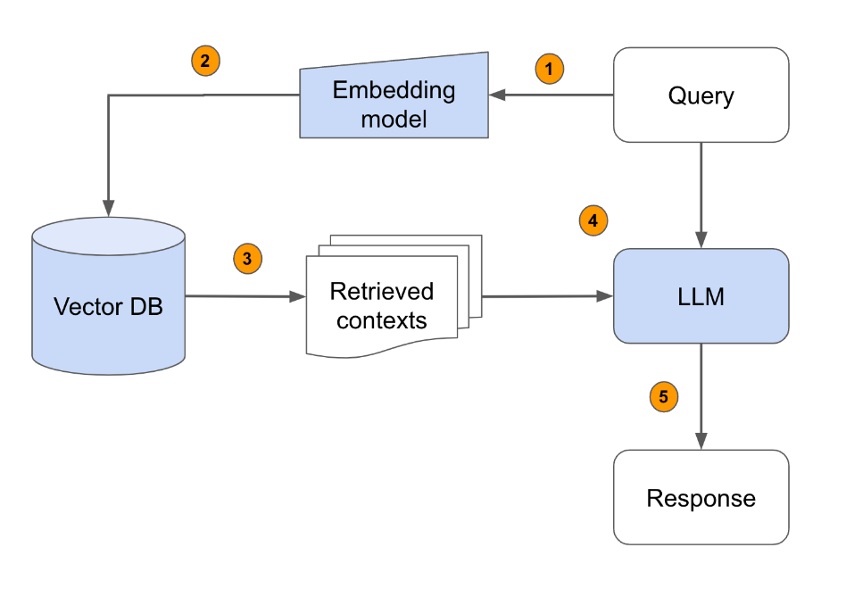

# RAG (Retrieval-Augmented Generation)

**Retrieval-Augmented Generation (RAG)** is an AI framework that:
* combines **retrieval (searching external data)**
* with **generation (LLM output)**

    

Instead of relying only on trained knowledge, it:
* **retrieves relevant documents**
* then **uses them to generate answers** 

---

## Why RAG is Needed
Traditional LLM problems:
* Outdated knowledge
* Hallucinations (wrong answers)
* No access to private data

RAG solves these by:
* accessing **real-time external data**
* improving **accuracy and relevance** 

---

## Key Benefits
* **Up-to-date information** (dynamic retrieval)
* **Better accuracy** (less hallucination)
* **Domain-specific knowledge** (e.g., legal, medical)
* **Cost efficient** (no need to retrain models)
* **Personalization** (user-specific data) 

---

## Core Components of RAG

### Main Components:
1. **External Knowledge Source**
   * Documents, APIs, databases

2. **Text Chunking**
   * Break large text into smaller parts

3. **Embedding Model**
   * Converts text → vectors

4. **Vector Database**
   * Stores embeddings

5. **Query Encoder**
   * Converts query → vector

6. **Retriever**
   * Finds relevant chunks

7. **Prompt Augmentation**
   * Adds retrieved data to query

8. **LLM (Generator)**
   * Generates final answer

9. **Updater (optional)**
   * Keeps data fresh 

---

## Working of RAG (Step-by-Step)

### Pipeline:
```text
1. Collect external data
2. Convert to embeddings
3. Store in vector DB
4. User query → embedding
5. Retrieve similar documents
6. Add to prompt
7. LLM generates answer
```

Key idea:
* Retrieval happens **before generation** 

---

## Problems Solved by RAG

1. Hallucination
    * Grounds answers in real data

2. Outdated Knowledge
    * Retrieves latest information

3. Poor Context
    * Adds relevant documents

4. Lack of Expertise
    * Uses domain-specific datasets

5. High Training Cost
    * Avoids retraining LLMs 

---

## Challenges of RAG
* Complex system design
* Latency (slow due to retrieval step)
* Depends on retrieval quality
* Bias in retrieved data

---

## Applications of RAG
* Chatbots & Q&A systems
* Document search & summarization
* Virtual assistants
* Educational tools
* Enterprise knowledge systems 

---

## RAG vs Other Approaches
| Method             | Description             | When to Use               |
| ------------------ | ----------------------- | ------------------------- |
| Prompt Engineering | Modify input prompt     | Simple tasks              |
| RAG                | Retrieve + generate     | Real-time + accurate info |
| Fine-tuning        | Train model on new data | Specialized tasks         |
| Pre-training       | Train from scratch      | Large-scale models        |

RAG = **best for dynamic + factual systems** 

---

## Types of RAG
RAG systems can be categorized based on **how retrieval and generation are designed and optimized**.

---

### Naive RAG (Basic RAG)
Idea:
* Simple pipeline:

```text
Query → Retrieve → Add Context → LLM → Answer
```

Working:
1. Convert query → embedding
2. Retrieve top-K documents
3. Append to prompt
4. Generate answer

Advantages:
* Easy to implement
* Good for small projects

Limitations:
* No optimization
* May retrieve irrelevant chunks
* No ranking/refinement

Used in: **basic chat-with-docs apps**

---

### Advanced RAG
Idea:
Improves retrieval quality and response accuracy.

Enhancements:
1. Better Chunking
    * Smart splitting (semantic, recursive)

2. Query Expansion
    * Rewrite query into multiple forms

3. Re-ranking
    * Rank retrieved documents using:
        * LLM
        * cross-encoder models

4. Filtering
    * Metadata-based filtering

Advantages:
* Higher accuracy
* Better context relevance

Limitations:
* More complex
* Higher latency

---

### Modular RAG
Idea:
Break RAG into independent modules that can be customized.

Modules:
* Retriever
* Ranker
* Generator
* Query processor

Benefit:
You can swap components:
* FAISS → Pinecone
* GPT → other LLM

Advantages:
* Flexible
* Scalable

---

### Hybrid RAG
Idea:
Combine **multiple retrieval methods**

Types of Hybrid:
1. Keyword + Vector Search
    * BM25 (keyword)
        * embedding similarity

2. Multi-source Retrieval
    * PDFs + APIs + DBs

Advantages:
* Better recall & precision
* Handles diverse queries

---

### Graph RAG
Idea:
Combine **vector search + knowledge graphs**

How it works:
* Use graph relationships between data
* Retrieve based on:
  * similarity + relationships

Advantages:
* Better reasoning
* Handles complex queries

Limitation:
* Complex to build

---

### Agentic RAG
Idea:
Use **AI agents to control retrieval**

What agents do:
* Decide:
  * what to retrieve
  * how many queries
  * when to stop

Features:
* Multi-step reasoning
* Tool usage

Advantages:
* Dynamic retrieval
* More intelligent

---

### Multi-hop RAG
Idea:
Answer requires **multiple retrieval steps**

Example:
* “Who is the CEO of the company that acquired X?”

Needs:
1. Find company
2. Find CEO

Advantages:
* Handles complex questions

---

### Fusion RAG
Idea:
Combine results from **multiple queries or retrievers**

Example:
* Generate 5 query variations
* Retrieve results
* Merge + rank

Benefit:
* Improves retrieval coverage

---

### Self-RAG
Idea:
Model evaluates its own responses

Features:
* Checks:
  * relevance
  * correctness

* Can:
  * re-retrieve
  * refine answer

Advantage:
* Reduces hallucination

---

### Adaptive RAG
Idea:
System adapts based on query type

Example:
* Simple query → basic retrieval
* Complex query → multi-hop + re-ranking

Benefit:
* Efficient + intelligent

---

### Summary Table

| Type          | Key Idea               | Complexity | Use Case           |
| ------------- | ---------------------- | ---------- | ------------------ |
| Naive RAG     | Basic retrieval        | Low        | Beginners          |
| Advanced RAG  | Optimized pipeline     | Medium     | Better accuracy    |
| Modular RAG   | Replaceable components | Medium     | Flexible systems   |
| Hybrid RAG    | Keyword + vector       | Medium     | Search systems     |
| Graph RAG     | Relationships          | High       | Enterprise data    |
| Agentic RAG   | AI-controlled          | High       | Autonomous systems |
| Multi-hop RAG | Multi-step retrieval   | High       | Complex queries    |
| Fusion RAG    | Combine results        | Medium     | Better recall      |
| Self-RAG      | Self-evaluation        | High       | Reliable AI        |
| Adaptive RAG  | Dynamic approach       | High       | Smart systems      |

--- 

## Chunking

* **Chunking** = splitting large documents into **smaller segments (chunks)** for processing.
* Used in:

  * Retrieval-Augmented Generation (RAG)
  * Semantic search
  * Document processing systems

Purpose: Make data easier for models to **embed, retrieve, and understand**

---

### Why Chunking is Important
* LLMs have **limited context windows** → cannot process full documents.
* Good chunking:
  * Improves **retrieval accuracy**
  * Preserves **meaning & context**
  * Enables **better embeddings**
* Poor chunking:
  * Breaks relationships between ideas
  * Produces incomplete/misleading answers

---

### Chunking in RAG Pipeline
**Pipeline flow:**
1. Document preprocessing
2. Chunking
3. Embedding generation
4. Retrieval

* Chunking acts as a **bridge between raw data and embeddings**.
* Better chunks → better embeddings → better retrieval

---

### Core Principles of Good Chunking
1. **Semantic coherence**
   * Each chunk = one meaningful idea
2. **Context preservation**
   * Enough info to understand chunk independently
3. **Computational efficiency**
   * Balance size vs performance

---

### Chunking Strategies

#### 1. Fixed-Size Chunking
Splitting text into equal-sized chunks (by tokens, words, or characters)

**How it works:**
* Example: every 500 tokens → 1 chunk

**Advantages:**
* Simple and fast
* Easy to implement
* Works well for large-scale systems

**Disadvantages:**
* Breaks sentences/ideas
* No semantic awareness

**Best Use Cases:**
* Baseline systems
* When speed > accuracy

---

#### 2. Sentence-Based Chunking
* Splits text using sentence boundaries

**How it works:**
* Each chunk = 1 or more full sentences

**Advantages:**
* Preserves readability
* Better than fixed-size for meaning

**Disadvantages:**
* Uneven chunk sizes
* May lose broader context

**Best Use Cases:**
* Chatbots
* QA systems

---

#### 3. Semantic Chunking
* Splits text based on **meaning or topic similarity**

**How it works:**
* Uses embeddings to detect topic shifts
* Groups semantically related sentences

**Advantages:**
* High-quality chunks
* Better retrieval accuracy

**Disadvantages:**
* Computationally expensive
* More complex to implement

**Best Use Cases:**
* High-accuracy RAG systems
* Knowledge bases

---

#### 4. Sliding Window Chunking
* Creates overlapping chunks

**How it works:**
* Chunk 1: tokens 1–500
* Chunk 2: tokens 250–750

**Advantages:**
* Preserves context across chunks
* Reduces boundary issues

**Disadvantages:**
* Redundant data
* Higher storage & compute cost

**Best Use Cases:**
* Long documents
* Context-sensitive tasks

---

#### 5. Hierarchical Chunking
* Uses document structure (sections → paragraphs → sentences)

**How it works:**
* Multi-level chunking
* Retrieval can zoom in/out

**Advantages:**
* Maintains structure
* Flexible retrieval

**Disadvantages:**
* More complex indexing

**Best Use Cases:**
* Books, research papers
* Structured documents

---

#### 6. Contextual Chunking
* Enhances chunks with metadata

**How it works:**
* Adds:
  * Headings
  * Source info
  * Timestamps

**Advantages:**
* Improves retrieval relevance
* Adds traceability

**Disadvantages:**
* Extra storage overhead

**Best Use Cases:**
* Enterprise search
* Document-heavy systems

---

#### 7. Topic-Based Chunking
* Groups text by topics/themes

**How it works:**
* Uses clustering or topic modeling

**Advantages:**
* Strong thematic coherence
* Good for multi-topic documents

**Disadvantages:**
* Requires preprocessing
* May misclassify topics

**Best Use Cases:**
* Blogs, articles, reports

---

#### 8. Modality-Specific Chunking
* Different chunking for different data types

**How it works:**
* Text → sentences
* Tables → rows
* Images → regions

**Advantages:**
* Optimized per data type
* Enables multimodal systems

**Disadvantages:**
* Complex pipelines

**Best Use Cases:**
* Multimodal AI systems

---

#### 9. AI-Driven / Dynamic Chunking
* LLM decides chunk boundaries

**How it works:**
* Model analyzes content
* Adjusts chunk size dynamically

**Advantages:**
* Adaptive
* Handles complex documents well

**Disadvantages:**
* Expensive
* Less predictable

**Best Use Cases:**
* Advanced RAG systems

---

#### 10. Agentic Chunking
* AI agents dynamically choose chunking strategies

**How it works:**
* Combines multiple methods
* Adapts to context & query

**Advantages:**
* Highly flexible
* Optimized performance

**Disadvantages:**
* Very complex
* High computational cost

**Best Use Cases:**
* Cutting-edge AI pipelines

---

#### 11. Post-Chunking
* Chunking happens **after embeddings**

**How it works:**
* Embed full document first
* Then split during retrieval

**Advantages:**
* Preserves full context initially

**Disadvantages:**
* Expensive
* Slower retrieval

**Best Use Cases:**
* Experimental systems

---

#### 12. Late Chunking
* Chunking done at **query time**

**How it works:**
* Dynamically creates chunks based on query

**Advantages:**
* Highly flexible
* Query-aware

**Disadvantages:**
* High latency
* Complex implementation

**Best Use Cases:**
* Adaptive retrieval systems

---

#### Quick Comparison

| Strategy       | Accuracy  | Speed  | Complexity |
| -------------- | --------- | ------ | ---------- |
| Fixed-size     | Low       | High   | Low        |
| Sentence       | Medium    | High   | Low        |
| Semantic       | High      | Medium | High       |
| Sliding window | High      | Medium | Medium     |
| Hierarchical   | High      | Medium | High       |
| AI/Agentic     | Very High | Low    | Very High  |

---

### Advanced Approaches
* **Post-chunking**: chunk after embedding
* **Late chunking**: chunk at query time
* Trade-off:
  * More flexible
  * Higher latency

---

### Trade-offs in Chunking
| Problem          | Cause                          |
| ---------------- | ------------------------------ |
| Chunks too large | Hard to retrieve specific info |
| Chunks too small | Lack context                   |
| Wrong boundaries | Broken meaning                 |

Ideal chunk = **self-contained unit of meaning**

---

### Best Practices
* Use **overlap (20–50%)** for context retention
* Keep chunk size within model limits (e.g., 200–400 tokens common)
* Match strategy to:
  * Document type
  * Use case
  * Model capability

--- 

## Embeddings
* **Embeddings** = numerical vector representations of text
* Convert words/sentences into **high-dimensional vectors**

Similar meaning → vectors are **closer in space**

**Example:**
* “dog” and “puppy” → similar vectors
* “dog” and “car” → far apart

---

### Role of Embeddings in RAG
Embeddings are the **core mechanism for retrieval**

RAG Pipeline with Embeddings:
1. Documents → chunked
2. Each chunk → converted into embeddings
3. Stored in a **vector database**
4. User query → converted into embedding
5. System finds **most similar chunks**
6. Retrieved chunks → sent to LLM for answer generation

---

### How Embeddings Work
* Based on **Vector Space Representation**
* Each text → point in multi-dimensional space
* Similarity measured using:
  * Cosine similarity (most common)
  * Euclidean distance

---

### Types of Embeddings in RAG

#### A. Document Embeddings
* Represent entire documents
* Too coarse for precise retrieval

#### B. Chunk Embeddings
* Each chunk → one embedding
* Best balance of context + precision

#### C. Query Embeddings
* User query → embedding
* Used to search similar chunks

---

### Embedding Models
Popular models include:
* OpenAI Embeddings
* Sentence-BERT
* Cohere Embeddings

**Key features:**

* Capture semantic meaning
* Work across languages (in some models)

---

### Why Embeddings are Critical in RAG
* Enable **semantic search**
* Handle:
  * Synonyms
  * Context
  * Natural language queries

**Without embeddings:**
* Retrieval becomes inaccurate

---

### Challenges with Embeddings

A. Loss of Context
* Embeddings compress meaning → some detail lost

B. Chunk Dependency
* Poor chunking → poor embeddings

C. Domain Mismatch
* General models may fail in:
  * Medical
  * Legal
  * Technical domains

D. Cost & Storage
* Large datasets → many embeddings
* High compute & storage requirements

---

## Retrieval in RAG
* Retrieval = finding **relevant information (chunks)** from a knowledge base based on a user query
* It happens **before generation**, and directly determines answer quality

Think of it as:
**“Search engine inside your AI system”**

---

### End-to-End Retrieval Flow

#### Step-by-step pipeline:

1. Query Input
    * User asks a question
    * Example: “What are chunking strategies in RAG?”

2. Query Embedding
    * Convert query → vector using embedding model
    * Based on **Vector Space Representation**

    Output: numerical vector representing meaning

3. Vector Search
    * Compare query vector with stored chunk vectors
    * Stored in vector DB (like FAISS or Pinecone)

    Similarity metrics:
    * Cosine similarity (most used)
    * Dot product
    * Euclidean distance

    Output: Top-K most similar chunks

4. Filtering
    * Apply constraints:
    * Metadata (date, author, source)
    * Document type
    * Permissions

    Example:
    * Only retrieve chunks from “research papers”

5. Ranking & Re-ranking:
    
    Ranking and re-ranking are two-stage retrieval techniques in RAG that improve accuracy by refining search results before they reach the LLM. 
    
    Initial ranking retrieves a broad set of documents using fast semantic search, while re-ranking uses a, more precise, compute-intensive cross-encoder model to reorder them based on semantic relevance.
    
    Initial retrieval may not be perfect → improve it:

    A. Bi-encoder retrieval (fast)
    * Uses embeddings similarity

    B. Cross-encoder re-ranking (accurate)
    * Evaluates:
    * Query + chunk together
    * Produces better ranking

6. Context Assembly
    * Combine top chunks into a **context window**

    Important:
    * Respect LLM token limits
    * Maintain logical order

7. Pass to Generator
    * Retrieved context + query → sent to LLM
    * LLM generates final answer

---

### Retrieval Techniques

#### **A. Dense Retrieval (Embedding-based)**
* Uses embeddings for semantic search

Pros:

* Handles synonyms & meaning

Cons:
* May miss exact keywords

---

#### **B. Sparse Retrieval (Keyword-based)**
* Based on **BM25**

Pros:
* Precise keyword matching

Cons:
* No semantic understanding

---

#### **C. Hybrid Retrieval**
* Combines:
  * Dense + Sparse

Why?
* Semantic + exact match = best results

---

#### **D. Multi-Stage Retrieval**
1. Fast retrieval (top 100)
2. Re-rank (top 10)
3. Final selection

---

### Important Retrieval Concepts
#### 1. Top-K Retrieval
* Retrieve K most similar chunks

Trade-off:
* Low K → may miss info
* High K → noise

---

#### 2. Recall vs Precision
* **Recall**: Did we retrieve all relevant info?
* **Precision**: Are retrieved chunks relevant?

Balance is critical

---

#### 3. Latency vs Accuracy
* Faster retrieval → less accurate
* Slower retrieval → better results

---

#### 4. Context Window Limits
* LLM can only process limited tokens

Retrieval must:
* Select **most useful chunks only**

---

### Advanced Retrieval Techniques

#### A. Query Expansion
* Expand query with synonyms or related terms

Improves recall

---

#### B. Query Rewriting
* LLM reformulates query for better search

---

#### C. Multi-Query Retrieval
* Generate multiple variations of query
* Retrieve results for each

---

#### D. Parent-Child Retrieval
* Retrieve small chunks
* Expand to larger parent document

---

#### E. Self-Query Retrieval
* LLM extracts:
  * Filters
  * Conditions

---

#### F. Contextual Compression
* Reduce chunk size while keeping key info

---

### Retrieval Architectures

#### 1. Basic RAG
* Single retrieval step

---

#### 2. Iterative Retrieval
* Retrieve → generate → retrieve again

---

#### 3. Agentic Retrieval
* AI decides:
  * When to retrieve
  * What to retrieve

---

### Common Problems in Retrieval

1. Irrelevant Results
2. Missing Context
3. Redundant Chunks
4. Domain Gap

---

## Augmentation in RAG
**Augmentation** = The process of **injecting retrieved information into the model’s prompt** before generating an answer

It sits between:
* Retrieval (finding data)
* Generation (producing answer)

---

### Core Idea
Instead of relying only on model memory: We **augment the prompt with external knowledge**

**Example:**
```
Query: What is chunking?

Retrieved chunks:
- Chunk 1: definition
- Chunk 2: types

Augmented prompt:
"Using the following context:
[chunk 1]
[chunk 2]

Answer the question: What is chunking?"
```

---

### Components of Augmentation

#### A. Retrieved Context
* Top-K chunks from retrieval
* Must be:
  * Relevant
  * Complete
  * Non-redundant

#### B. Prompt Template
* Structure used to inject context

    **Common format:**
    ```
    You are an expert assistant.
    Use the context below to answer.

    Context:
    {retrieved_chunks}

    Question:
    {query}
    ```

#### C. Instructions
* Guide the model:
  * Be factual
  * Use only provided context
  * Avoid hallucination

---

### Types of Augmentation

#### 1. Simple Augmentation
* Directly append retrieved chunks
* Easy
* Can include noise

#### 2. Contextual Augmentation
* Add metadata:
  * Source
  * Title
  * Section

Improves understanding & trust

#### 3. Selective Augmentation
* Only include **most relevant parts**
* Reduces noise

#### 4. Compressed Augmentation
* Summarize chunks before adding

Useful for:
* Long documents
* Limited context window

#### 5. Iterative Augmentation
* Retrieve → augment → generate → retrieve again
* Multi-step reasoning

#### 6. Query-Aware Augmentation
Improves search or generation quality by enriching or rewriting a user’s initial query with context, entities, or semantic variations.
* Tailor context based on query intent
* More precise answers

#### 7. Multi-Source Augmentation
* Combine data from:
  * Docs
  * APIs
  * Databases

#### 8. Chain-of-Thought Augmentation
Improves complex reasoning by breaking down queries into intermediate, logical steps before retrieving information or generating answers.

* Include reasoning steps in context
* Helps complex problem solving

---

### How Augmentation Works Internally

#### Step 1: Chunk Selection
* From Top-K retrieved results

#### Step 2: Ordering
* Arrange chunks:
  * By relevance
  * Chronological
  * Logical flow

#### Step 3: Deduplication
* Remove overlapping/redundant chunks

#### Step 4: Token Budgeting
* Fit within LLM context limit

Important constraint:
* Context window is limited

#### Step 5: Prompt Construction
* Combine:
  * Instructions
  * Context
  * Query

---

### Key Challenges

#### 1. Context Window Limit
* Too much data → truncation

#### 2. Noise in Retrieval
* Irrelevant chunks degrade answers

#### 3. Redundancy
* Overlapping chunks waste tokens

#### 4. Hallucination Risk
* If context is weak or missing

#### 5. Ordering Issues
* Poor structure → confusion

---

### Best Practices

#### Keep Context Relevant
* Use Top-K wisely (3–10 chunks)

#### Use Clear Prompt Templates
* Explicit instructions reduce hallucination

#### Limit Redundancy
* Deduplicate overlapping chunks

#### Use Compression
* Summarize long content

#### Add Citations
* Improves trust and traceability

#### Combine with Re-ranking
* Better chunk selection

---

### Why Augmentation is Critical
* Retrieval finds data
* **Augmentation decides how data is used**

Even with perfect retrieval:
* Poor augmentation → bad answers

---

## LLM Integration in RAG

* **LLM Integration** = using a Large Language Model to **generate the final answer using retrieved + augmented context**

It is the **last step** in the RAG pipeline: **Query → Retrieval → Augmentation → LLM (Generation)**

---

### Role of LLM in RAG
The LLM is responsible for:
* Interpreting the query
* Understanding retrieved context
* Generating coherent, natural language answers
* Performing reasoning (if needed)

It acts as: **“Reasoner + Answer Generator”**

---

### Input to the LLM
The LLM does NOT just get the query. It receives a **constructed prompt**:

#### Components:

1. **System Instructions**
   * Define behavior (e.g., “Answer using only provided context”)

2. **Retrieved Context (Augmented Data)**
   * Top-K chunks from retrieval

3. **User Query**

#### Example Prompt:

```id="rag_prompt_example"
You are an expert assistant.

Use ONLY the context below to answer the question.

Context:
- Chunk 1: ...
- Chunk 2: ...

Question:
What is chunking in RAG?
```

---

### How LLM Processes This

#### Step-by-step:

**1. Context Understanding**
* Reads all chunks
* Builds internal representation

**2. Relevance Filtering (Implicit)**
* Focuses on useful parts
* Ignores noise

**3. Reasoning**
* Combines multiple chunks
* Infers relationships

**4. Answer Generation**
* Produces structured, human-like output

---

### Types of LLM Integration

#### A. Basic Integration
* Single prompt → single response
    * Simple
    * Limited reasoning

#### B. Retrieval-Aware Generation
* LLM explicitly guided to:
  * Use context
  * Avoid external knowledge

#### C. Chain-of-Thought Integration
* LLM generates reasoning steps

Improves:
* Complex problem solving

#### D. Iterative Integration
* Multi-step:
  1. Generate partial answer
  2. Retrieve more info
  3. Refine answer

#### E. Agentic Integration
* LLM acts as an agent:
  * Decides when to retrieve
  * Chooses tools
  * Plans steps

---

### Key Factors Affecting Performance

1. Context Quality
    * Garbage context → poor answers

2. Prompt Design
    * Clear instructions → better output

3. Context Length
    * Too long → noise
    * Too short → missing info

4. Model Capability
    * Stronger LLM → better reasoning

---

### Challenges in LLM Integration

1. Hallucination
2. Context Ignoring
3. Token Limits
4. Conflicting Information

---

### Techniques to Improve LLM Integration

* Strong Prompting
* Context Formatting
    * Use:
        * Bullet points
        * Sections
        * Labels
* Source Attribution
    * Ask LLM to cite sources
* Re-ranking Before LLM
    * Improves context quality
* Temperature Control
    * Lower temperature → more factual output
* Response Constraints
    * Limit length or format

---

### Advanced Techniques

**A. Retrieval-Augmented Reasoning**
* LLM reasons over retrieved data

**B. Fusion-in-Decoder (FiD)**
* Processes each chunk separately
* Combines during generation

**C. Self-Consistency**
* Generate multiple answers → pick best

**D. Tool-Augmented LLMs**

* LLM uses:

  * APIs
  * Calculators
  * Databases

---

### LLM vs Retrieval
| Component    | Role                   |
| ------------ | ---------------------- |
| Retrieval    | Finds relevant data    |
| Augmentation | Prepares context       |
| LLM          | Generates final answer |

---

## RAG Evaluation
* **RAG Evaluation** = measuring the performance of:
  1. Retrieval (are we getting the right info?)
  2. Generation (is the answer correct?)

Goal: ensure **accurate, relevant, and grounded responses**

---

### Evaluation Layers in RAG

1. Retrieval Evaluation
2. Generation Evaluation
3. End-to-End Evaluation
    * Checks **overall system performance**

---

### Retrieval Evaluation Metrics

#### A. Precision@K
* Out of top K retrieved chunks:
  👉 How many are relevant?

**Formula:**
```
Precision@K = Relevant retrieved / K
```

#### B. Recall@K
* Out of all relevant chunks: How many did we retrieve?

#### C. Mean Reciprocal Rank (MRR)
* Measures how early the correct result appears

#### D. Hit Rate
* Whether at least one correct chunk is retrieved

#### E. nDCG (Normalized Discounted Cumulative Gain)
* Measures ranking quality

---

### Generation Evaluation Metrics

#### A. Exact Match (EM)
* Answer exactly matches ground truth

#### B. F1 Score
* Overlap between:
  * predicted answer
  * actual answer

#### C. BLEU / ROUGE
* Text similarity metrics
* Used in summarization/translation

#### D. Semantic Similarity
* Uses embeddings to compare meaning

#### E. Faithfulness (Very Important)
* Is answer supported by retrieved context?
    * Detects hallucination

#### F. Answer Relevance
* Does answer actually address the question?

---

### RAG-Specific Metrics

#### 1. Context Relevance
* Are retrieved chunks relevant to query?

#### 2. Context Recall
* Did we retrieve all necessary info?

#### 3. Groundedness
* Is answer based on context (not imagination)?

#### 4. Answer Correctness
* Factually correct?

#### 5. Answer Completeness
* Covers all aspects of query?

---

### Evaluation Methods

#### A. Human Evaluation
* Experts judge:
  * correctness
  * relevance
  * clarity

#### B. LLM-as-a-Judge
* Use LLM to evaluate outputs

Example:
* “Is this answer supported by context?”

#### C. Automated Evaluation
* Use metrics like:
  * Precision@K
  * F1
  * ROUGE

---

### Common Problems Found

#### 1. Good Retrieval, Bad Answer
* LLM fails to use context

#### 2. Bad Retrieval, Good Answer
* LLM uses prior knowledge (hallucination risk)

#### 3. Partial Answers
* Missing important chunks

#### 4. Irrelevant Context
* Noise reduces accuracy

---

### Key Insight
**RAG performance = Retrieval quality × Generation quality**
* If either fails → system fails


