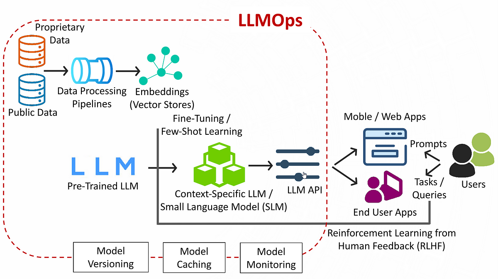

# Large Language Models (LLMs)
* LLMs are **deep learning models trained on massive text data** to understand and generate human-like language 
* They typically have **millions to billions of parameters** 

Core idea: LLM = **Next-token prediction engine trained at massive scale**

---

## Where LLMs Fit
```
AI
 └── Machine Learning
      └── Deep Learning
           └── NLP
                └── LLMs (Modern approach)
```
* Built on **Transformer architecture** 
* Considered **foundation models** (general-purpose)

---

## Core Components of LLM
### 1. Tokenization
* Text → tokens (words/subwords)
* Example:
  ```
  "I love AI" → ["I", "love", "AI"]
  ```

* Techniques:
  * BPE (Byte Pair Encoding)
  * WordPiece

Needed because models process **numbers, not text**

---

### 2. Embeddings
* Tokens → vectors (dense numerical representations)

Captures:
* Semantic meaning
* Relationships between words

---

### 3. Positional Encoding
* Adds **order information** to tokens
* Important because transformers don’t process sequentially by default 

---

### 4. Transformer Layers (Core Engine)
#### Components:
* Self-attention
* Multi-head attention
* Feed-forward networks
* Layer normalization
* Residual connections 

---

## Self-Attention 

Allows model to:
* Focus on **relevant words in a sentence**

Example:
```
"The animal didn’t cross the road because it was tired"
```

“it” refers to → animal

---

#### How it works:
Each word:
* Looks at every other word
* Assigns importance (weights)

Output = context-aware representation

---

## Multi-Head Attention
* Multiple attention layers in parallel
* Each learns different relationships

---

## Architecture of LLM
### Typical pipeline:
1. Input tokens
2. Embedding layer
3. Positional encoding
4. Transformer blocks (stacked)
5. Output layer (probabilities) 

---

## How LLMs Work (Step-by-Step)



### Step 1: Input Processing
* User input → tokenized → embeddings

### Step 2: Context Understanding
* Through **self-attention**
* Model learns relationships between words

### Step 3: Probability Prediction
* Predicts probability of next token

Example:
```
"I love machine ____"
→ learning (0.7)
→ pizza (0.01)
```

### Step 4: Token Generation
* Select next token (sampling)

### Step 5: Repeat Loop
* Continues token-by-token generation

This is called:
> **Autoregressive generation**

---

## Training Process of LLM

### 1. Pretraining
* Train on massive unlabeled data
* Objective:
  * Predict next word
  * Learn grammar + knowledge

Called:
* Self-supervised learning 

### 2. Fine-Tuning
#### Types:
* Supervised Fine-Tuning (SFT)
* Instruction tuning
* Domain adaptation

### 3. RLHF (Advanced)
* Reinforcement Learning from Human Feedback
* Improves:
  * Safety
  * Alignment
  * Response quality 

---

## Types of LLM Architectures
### 1. Encoder-only
* Example: BERT
* Use: classification, embeddings

---

### 2. Decoder-only
* Example: GPT
* Use: text generation

---

### 3. Encoder-Decoder
* Example: T5
* Use: translation, summarization

---

## Key Concepts in LLM
### Tokens & Context Window
* Max tokens model can process at once

### Parameters
* Weights learned during training
* More parameters → better capability (usually)

### Scaling Laws
* Performance improves with:
  * More data
  * Bigger models
  * More compute

### Prompting
* Input format affects output quality

### Hallucination
* Generates incorrect but confident answers

---

## Capabilities of LLMs
* Text generation
* Question answering
* Translation
* Summarization
* Code generation 

---

## Limitations
* High compute cost 
* Bias from training data
* Hallucinations
* Data dependency

---

## Simple Mental Model
Think of LLM as:
```
Input text → Understand context → Predict next word → Repeat
```

OR
> “A probability machine over language”

---

## Real-World LLM Examples
* GPT (ChatGPT)
* Gemini
* Claude
* LLaMA 

