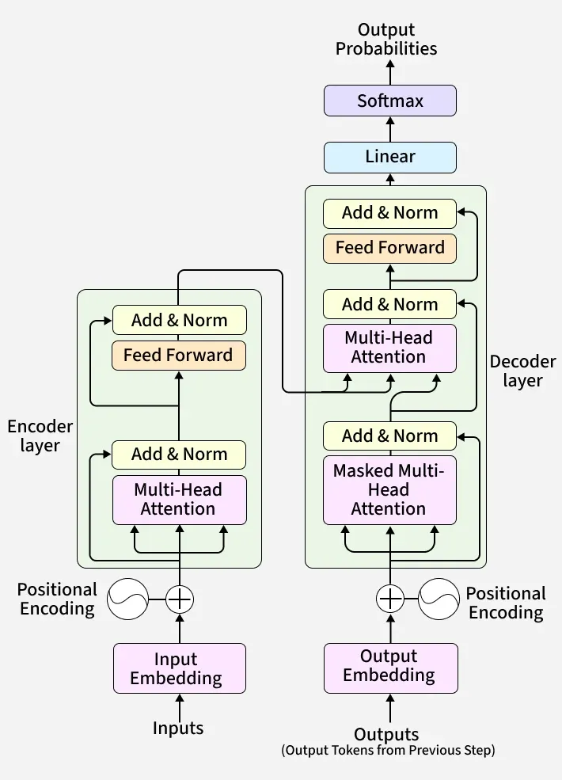

# Transformers

* Transformers are **deep learning architectures** designed for **sequence-to-sequence tasks** like translation and text generation

* They rely entirely on **attention mechanisms (no RNN/CNN)** 

Core idea:
> Understand relationships between words using **attention**, not sequence processing

---

## Why Transformers Replaced RNNs

### Problems with RNNs / LSTMs:
* Sequential processing → slow
* Hard to capture long-range dependencies

### Transformers solve this by:
* Parallel processing
* Direct attention between all words 

Key insight:
> Any word can attend to any other word instantly

## Core Components of Transformer

### 1. Input Embeddings
* Convert tokens → vectors

### 2. Positional Encoding
* Adds order information (since no recurrence)

Uses:
* Sine & cosine functions to encode positions 

### 3. Self-Attention (Heart of Transformer)
* Each word:
  * Looks at all other words
  * Assigns importance (weights)

### 4. Multi-Head Attention
* Multiple attention mechanisms run in parallel
* Each head learns different relationships

### 5. Feed Forward Network (FFN)
* Fully connected layers applied to each token

### 6. Residual Connections + Layer Norm
* Helps:
  * Stable training
  * Deep networks

---

## Transformer Architecture


```text
Input → Embedding → Positional Encoding
      → Encoder Stack → Decoder Stack → Output
```
### Encoder
Purpose:
> Understand input sequence

#### Each Encoder Layer:
1. Multi-head self-attention
2. Add & Norm
3. Feed-forward network
4. Add & Norm

Stacked multiple times (e.g., 6 layers) 

---

### Decoder
Purpose:
> Generate output sequence

#### Each Decoder Layer:
1. Masked self-attention
2. Encoder–decoder attention
3. Feed-forward network
4. Add & Norm

---

## Self-Attention
```math
\text{Attention}(Q, K, V) = softmax (\frac{QK^T}{\sqrt{d_k}} ) . V
```

### Mechanism
Each token creates:
* Query (Q)
* Key (K)
* Value (V)

#### Step-by-Step:

1. Compute scores:
```text
score = Q · Kᵀ
```

2. Scale:
```text
score / √d
```

3. Apply softmax → attention weights

4. Multiply with V:
```text
output = weights · V
```

This produces **context-aware embeddings**

---

### Intuition
Example:
```text
"The bank is near the river"
```

* "bank" attends more to "river" → meaning = river bank

---

## Multi-Head Attention
Instead of 1 attention:
```text
Multi-head = many attention heads in parallel
```

Benefits:
* Captures different relationships:
  * Syntax
  * Semantics
  * Long-range dependencies 

---

## How Transformers Work (End-to-End)

### Step 1: Input Processing
* Tokenization + embeddings

### Step 2: Encoding
* Input passes through encoder stack
* Produces contextual representations

### Step 3: Decoding
* Decoder:
  * Looks at previous outputs
  * Uses encoder output

### Step 4: Prediction
* Linear layer + Softmax → next token probability

### Step 5: Autoregressive Loop
* Repeat until end token

---

## Key Properties

### Parallelization
* Processes all tokens at once

### Long-Range Dependency Handling
* Direct attention → no vanishing gradient

### Scalability
* Works well with large data & compute


## Applications of Transformers

### NLP
* Translation
* Chatbots
* Summarization

### Computer Vision
* Vision Transformers (ViT)

### Speech
* Speech recognition

### Multimodal
* Text + image + audio models 

---

## Modern Improvements

### Flash Attention
* Faster & memory-efficient attention

### RoPE (Rotary Positional Encoding)
* Better positional understanding

### Efficient Transformers
* Reduce O(n²) complexity

---

## Limitations
* Quadratic complexity (O(n²))
* High memory usage
* Requires large datasets
* Can hallucinate
