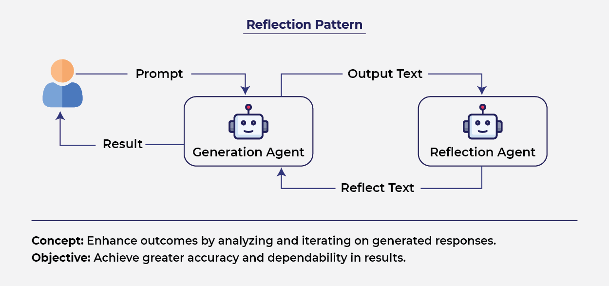
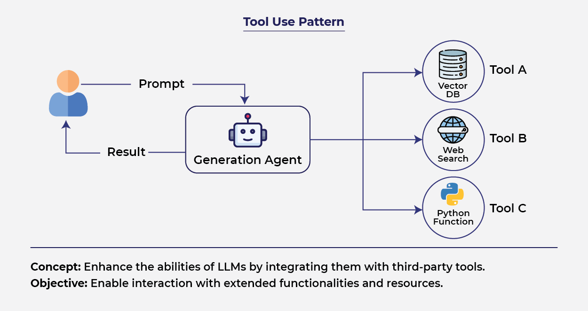
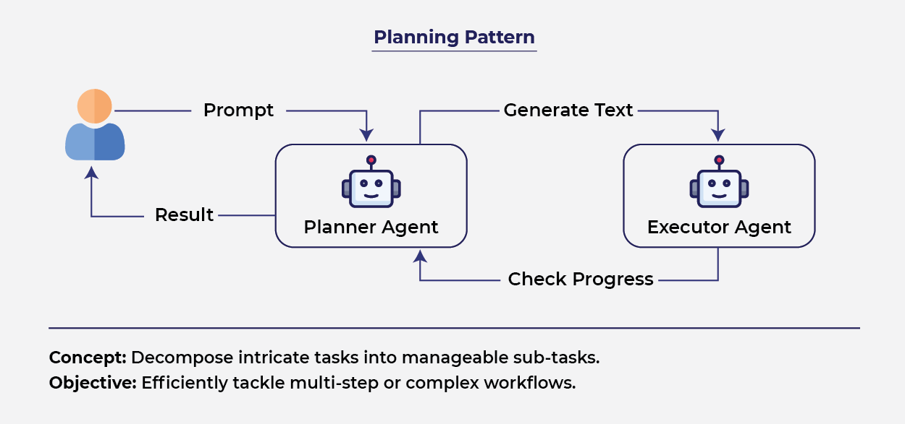
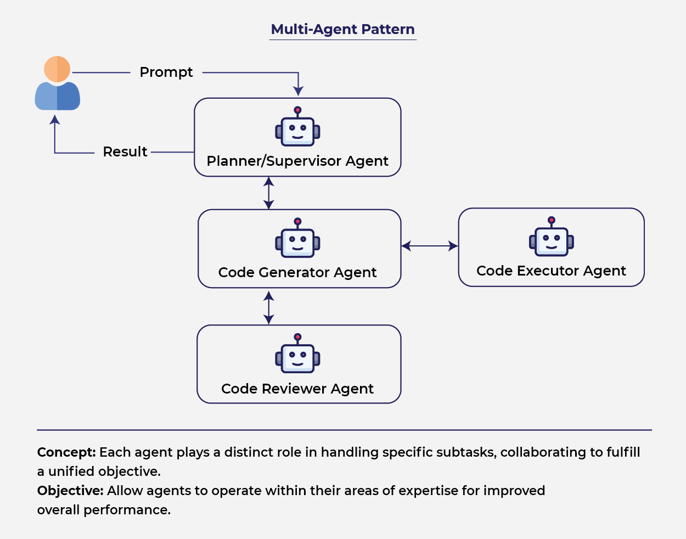

# Agentic AI

**Agentic AI** is a type of artificial intelligence that:

* Focuses on **one specific task or domain**
* Can **take actions on its own** to achieve a goal
* Uses tools (APIs, software, databases) to complete tasks automatically

Unlike traditional AI (which mostly gives answers), Agentic AI **does the work for you**.

---

## Key Features

1. **Goal-oriented**

   * It doesn’t just respond—it **works toward completing a task**
     (e.g., not just suggesting flights, but booking them)

2. **Autonomous (independent)**

   * Can make decisions and act **without constant human input** 

3. **Specialized**

   * Built for **specific problems**, so it performs better in that area

4. **Tool usage**

   * Can interact with **external systems** like APIs, apps, and databases

5. **Adaptive learning**

   * Learns from past actions and improves over time

---

## How Agentic AI Works (Step-by-Step)

Agentic AI follows a loop:

1. **Perception** → Collects relevant data (from users, APIs, sensors)
2. **Reasoning** → Understands and analyzes the data
3. **Goal Setting** → Defines what needs to be done
4. **Decision Making** → Chooses the best action
5. **Execution** → Performs the task using tools
6. **Learning** → Improves based on feedback

This loop makes it **dynamic and self-improving**. 

---

## Simple Example

Instead of:
> “Here are flight options”

Agentic AI:
* Searches flights
* Compares prices
* Checks weather
* Books tickets

It completes the **entire workflow automatically**

---

## Agentic AI vs Traditional / Generative AI
* **Generative AI** → creates content (text, images, code)
* **Agentic AI** → **plans + acts + executes tasks**

Think:
* ChatGPT answer = Generative AI
* AI booking your whole trip = Agentic AI

---

## Agentic AI vs Traditional AI

|          Feature          |          Traditional AI          |          Agentic AI          |
| ------------------------- | -------------------------------- | ---------------------------- |
| Core Function|Performs specific, preprogrammed tasks |Autonomously sets goals and executes tasks |
| Typical output | Deterministic results—answers, classifications, predictions | Actions, decisions, multi-step workflows |
| Autonomy | Low as it requires explicit instructions, operates within set boundaries | High as it plans, adapts and makes decisions with minimal human direction |
| Learning | Learns from labeled data, often needs retraining for new situations | Learns from experience, adapts strategies and workflows in real time |
| Use cases | Data sorting, image recognition, basic diagnostics | Workflow automation, dynamic planning, virtual assistants, problem solving |
| Scalability | Requires manual oversight as systems grow. | Oversees and coordinates whole systems hence reducing manual monitoring. |
| Adaptability | Struggles with unexpected changes and may needs retraining. | Adjusts strategies and learns in real time and best suited for fast-changing situations. |
| Business value | Automates simple, rule-based jobs, increases consistency | Automates complex operations, reduces manual work, enables personalized tasks |

---

## Main Types of AI Agents

### 1. Simple Reflex Agents
* Work on **current input only** (no memory)
* Use **if–then rules**
* Fast but **not smart in complex situations**

- **Example:** Traffic light system
- **Best for:** Simple, predictable environments 

### 2. Model-Based Reflex Agents
* Maintain an **internal model (memory)** of the world
* Can handle **partially observable environments**

- **Example:** Robot vacuum mapping your house
- Better than reflex agents, but more complex 

### 3. Goal-Based Agents
* Focus on **achieving a goal**
* Plan steps and think about **future outcomes**

- **Example:** Route planning (Google Maps)
- **Good for:** Tasks needing planning and strategy 

### 4. Utility-Based Agents
* Choose actions based on **best overall value (utility)**
* Consider multiple factors like **cost, time, risk**

- **Example:** Investment decision systems
- **Best for:** **Trade-offs and optimization problems** 

### 5. Learning Agents
* **Learn from experience**
* Improve performance over time

- **Example:** Chatbots that get better with usage
- **Best for:** Dynamic, changing environments 

### 6. Multi-Agent Systems (MAS)
* **Multiple agents interact**
* Can cooperate or compete

- **Example:** Smart traffic systems or robot teams
- **Best for:** Distributed, complex problems 

### 7. Hierarchical Agents
* Organized in **levels (strategy → tasks → actions)**
* Break big problems into smaller ones

- **Example:** Drone delivery systems
- **Best for:** Large, complex workflows 

---

## Simple Way to Remember

Think of evolution like this:

1. Reflex → reacts instantly
2. Model-based → remembers
3. Goal-based → plans
4. Utility-based → optimizes
5. Learning → improves
6. Multi-agent → collaborates
7. Hierarchical → scales

---

## Agentic Systems - design patterns
Agentic design patterns are **reusable architectures** for building AI agents that:
* **Plan**
* **Act**
* **Collaborate**
* **Improve over time**

Think of them as **“blueprints” for building autonomous AI systems**

They help solve **real-world complexity** like multi-step tasks, uncertainty, and coordination. 

---

## Core Idea Behind Agentic Systems
Modern agentic systems are built around a loop:

* **Perception → Reasoning → Planning → Action → Learning**

This enables:
* Autonomy
* Continuous improvement
* Multi-step decision making 

---

## Reflection Pattern
The agent **reviews and improves its own output** using feedback loops.

### Flow
* Generate output
* Critique (self or external)
* Refine
* Repeat until good enough

### Purpose
* Improve **accuracy, reasoning, and quality**
* Reduce hallucinations

### Example
* Writing an essay → then editing it
* Code generation → then debugging itself

### When to Use
* High-stakes tasks (code, research, analysis)
* When **quality matters more than speed**

### Limitation
* Slower (multiple iterations)
* Higher cost (more model calls)

---

## Tool Use Pattern
The agent uses **external tools** to perform actions.

### Tools Can Include
* APIs (weather, payments)
* Databases
* Web search
* Code execution

### Flow
* Understand task
* Decide which tool to use
* Call tool
* Use result to continue

### Purpose
* Extend beyond “text-only intelligence”
* Enable **real-world actions**

### Example
* Booking a flight
* Fetching real-time stock prices
* Running Python calculations

### When to Use
* Need **real-time data or computation**
* Task requires **external interaction**

### Limitation
* Tool failures can break flow
* Needs good tool selection logic

---

## Planning Pattern
The agent **breaks a task into steps** before acting.

### Flow
* Understand goal
* Create step-by-step plan
* Execute steps
* Adjust if needed

### Purpose
* Handle **complex, multi-step problems**

### Example
Task: “Plan a trip”
* Step 1: Choose destination
* Step 2: Book flights
* Step 3: Reserve hotel

### Variants
* Static planning (fixed steps)
* Dynamic planning (adjusts during execution)

### When to Use
* Tasks requiring **strategy or sequencing**

### Limitation
* Plans may be wrong → need re-planning
* Adds overhead

---

## Multi-Agent Pattern
Use **multiple specialized agents** working together.

### Types of Collaboration
* **Sequential** → one after another
* **Parallel** → simultaneously
* **Hierarchical** → manager + workers
* **Debate** → agents critique each other

### Purpose
* Solve **large, complex problems**
* Improve performance via specialization

### Example
* Research agent → gathers info
* Writer agent → drafts content
* Reviewer agent → improves it

### When to Use
* Complex workflows
* Tasks needing **multiple skills**

### Limitation
* Coordination is hard
* Higher cost + latency

---

## How They Work Together?
These patterns are rarely used alone:

Real systems combine them:
* **Planning + Tool Use** → plan tasks + execute via tools
* **Reflection + Planning** → improve plans
* **Multi-Agent + Reflection** → agents review each other

---

## Advanced Design Concepts
These patterns often combine together:

### Subgoal Decomposition
* Break big problems into **smaller tasks**

### Chain-of-Thought Reasoning
* Step-by-step thinking before acting

### Self-Evaluation
* Agent checks its own performance

### Multi-Agent Collaboration
* Agents specialize and **work like a team**

This is the future of AI systems

---

## Evolution of Agentic Design

| Level | Pattern Type | Capability               |
| ----- | ------------ | ------------------------ |
| 1     | Tool Use     | Access external world    |
| 2     | Planning     | Handle multi-step tasks  |
| 3     | Reflection   | Improve quality          |
| 4     | Multi-Agent  | Scale & collaborate      |
| 5     | Hierarchical | Enterprise-level systems |

---

## Key Takeaways
* Agentic systems are **not just models → they are architectures**
* Real power comes from:
  * Combining patterns
  * Not using just one
* Most real-world systems use:
  * **Planning + Tool Use + Multi-Agent**

In short:
**Agentic AI = modular + iterative + collaborative systems**

---

## Simple Analogy
Think of building a startup:
* Tool use → employees use tools
* Planning → CEO defines strategy
* Reflection → reviews & feedback
* Multi-agent → team collaboration
* Hierarchical → org structure

That’s exactly how agentic systems work.

---

## MULTI AGENT SYSTEM
A **Multi-Agent System** is a system where **multiple intelligent agents interact with each other and their environment** to achieve goals (either individual or shared).

* An **agent** = an autonomous entity that can:
  * perceive environment
  * make decisions
  * take actions

Instead of one “big AI”, MAS uses a **team of smaller specialized AIs**.

---

### Key Components of MAS

#### 1. Agents
* Independent entities with **own knowledge, goals, and abilities**
* Can be bots, robots, or software programs 

#### 2. Environment
* The world where agents operate (physical or virtual)

#### 3. Interaction
* Agents:
  * cooperate 
  * compete 
  * coordinate 

#### 4. Communication
* Agents exchange information to:
  * coordinate tasks
  * negotiate
  * share knowledge

---

### Types of Multi-Agent Systems

#### 1. Cooperative MAS
* All agents work toward **same goal**
* Example: rescue drones

#### 2. Competitive MAS
* Agents compete for **limited resources**
* Example: stock trading bots

#### 3. Hierarchical MAS
* Structured like a company:
  * managers + workers

#### 4. Heterogeneous MAS
* Agents have **different roles and skills** 

---

### Architectures of MAS

#### Reactive
* Fast response, no deep thinking
* Example: obstacle-avoiding robot

#### Deliberative (Cognitive)
* Uses reasoning, planning
* Example: AI assistants

#### Hybrid
* Combines both
* Example: self-driving cars

---

### Behavior in MAS
Agents can show different behaviors:
* **Autonomous** → act independently
* **Cooperative** → work together
* **Competitive** → conflict-based
* **Adaptive** → learn from experience
* **Emergent** → complex behavior from simple rules

---

### Structures of MAS
How agents are organized:

#### 1. Flat Structure
* All agents equal (peer-to-peer)

#### 2. Hierarchical
* Command chain (top-down control)

#### 3. Holonic
* Agents grouped into sub-units (modular system)

#### 4. Network / Organizational
* Dynamic teams formed as needed

---

### How MAS Works (Simple Flow)
1. Each agent observes environment
2. Makes decisions locally
3. Communicates with others
4. Coordinates actions
5. Achieves global objective

Key idea: **local intelligence → global intelligence**

---

### Real-World Applications

#### Robotics
* Multiple robots in warehouses or rescue missions

#### Smart Cities
* Traffic lights + autonomous cars coordination

#### Finance
* Trading bots competing/cooperating

#### Healthcare
* Hospital resource optimization

#### Gaming
* Intelligent NPCs

#### Cybersecurity
* Distributed threat detection 

---

### Advantages of MAS
* **Decentralization** → no single point of failure
* **Scalability** → easy to add more agents
* **Flexibility** → adapts to dynamic environments
* **Parallelism** → tasks done simultaneously
* **Emergent intelligence** → complex solutions from simple agents

---

### Challenges of MAS
* Hard to coordinate agents
* Communication overhead
* Conflict between agents
* Scalability issues at large scale
* Security & trust problems

---

#### Single-Agent vs Multi-Agent
| Feature             | Single-Agent | Multi-Agent   |
| ------------------- | ------------ | ------------- |
| Control             | Centralized  | Decentralized |
| Complexity          | Lower        | Higher        |
| Scalability         | Limited      | High          |
| Real-world modeling | Weak         | Strong        |

MAS is preferred when problems are:
* large
* distributed
* dynamic

---

### Simple Example
Think of a **food delivery system**:
* Agent 1 → takes order
* Agent 2 → finds restaurant
* Agent 3 → assigns delivery
* Agent 4 → tracks route

Together → smooth delivery system

---

## Agent2Agent (A2A)
**Agent2Agent (A2A)** is a **standard communication protocol** that allows AI agents to:
* discover each other
* communicate
* collaborate on tasks

It enables agents built on different platforms to work together seamlessly. 

---

### Key Idea
Instead of isolated AI systems, A2A creates a **network of cooperating agents** that can:
* delegate tasks
* share results
* coordinate workflows

---

### Core Components

#### 1. Agent Card
* A JSON profile describing an agent’s:
  * capabilities
  * identity
  * permissions
* Helps other agents find and use it

#### 2. Tasks
* Work units handled by agents
* Go through stages like:
  * submitted → working → completed / failed

#### 3. Messages
* Used for communication
* Can include text, data, files, etc.

#### 4. Artifacts
* Final structured outputs of tasks

Together, these enable **organized and trackable collaboration**. 

---

### How A2A Works (Workflow)
* Uses a **client–server model**:
  * One agent (client) requests a task
  * Another agent (server) executes it
* Roles can switch dynamically
* Agents communicate continuously during task execution 

---

### Key Features
* **Autonomy** → agents act independently
* **Interoperability** → works across systems
* **Real-time communication** → supports long tasks
* **Multi-format support** → text, audio, video
* **Built-in security** → authentication & permissions 

---

### Types of Agent Interaction
* **Cooperative** → work toward shared goals
* **Competitive** → compete for resources
* **Negotiative** → reach agreements
* **Mediated** → use a central mediator agent 

---

### A2A vs MCP
* **A2A** → agent-to-agent collaboration
* **MCP (Model Context Protocol)** → connects AI models to tools/data

A2A focuses on **teamwork between agents**, while MCP focuses on **tool access**. 

---

### Applications
* Autonomous vehicles coordination
* Smart grids (energy systems)
* Supply chain optimization
* Online marketplaces & auctions 

---

### Advantages
* Easy integration using web standards (HTTP, JSON-RPC)
* Flexible and supports multiple data types
* Secure communication
* Enables real-time collaboration 

---

### Challenges
* Coordination between many agents
* Scalability issues
* Security & privacy concerns
* Standardization difficulties 

---

## Resources
- https://www.geeksforgeeks.org/artificial-intelligence/agentic-ai-tutorial/
- https://www.analyticsvidhya.com/blog/2024/10/agentic-design-patterns/
- https://www.cybage.com/blog/building-intelligent-ai-systems-understanding-agentic-ai-and-design-patterns
- https://www.geeksforgeeks.org/artificial-intelligence/multi-agent-system-in-ai/
- https://www.geeksforgeeks.org/artificial-intelligence/agent2agent-a2a/