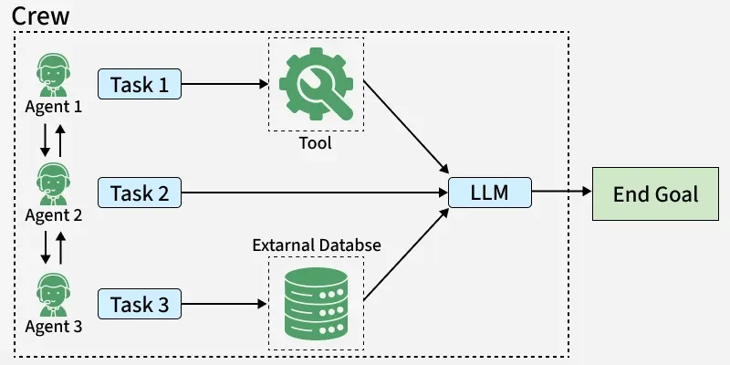

# **Crew AI**

**CrewAI** is an **open-source multi-agent framework** that allows multiple AI agents to **work together as a team** to solve complex tasks.

Each agent has a **specific role**, and together they collaborate like a real-world team (e.g., planning an event).



---

## **Core Idea**
* Break a complex problem into smaller tasks
* Assign each task to a **specialized agent**
* Coordinate them through a **crew (team)**

Result: efficient and structured problem-solving

---

## **Main Components**

### 1. Agents
* Individual AI units with:
  * **role** (what they do)
  * **goal** (what they aim to achieve)
  * **backstory** (context/skills)
* Can optionally delegate tasks and explain reasoning 

### 2. Tasks
* Specific jobs assigned to agents
* Include:
  * description
  * expected output
* Each task is linked to an agent 

### 3. Crew
* A **group of agents + tasks** working together
* Executes the full workflow collaboratively 

---

## **How CrewAI Works**
1. Define agents with roles
2. Assign tasks to each agent
3. Group them into a crew
4. Run the crew → agents execute tasks step-by-step

Example:
Party planning with different agents:
* planner
* food coordinator
* decorator
* entertainment manager 

---

## **Key Features**
* **Collaboration** → multiple agents work together
* **Context awareness** → uses memory to maintain context
* **Task delegation** → agents can assign work (optional)
* **Verbose reasoning** → shows step-by-step thinking
* **Modularity** → easy to add/remove agents 

---

## **Applications**
CrewAI can be used in:
* Event planning
* Content creation (research + writing)
* Software development
* Market research and reporting 

---

## **CrewAI Tools**
**CrewAI tools** are **specialized utilities** that extend the capabilities of AI agents, allowing them to perform real-world tasks like:
* web scraping
* searching the internet
* reading files
* generating images

They help agents go beyond just text generation and **interact with data and external systems**. 

---

### Purpose of Tools
* Enable agents to perform **task-specific actions**
* Allow **data collection, processing, and automation**
* Support **autonomous workflows** within multi-agent systems 

---

### How to Use Tools
* Install via: `pip install crewai_tools`
* Tools can be:
  * listed programmatically
  * explored using `help()` for documentation
* Each tool has parameters and configurations for customization 

---

### Popular CrewAI Tools

#### 1. RAG Tool (Retrieval-Augmented Generation)
* Combines:
  * retrieving external data
  * generating responses
* Useful for answering questions using **both stored knowledge + real-time data** 

#### 2. ScrapeWebsiteTool
* Extracts content from websites
* Converts raw HTML into useful information 

#### 3. SerperDevTool
* Performs **web searches**
* Returns structured search results (like a search engine API) 

#### 4. File Read Tool
* Reads local files
* Useful for:
  * data processing
  * document analysis 

#### 5. DALL·E Tool
* Generates images from text descriptions
* Integrates with AI image models 

---

### Categories of Tools
CrewAI provides tools across multiple domains:
* **Web & scraping** → collect online data
* **Search & research** → find information
* **File handling** → read/write documents
* **Databases** → query structured data
* **AI services** → image generation, RAG, etc. 

---

### Key Benefits
* **Extensibility** → add new capabilities to agents
* **Automation** → reduce manual effort
* **Flexibility** → supports many use cases
* **Context-aware execution** → integrates into agent workflows 

---

## **Creating Custom Tools in CrewAI**

### What are Custom Tools?
Custom tools in CrewAI are **user-defined functions** that extend what agents can do beyond built-in capabilities.

They are used when agents need to:
* perform calculations
* call APIs
* process data
* handle specialized logic 

---

### Why Use Custom Tools?
* Avoid hardcoding logic inside agents
* Make agents **more flexible and reusable**
* Enable **automation of complex tasks** 

---

### Steps to Create a Custom Tool

#### 1. Setup Environment
* Install CrewAI (`pip install crewai`)
* Set API keys (e.g., OpenAI) if needed 

#### 2. Define the Tool
* Use the **`@tool` decorator** to register a function as a tool
* Example: calculator tool that evaluates expressions

Key idea:
A normal Python function → becomes a **tool agents can use** 

#### 3. Assign Tools to Agents
* Agents are configured with:
  * role
  * goal
  * backstory
  * **tools list**
* Tools expand the agent’s abilities 

#### 4. Create Tasks
* Tasks define what agents must do
* Include:
  * description
  * expected output
  * assigned agent
  * optional context (from previous tasks) 

#### 5. Run with a Crew
* Combine agents + tasks into a **Crew**
* Choose execution type (sequential/parallel)
* Start execution using `kickoff()` 

---

### How It Works (Flow)
1. Create tool
2. Give tool to agent
3. Assign task
4. Run crew
5. Agent uses tool → passes result to next agent

Enables **multi-agent collaboration with real functionality**

---

### Important Note
* Using functions like `eval()` can be unsafe
* Safer alternatives should be used in production 

---

### Applications
Custom tools are useful in:
* **Education** → calculators, quiz tools
* **Research** → data analysis, computations
* **Content creation** → summaries, reports
* **Business** → finance, automation workflows 

---

## **Memory in CrewAI**
Memory in CrewAI allows agents to **store, recall, and use past information** so they don’t start from scratch every time.

It ensures:
* continuity
* context awareness
* better collaboration between agents 

---

### Why Memory is Important
* Helps agents **build on previous work**
* Maintains **context across tasks and sessions**
* Improves **accuracy and coherence**

Without memory, agents would produce **disconnected results** 

---

### Types of Memory in CrewAI
When `memory=True` is enabled, three types of memory are used:

#### 1. Short-Term Memory
* Stores **current session context**
* Uses **RAG (Retrieval-Augmented Generation)**
* Helps with immediate task understanding

#### 2. Long-Term Memory
* Stores data **across multiple sessions**
* Uses databases like **SQLite**
* Keeps persistent knowledge

#### 3. Entity Memory
* Stores details about:
  * people
  * places
  * concepts
* Helps agents recall specific entities

Together, these create a **complete memory system** 

---

### How Memory Works
1. Memory is enabled in agents or crew (`memory=True`)
2. Agents store outputs and context
3. Future tasks retrieve relevant past information
4. Tasks become more **connected and meaningful**

Example:
* Writer creates content
* Editor uses memory to **access and improve it**
Leads to better workflow continuity 

---

### Implementation Highlights
* Memory is added when defining agents
* Tasks can pass **context from previous tasks**
* Crew executes tasks sequentially or in parallel
* Memory is automatically used during execution 

---

### Storage Details
* Stored **locally on the system**
* Directory auto-generated by CrewAI
* Can be customized using:
  * `CREWAI_STORAGE_DIR` environment variable 

---

### Key Benefits
* **Context retention** across tasks
* **Improved collaboration** between agents
* **Better decision-making**
* **Structured workflows**

--- 

## **CrewAI Embeddings**
Embeddings are **numerical vector representations of text** where:
* similar words/sentences are placed **closer together**
* unrelated ones are **far apart**

Example: “cat” and “kitten” → close, “cat” and “rocket” → far 

---

### Role of Embeddings in CrewAI
Embeddings are the **foundation of memory and context** in CrewAI. They enable:
* **Contextual Memory** → recall relevant past information
* **Information Retrieval** → match queries with related data
* **Cross-session memory** → store and reuse knowledge over time 

Without embeddings, agents would treat every task **independently (no memory)**.

---

### How Embeddings Work in CrewAI
1. Text is converted into vectors
2. Stored in a database
3. When needed → similarity search is performed
4. Most relevant past data is retrieved

This powers **RAG-based memory systems** in CrewAI 

---

### Integration in CrewAI
* Enabled using: `memory=True`
* Configured via an **embedding provider**
* Allows agents and tasks to **share context seamlessly**

Embeddings connect:
* agents
* tasks
* memory

---

### Embedding Providers in CrewAI

#### 1. OpenAI
* Models: `text-embedding-3-small`, `large`
* High accuracy, reliable
* Best for: general use

#### 2. Google
* Model: `embedding-001`
* Strong multilingual support
* Best for: global/multi-language tasks

#### 3. Hugging Face
* Example: `all-MiniLM-L6-v2`
* Open-source, customizable
* Best for: research, experimentation

#### 4. Cohere
* Model: `embed-english-v2.0`
* Optimized for English search
* Best for: production retrieval systems 

---

### Key Insight on Providers
> The choice of embedding model directly affects:
* how well agents **understand meaning**
* how accurately they **retrieve context**

---

### Challenges
* Poor embeddings → irrelevant results
* Model drift can reduce accuracy
* Requires tuning for best performance 

---

## **CrewAI Collaboration**
CrewAI collaboration is how **multiple AI agents work together** by:
* sharing tasks
* coordinating workflows
* passing outputs between each other

It mimics **real-world teamwork** using agents, tasks, and processes.

---

### Types of Collaboration in CrewAI

#### 1. Sequential Collaboration
* Tasks are executed in a **fixed order (step-by-step)**
* Output of one agent → input for the next

Key idea: **strict dependency chain**

Best for:
* research workflows
* reporting
* step-by-step processes

Limitation:
* less flexible (cannot change order easily) 

#### 2. Hierarchical Collaboration
* Introduces a **manager agent (or LLM)**
* Manager:
  * assigns tasks dynamically
  * decides execution order

Key idea: **central coordination with flexibility**

Best for:
* complex projects
* multiple specialized agents
* dynamic workflows

---

### How Collaboration Works
1. Define agents (roles + goals)
2. Define tasks (what needs to be done)
3. Combine into a **Crew**
4. Choose process:
   * sequential → fixed flow
   * hierarchical → dynamic flow
5. Run using `kickoff()`

Agents collaborate based on the chosen process 

---

### Sequential vs Hierarchical (Key Difference)
| Feature     | Sequential       | Hierarchical    |
| ----------- | ---------------- | --------------- |
| Task Flow   | Fixed order      | Dynamic         |
| Flexibility | Low              | High            |
| Manager     | Not needed       | Required        |
| Use Case    | Linear workflows | Complex systems |

* Sequential = predictable
* Hierarchical = adaptive 

---

### Key Insight
> Collaboration in CrewAI is controlled by the **process type**, which determines how agents interact and share work.

---

### Example
#### Sequential:
* Chef → cooks food
* Critic → reviews food

Must happen in order

#### Hierarchical:
* Manager → assigns tasks
* Workers → build parts of a house

Order can change dynamically

---

## CrewAI Knowledge
**Knowledge in CrewAI** allows agents to **access explicit facts and real-world information** while performing tasks.

Instead of relying only on memory or prompts, agents can use **external knowledge sources** to:
* answer accurately
* generate factual content
* provide domain-specific insights 

---

### Why Knowledge is Important
* Improves **accuracy and reliability**
* Enables **domain-specific intelligence**
* Supports **context-aware responses**

It makes agents more like **experts with reference material**, not just text generators.

---

### Knowledge Sources in CrewAI
CrewAI supports multiple **knowledge sources** to provide data in different formats:

#### File-Based Sources
* **Text files** → notes, documentation
* **PDF files** → reports, research papers
* **CSV / Excel** → structured/tabular data

#### Structured Data Sources
* **JSON** → hierarchical data
* **CSV / Excel** → business or analytical data

#### Other Sources
* **StringKnowledgeSource** → small text snippets or predefined facts
* **CrewDoclingSource** → internal Crew documentation
* **BaseKnowledgeSource** → for creating custom sources 

---

### How Knowledge Works
1. Load knowledge from a source (file, text, etc.)
2. Attach it to an agent
3. Agent uses this knowledge while performing tasks
4. Produces **fact-based outputs**

Example:
* Agent given product info → answers customer queries correctly 

---

### Key Features
* **Multi-format support** → PDF, JSON, CSV, text
* **Customizable sources** → create your own knowledge systems
* **Chunking support** → splits large data into manageable parts
* **Integration with agents** → directly used during task execution 

---

### Key Insight
> Knowledge ≠ Memory
* **Memory** → stores past interactions
* **Knowledge** → provides external factual data

Together, they make agents **context-aware + fact-aware**

---

### Use Cases
* Customer support bots
* Product information assistants
* Research & analysis systems
* Domain-specific AI (finance, healthcare, etc.) 

---

## CrewAI Planning & Reasoning
**Planning** in CrewAI is the ability to **create a step-by-step strategy before executing tasks**.
* Enabled using: `planning=True` in the Crew
* A special **AgentPlanner** generates a plan for all tasks
* The plan is added to task descriptions before execution 

Key idea:
Agents don’t just act—they **know what to do first, next, and why**.

---

### How Planning Works
1. All crew information is gathered
2. Planner agent creates a **step-by-step workflow**
3. Plan is injected into tasks
4. Agents follow the plan during execution

This improves:
* organization
* task sequencing
* efficiency 

---

### What is Reasoning in CrewAI?
**Reasoning** allows agents to **think before acting**.
* Enabled using: `reasoning=True` in an agent
* Agent reflects on the task before execution 

---

### How Reasoning Works
Before performing a task, the agent:
1. Analyzes the problem
2. Creates a plan
3. Evaluates readiness
4. Refines the plan if needed
5. Executes the task

Can repeat multiple times (`max_reasoning_attempts`) 

---

### Planning vs Reasoning (Key Difference)
| Feature       | Planning          | Reasoning        |
| ------------- | ----------------- | ---------------- |
| Scope         | Crew-level        | Agent-level      |
| Purpose       | Task organization | Decision making  |
| When used     | Before execution  | Before each task |
| Controlled by | Crew              | Individual agent |

* Planning = **“What steps to follow?”**
* Reasoning = **“How should I solve this step?”**

---

### Key Benefits
* **Better task execution** → structured workflow
* **Improved decision-making** → agents think before acting
* **Reduced errors** → less random output
* **Higher efficiency** → avoids unnecessary steps

---

### Example

#### Without Planning & Reasoning:
* Agents act randomly
* Results may be inconsistent

#### With Planning & Reasoning:
* Planner → creates workflow
* Agent → thinks before each step
    * Result: **organized + intelligent execution**

---

## CrewAI CLI

The **CrewAI CLI (Command-Line Interface)** is a tool that lets you **interact with CrewAI directly from the terminal**.

It is used to:
* create crews and workflows
* train agents
* run and test tasks
* deploy projects

It enables **efficient management of multi-agent systems without a GUI** 

---

### Basic Concept of CLI
* CLI = interact with software using **text commands**
* Faster and more flexible than graphical interfaces
* Common for developers and automation tasks 

---

### Command Structure
All commands follow this pattern:
```
crewai [COMMAND] [OPTIONS] [ARGUMENTS]
```

* **COMMAND** → action (create, train, run, etc.)
* **OPTIONS** → modify behavior
* **ARGUMENTS** → inputs like names or IDs 

---

### Key CLI Commands

#### 1. Create
* Creates a new crew or flow
```
crewai create crew my_crew
```

Sets up project structure 

#### 2. Version
* Displays installed version
* Optionally shows tools
```
crewai version --tools
```

#### 3. Train
* Improves agent performance through iterations
```
crewai train -n 3
```

#### 4. Run
* Executes a crew or workflow
```
crewai run
```

#### 5. Test
* Tests how a crew performs
```
crewai test -n 3
```

#### 6. Replay
* Re-runs tasks from a specific step
```
crewai replay -t <task_id>
```

#### 7. Log Outputs
* Shows results of previous execution
```
crewai log-tasks-outputs
```

#### 8. Reset Memory
* Clears stored memory (short-term, long-term, etc.)
```
crewai reset-memories --all
```

---

### Enterprise Features
CrewAI CLI also supports enterprise-level operations:

#### Login
* Authenticate via browser-based code

#### Deploy
* Deploy crews to production
* Commands:
  * `deploy create`
  * `deploy push`
  * `deploy status`

#### Organization Management
* Manage multiple organizations
* Switch between them

#### Configuration
* Set and manage CLI settings
* Stored locally in config files 

---

### Key Benefits
* **Fast workflow management** from terminal
* **Automation-friendly**
* **Full control** over crews and agents
* **Supports deployment & scaling**

---

## CrewAI Flow 
**CrewAI Flow** is a feature that helps you **design and manage workflows** by connecting:
* agents
* tasks
* logic (code + rules)

 It acts as an **orchestration layer** that controls how everything runs in a system. 

---

### Core Idea
Instead of just defining agents and tasks, Flow lets you:
* **control execution order**
* **connect multiple steps**
* **build structured pipelines**

It turns simple agent tasks into **complete automated workflows**

---

### Key Features

#### 1. Workflow Orchestration
* Combines multiple tasks and crews into one pipeline
* Controls how tasks are executed

#### 2. Event-Driven Architecture
* Workflow reacts to events (inputs, triggers, results)
* Enables **dynamic and responsive systems** 

#### 3. State Management
* Keeps track of:
  * data
  * progress
  * intermediate results
* Allows tasks to **share information smoothly** 

#### 4. Multi-Step Execution
* Supports complex processes with many steps
* Each step can involve:
  * code
  * LLM calls
  * agents

#### 5. Flexibility
* Mix:
  * rules
  * functions
  * agents
  * full crews

Not limited to just chat-based or agent-only systems 

---

### How CrewAI Flow Works
1. Define workflow steps
2. Connect tasks and agents
3. Manage state between steps
4. Control execution (sequential, conditional, event-based)
5. Run the full workflow

Result: **end-to-end automation system**

---

### Flow vs Crew (Important)
| Feature  | Crew                 | Flow                      |
| -------- | -------------------- | ------------------------- |
| Focus    | Agents collaboration | Workflow orchestration    |
| Scope    | Task execution       | Full pipeline             |
| Control  | Limited              | High control              |
| Use case | Team of agents       | Complex automation system |

* **Crew** = team of agents
* **Flow** = system that controls the team

---

### Use Cases
CrewAI Flow is useful for:
* Email automation (read → respond → send)
* Document processing (scan → extract → analyze)
* Chat with data systems
* Invoice parsing
* Multi-step business workflows 

---

### Advantages

* **Highly customizable workflows**
* **Scalable from simple to complex systems**
* **Better control over execution**
* **Supports real-world automation use cases** 

---

## Reference
- https://www.geeksforgeeks.org/blogs/what-is-crewai/
- https://www.geeksforgeeks.org/artificial-intelligence/crewai-tools/
- https://www.geeksforgeeks.org/artificial-intelligence/creating-custom-tools-for-crewai/
- https://www.geeksforgeeks.org/artificial-intelligence/crewai-planning-and-reasoning/
- https://www.geeksforgeeks.org/artificial-intelligence/crewai-cli/
- https://www.geeksforgeeks.org/artificial-intelligence/crewai-flow/
