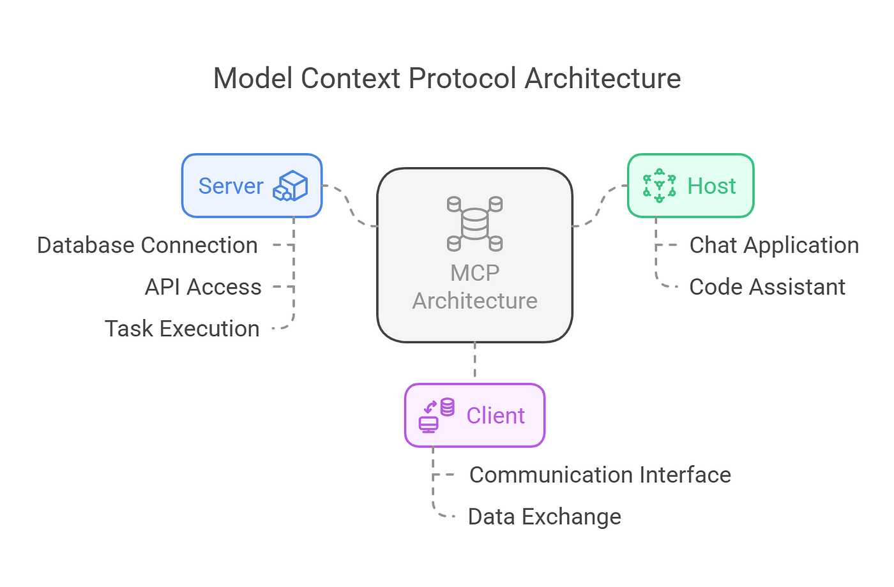

# MCP (Model Context Protocol)

## What is MCP?
**Model Context Protocol (MCP)** is a standardized way for **LLMs (Large Language Models)** to interact with:
* external tools
* APIs
* databases
* real-world systems

In simple terms:
**MCP = a bridge between AI models and external context/tools**

---

## Why MCP is Needed
LLMs like GPT have limitations:
* Static knowledge (cutoff)
* No direct access to real-time data
* Cannot safely call tools without structure

MCP solves this by:
* Providing **structured communication**
* Enabling **tool usage**
* Supporting **dynamic context injection**

---

## Core Idea
MCP defines a **standard protocol** where:
```
User → Model → MCP → Tool/API → MCP → Model → Response
```

---

## Key Components of MCP
### Model
* The AI (e.g., GPT)
* Understands user intent
* Decides when to use tools

### Context
Information passed to the model:
* User input
* System instructions
* Memory
* Tool results

Types:
* Static context (prompts)
* Dynamic context (API responses)

### Tools
External capabilities exposed to the model:
* APIs
* Functions
* Databases
* File systems

Examples:
* Weather API
* Payment gateway
* Search engine

### MCP Server
* Hosts tools
* Exposes capabilities in structured format
* Handles requests from model

### MCP Client
* Sends requests to MCP server
* Used by apps integrating AI

---

## How MCP Works (Step-by-Step)
1. User asks a question
2. Model analyzes intent
3. Model decides:
   * answer directly OR
   * call a tool
4. MCP formats tool request
5. Tool executes
6. Result returned via MCP
7. Model generates final response

---

## MCP vs Function Calling
| Feature                  | MCP          | Function Calling |
| ------------------------ | ------------ | ---------------- |
| Scope                    | Broader      | Limited          |
| Standardization          | High         | Low              |
| Multi-tool orchestration | Yes          | Limited          |
| External systems         | Full support | Partial          |

MCP is an **evolution of function calling**

---

## MCP Architecture



### Layers:
1. **Application Layer**
   * Chat apps, agents

2. **Model Layer**
   * LLM reasoning

3. **Protocol Layer (MCP)**
   * Structured communication

4. **Tool Layer**
   * APIs, DBs

---

## Data Flow in MCP
```
Input → Context Building → Tool Selection → Execution → Response Generation
```

---

## MCP in AI Agents
MCP is critical for **AI agents** because it enables:
* Tool use
* Planning
* Memory handling
* Multi-step reasoning

---

## MCP and RAG
MCP often works with **Retrieval-Augmented Generation**:
| MCP              | RAG                 |
| ---------------- | ------------------- |
| Tool interaction | Knowledge retrieval |
| Action-oriented  | Info-oriented       |

Together:
* RAG fetches knowledge
* MCP executes actions

---

## Example Use Case
### Query:
“Book me a flight to Delhi tomorrow”

### MCP Flow:
1. Model detects intent → booking
2. Calls flight API via MCP
3. API returns options
4. Model responds with choices

---

## Security in MCP
Important aspects:
* Authentication (API keys)
* Authorization
* Data validation
* Sandboxing tools

---

## Advantages of MCP
* Standardized tool usage
* Real-time capabilities
* Modular design
* Scalable systems
* Better agent design

---

## Challenges
* Tool reliability
* Latency
* Security risks
* Complex orchestration

---

## MCP vs API Integration
| MCP           | Traditional API  |
| ------------- | ---------------- |
| AI-driven     | Developer-driven |
| Dynamic       | Static           |
| Context-aware | Request-based    |

---

## MCP Use Cases
* AI assistants
* Autonomous agents
* Customer support bots
* Code generation tools
* Workflow automation

---

## Advanced Concepts

### Tool Selection Logic
* Model decides based on:
  * Intent
  * Context
  * Tool availability

### Multi-step Reasoning
* Chain multiple tools
* Maintain context across steps

### Memory Integration
* Short-term memory → session
* Long-term memory → database

### Context Window Optimization
* Avoid overload
* Inject only relevant data

---

## Future of MCP
* Standard across AI systems
* Interoperable AI ecosystems
* Fully autonomous agents
* Real-world task execution

---

