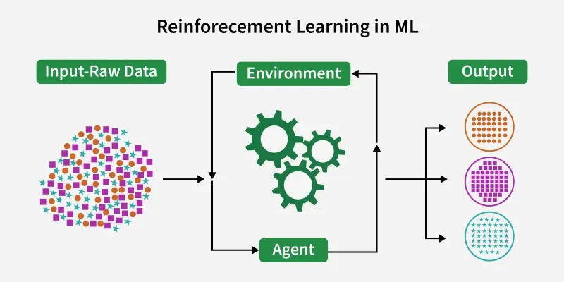

# Reinforcement Learning

**Reinforcement Learning (RL)** is a type of Machine Learning where an **agent learns by interacting with an environment** and improving its decisions through **trial and error**. It receives **rewards or penalties** as feedback and aims to **maximize total reward over time**. 

---

## Key Components
* **Agent** → decision-maker
* **Environment** → where the agent operates
* **State** → current situation
* **Action** → choices available
* **Reward** → feedback (positive/negative) 

---

## Core Concepts
* **Policy** → strategy mapping states to actions
* **Reward Signal** → defines the goal
* **Value Function** → estimates long-term benefit
* **Model (optional)** → predicts future states and outcomes 

---

## How It Works
The learning process is a loop:
1. Observe current state
2. Take action
3. Receive reward + new state
4. Update knowledge (policy/value)
5. Repeat

The agent balances:
* **Exploration** (trying new actions)
* **Exploitation** (using known best actions) 

---

## Mathematical Framework
RL is typically modeled using a
**Markov Decision Process (MDP)**,
where future states depend only on the current state and action. 

---

## Example
* A maze-solving agent learns paths using **Q-learning**
* It updates a **Q-table** to estimate the best action per state
* Over time, it finds the optimal path to the goal 

---

## Challenges / Disadvantages
* Requires high computation and data
* Difficult reward design
* Hard to interpret/debug
* Not ideal for simple problems
* Exploration vs exploitation trade-off is tricky 

---
