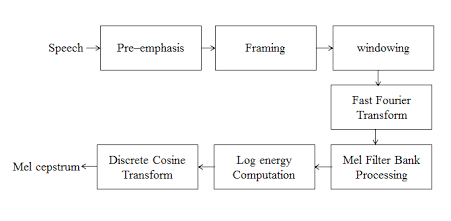

# **Audio Language Model**

## **Audio Fundamentals**

### **Sampling rate**
> The number of snapshots (or samples) taken of an audio wave per second, measured in Hertz (Hz) or Kilohertz (kHz).
>
> It determines the highest frequency you can record; for example, 44.1 kHz allows a maximum reproducible frequency of roughly 22.05 kHz.

### **Bit depth**
> Determines the resolution and dynamic range of each captured audio sample.

### **Waveforms**
> Visual graph that shows strength(amplitude i.e. height of waveform) of sound vibrations over time.
> 
> Taller peaks indicate louder sounds, flatter sections indicate silence, and different shapes define the sound's unique timbre.

### **Frequency**
> The rate at which sound waves vibrate, measured in Hertz (Hz) or cycles per second.
> 
> Frequency is measured by counting the number of complete wave cycles that occur in exactly one second

### **Spectrogram**
> A spectrogram is a visual, 2D graph of an audio signal that displays how different frequencies evolve over time. 
> 
> It maps time on the horizontal axis (x) and frequency on the vertical axis (y), using varying brightness or colors to represent the amplitude (loudness/energy) of those frequencies.

### **Mel Spectrogram**
> Visual representation of sound that maps frequencies to the Mel scale, which mimics how the human ear perceives pitch.
> 
> Mel scale is a perceptual scale of pitches where listeners judge equal intervals to sound equally distant from one another.

### **MFCC**
> MFCC (Mel-frequency Cepstral Coefficients) is a core feature extraction technique used to convert raw audio into numerical representations that computers can process. 
> 
> It mimics human hearing by transforming sound frequencies using the Mel scale and separates the sound's timbre (vocal tract) from its pitch.

### **STFT (Short-Time Fourier Transform)**
> The Short-Time Fourier Transform (STFT) is a mathematical technique used in digital audio processing to analyze how the frequency content of a signal changes over time. 
> 
> It works by dividing a long audio waveform into small, overlapping segments (called "windows") and applying a standard Fourier Transform to each individual chunk.


---

## **Classical Speech Processing**

> Classical speech processing relies on mathematical and statistical methods—such as Fourier transforms, Hidden Markov Models (HMMs), and Gaussian Mixture Models (GMMs)—to extract features and decode audio into text.

### **The Physical Foundation: The Source-Filter Model**
> 1. The Source (Excitation): 
Voiced sounds (e.g., vowels like /a/, /u/) happen when the vocal cords vibrate periodically. The rate of this vibration determines the fundamental frequency ($F_0$), or pitch.Unvoiced sounds (e.g., fricatives like /s/, /f/) happen when the vocal cords remain open, and turbulent air rushes through a constriction, acting as white noise.

> 2. The Filter (Vocal Tract): 
The pharynx, oral cavity, and nasal cavity act as a time-varying acoustic resonance tube. This tube filters the source signal, amplifying specific frequencies and damping others. These resonant peaks are called formants ($F_1, F_2, F_3$), and they dictate the specific phoneme being spoken. Mathematically, if the excitation source is $e(t)$ and the vocal tract impulse response is $v(t)$, the produced speech $s(t)$ is a convolution: $$s(t) = e(t) * v(t)$$

In the frequency domain, this simplifies to multiplication: $$S(\omega) = E(\omega) \cdot V(\omega)$$

### **Signal Pre-processing & Short-Time Analysis:** 
> Speech is non-stationary—its statistical properties change rapidly over time. However, over a micro-window of 10 to 30 milliseconds, the physical shape of the vocal tract remains relatively static. Classical speech algorithms rely on Short-Time Analysis via a sequential pipeline.

> **Step A:** Pre-Emphasis:-
High-frequency speech components naturally drop off at a rate of roughly 6 dB per octave due to glottal radiation. To balance the spectrum and boost these weaker high frequencies, the signal passes through a first-order high-pass filter:$$y(n) = x(n) - \alpha \cdot x(n-1)$$ Where $\alpha$ is typically chosen between 0.95 and 0.97.

> **Step B:** Framing and Windowing:- 
The continuous audio signal is carved into overlapping frames (typically 25 ms frame length with a 10 ms shift to maintain continuity).If we abruptly cut a frame out of a continuous signal, we introduce sharp edge transitions. In the frequency domain, these sharp edges create artificial high-frequency distortions known as spectral leakage. To mitigate this, each frame is multiplied by a smooth windowing function, such as the Hamming Window:$$w(n) = 0.54 - 0.46 \cos\left(\frac{2\pi n}{N-1}\right)$$ This tapers the edges of the frame to zero, smoothing out boundary discontinuities.

### **Core Feature Extraction Frameworks**
> Once the audio is framed and windowed, it must be compressed into a compact, robust feature vector. The two classical champions of this process are MFCCs and LPC.

> Mel-Frequency Cepstral Coefficients (MFCCs) are designed to mimic human auditory perception. The human ear resolves lower frequencies with much higher precision than higher frequencies.



The pipeline steps from the diagram follow a mathematically precise trajectory:

1. **Fast Fourier Transform (FFT):** Convert each windowed time-domain frame into the frequency domain to compute the power spectrum.

2. **Mel Filterbank:** Pass the power spectrum through a series of overlapping triangular bandpass filters spaced equally along the non-linear Mel Scale:$$M(f) = 1127 \ln\left(1 + \frac{f}{700}\right)$$

3. **Logarithm:** Take the log of the energy output from each Mel filter. This mimics human loudness perception, changing a multiplicative scaling relationship into an additive one.

4. **Discrete Cosine Transform (DCT):** The log-energies of the filterbank are highly correlated with one another. Applying a DCT decorrelates the features, yielding cepstral coefficients.

> Usually, the first 13 coefficients are kept. To capture the dynamic changes over time, developers append the first derivatives ($\Delta$ delta) and second derivatives ($\Delta\Delta$ delta-delta) of these coefficients, resulting in a standard 39-dimensional feature vector per frame.


#### **Linear Predictive Coding:**
> LPC takes the alternate route: instead of mimicking the ear, it explicitly models the vocal tract.

> LPC assumes that a speech sample at time $n$ can be approximated as a linear combination of the past $p$ samples, plus an excitation scaling factor:$$s(n) \approx \sum_{i=1}^{p} a_i s(n-i) + G \cdot e(n)$$Where $a_i$ are the predictor coefficients, $p$ is the prediction order (typically 10–16), and $G$ is the gain.

> By solving the system of linear equations (usually via the efficient Levinson-Durbin recursion), we determine the coefficients $a_i$. These coefficients perfectly describe the transfer function of the vocal tract filter, stripping away the pitch and leaving behind a pure representation of the phoneme.


Topics:
Voice Activity Detection (VAD)
Noise Removal
Echo Cancellation
Speaker Diarization
Speaker Verification
Pitch Detection

Good libraries :
WebRTC VAD
pyannote.audio
SpeechBrain


---

## Deep Learning for Audio

Deep learning for audio uses neural networks to process, analyze, and generate sound. It powers applications like speech-to-text, music generation, and noise reduction.

### CNNs

### RNN/LSTM

### CTC Loss

### Attention

### Transformers


### **1. Convolutional Neural Networks (CNNs) in Audio**

> While CNNs are famously associated with computer vision, they are equally dominant in audio processing. Instead of images, 2D CNNs treat **spectrograms** (visual representations of frequencies over time) as single-channel images.

#### 2D CNNs on Spectrograms

>When using standard 2D convolutions on a log-Mel spectrogram, the kernel slides over both **Time** and **Frequency** axes.

* **Translation Invariance Paradox:** In vision, an object is the same whether it is at the top or bottom of an image. In audio, shifting an acoustic pattern up or down the frequency axis completely changes its pitch or phoneme identity.
* **The Solution:** Keep 2D receptive fields small (e.g., $3 \times 3$ kernels in VGG-style backbones) to capture localized spectral-temporal dynamics, while relying on deeper pooling and fully connected layers to learn global position-specific semantics.

#### 1D CNNs on Raw Waveforms (End-to-End)

> To bypass spectrogram generation entirely, architectures like **WaveNet** or **SincNet** run 1D convolutions directly on raw 1D time-domain signals.

* **The Challenge:** Raw audio sampled at 16 kHz contains 16,000 data points per second. Standard 1D CNNs need massive filters to capture long-range dependencies.
* **The Solution: Dilated Convolutions.** Dilated convolutions introduce a spacing factor ($d$) between kernel weights, allowing the receptive field to grow exponentially with depth without increasing the parameter count.

$$y(n) = \sum_{i=0}^{K-1} x(n - d \cdot i) \cdot w(i)$$


### **2. Recurrent Neural Networks (RNNs) & LSTMs**

Audio is an inherently sequential, variable-length medium. Frame $t$ is highly dependent on frame $t-1$ and $t+1$.

#### Why Standard RNNs Fail

Standard RNNs struggle with the **vanishing gradient problem** when processing long sequences (which is common in audio, where a 5-second clip can easily translate to 500 spectral frames). The gradient backpropagated through time decays exponentially, preventing the network from learning long-term dependencies.

#### LSTM & GRU Gating Mechanisms

Long Short-Term Memory (LSTM) networks solve this by utilizing a cell state ($C_t$) regulated by three distinct multiplicative gates:

| Gate | Mathematical Formula | Function |
| --- | --- | --- |
| **Forget Gate ($f_t$)** | $f_t = \sigma(W_f [h_{t-1}, x_t] + b_f)$ | Decides what information to discard from the cell state. |
| **Input Gate ($i_t$)** | $i_t = \sigma(W_i [h_{t-1}, x_t] + b_i)$ | Decides which new values to update in the cell state. |
| **Output Gate ($o_t$)** | $o_t = \sigma(W_o [h_{t-1}, x_t] + b_o)$ | Determines the next hidden state ($h_t$) sent to the next step. |

#### Bidirectional LSTMs (BiLSTMs)

In speech recognition, understanding the context of the *next* phoneme is crucial for identifying the current one. **BiLSTMs** process the acoustic sequence in both directions (forward and backward) simultaneously, concatenating their hidden states $[\overrightarrow{h_t}; \overleftarrow{h_t}]$ at each time step.


### **3. Connectionist Temporal Classification (CTC) Loss**

One of the hardest challenges in Automatic Speech Recognition (ASR) is alignment. If you have an audio clip of someone saying "dog" over 3 seconds, you might have 300 acoustic frames, but only 3 target character labels: `['d', 'o', 'g']`. You do not know exactly which acoustic frames correspond to which characters.

**CTC Loss** solves this alignment problem by letting the model output a token for *every single frame*, introducing a special **blank token ($\epsilon$)** to represent silence or transitions.

#### The Collapse Operator ($\mathcal{B}$)

At inference time, CTC maps the frame-level predictions to the final target sequence using a collapsing operator ($\mathcal{B}$). It operates in two steps:

1. **Remove adjacent duplicate characters** (e.g., `d-d-o-o-o-g-g` $\rightarrow$ `d-o-g`).
2. **Remove all blank tokens** (e.g., `_d_o__g_` $\rightarrow$ `dog`).

This allows multiple distinct paths to map to the exact same label sequence. For instance, both `_d_o__g_` and `dd_oo_gg` collapse directly to `dog`.

#### The Loss Computation

CTC trains the network by maximizing the sum of probabilities of all possible valid alignments ($\pi$) that collapse to the target label sequence ($Y$):


$$P(Y\vert{}X) = \sum_{\pi \in \mathcal{B}^{-1}(Y)} P(\pi\vert{}X)$$

This marginalization over all possible paths is calculated highly efficiently using a dynamic programming **Forward-Backward Algorithm**.


### **4. The Attention Mechanism in Audio**

While RNNs pass information step-by-step through a bottle-necked hidden state, **Attention** allows direct, direct pathways between any two positions in a sequence, regardless of distance.

```
  Acoustic Encoder (Encoder States: h_i)
            │
            ▼
   [ Compute Similarity ] <─── Decoder State (s_t)
            │
            ▼
    Attention Weights (α_ti) ──> Context Vector (c_t) ──> Predict Word

```

#### Sequence-to-Sequence Attention (Bahdanau Attention)

In an encoder-decoder speech system, the encoder processes acoustic frames to produce hidden representations $h_i$. The decoder generates text tokens one by one. To generate target token $t$, the decoder looks at its current state $s_t$ and computes an alignment score with every encoder frame $h_i$:


$$e_{t,i} = v_a^T \tanh(W_a s_t + U_a h_i)$$

These scores are normalized using a Softmax function to generate attention weights:


$$\alpha_{t,i} = \frac{\exp(e_{t,i})}{\sum_{j} \exp(e_{t,j})}$$

The final representation, the **Context Vector ($c_t$)**, is a weighted sum of the encoder states:


$$c_t = \sum_{i} \alpha_{t,i} h_i$$

This allows the decoder to dynamically focus on specific segments of the audio signal during transcription.


### **5. Transformers & Conformers in Speech**

Modern state-of-the-art ASR systems (like OpenAI's Whisper) have largely replaced RNNs with **Transformer-based** architectures.

### Self-Attention in Audio

Instead of relying on a decoder state to query the encoder, **Self-Attention** allows the acoustic sequence to query itself, updating every frame's representation based on its relationship to all other frames:


$$\text{Attention}(Q, K, V) = \text{softmax}\left(\frac{QK^T}{\sqrt{d_k}}\right)V$$

* **$Q$ (Query), $K$ (Key), $V$ (Value):** Linear projections of the input audio frames.
* **$\sqrt{d_k}$ Scaling Factor:** Prevents the dot-product outputs from growing too large in high dimensions, which would cause the softmax gradients to vanish.

### The Conformer: The Standard ASR Backbone

While Transformers excel at learning long-range global context, they struggle with local feature extraction (like sudden, microsecond pitch shifts or localized formant patterns) which CNNs excel at.

To get the best of both worlds, the **Conformer (Convolution-augmented Transformer)** mixes both blocks in a sandwich-like structure:

```
  Input Frame ──> [ Feed Forward ] ──> [ Multi-Head Self-Attention ] ──> [ Convolution Module ] ──> [ Feed Forward ] ──> Output

```

By nesting a **1D Depthwise Separable Convolution** module inside the self-attention flow, the model captures fine-grained local spectral features alongside long-range language semantics.

---


---

## Self-supervised Audio Models

### wav2vec

### wav2vec 2.0

### HuBERT

### WavLM

### Data2Vec


---

## Automatic Speech Recognition (ASR)

Models

DeepSpeech
Whisper
NeMo ASR
wav2vec2 fine-tuning

Important concepts

Beam Search
Language Models
Word Error Rate (WER)


---

## Speech Language Models


---

## Large Audio Models

### Whisper

### Whisper Large-v3

### Qwen2-Audio

### SALMONN

### SpeechGPT

### Mini-Omni

### Moshi

### Gemini Audio

### GPT-4o


---

## Audio Tokenizers

### EnCodec

### SoundStream

### DAC (Descript Audio Codec)


---

## Speech Generation


---

## Speech-to-Speech Models


---

## Audio Reasoning


---

## Training an Audio Language Model


---